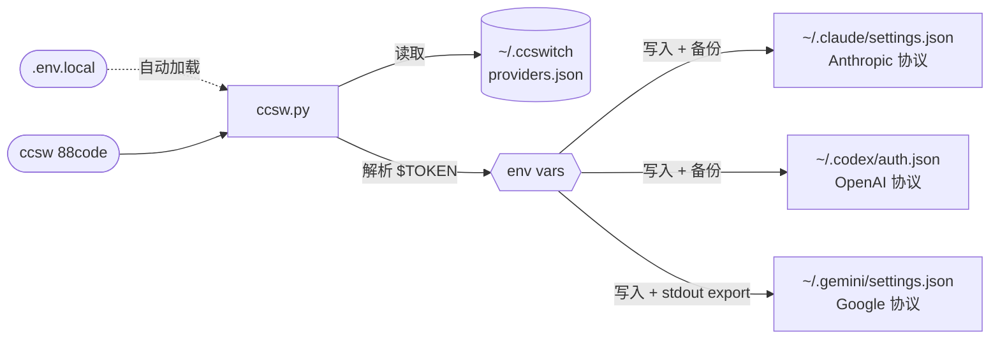

<div align="center">

# ccswitch--terminal

**Claude Code + Codex CLI + Gemini CLI 三端统一 API 服务商切换工具**

一条命令在 Claude Code、Codex CLI、Gemini CLI 三个 AI 终端工具间切换 API 后端。
统一配置中心管理 Anthropic / OpenAI / Google 三套协议凭证，写入前自动时间戳备份。

[](LICENSE)
[](https://www.python.org/)
[](#安装)

[English](README_EN.md) | 简体中文

</div>

---

## 目录

- [功能特性](#功能特性)
- [工作原理](#工作原理)
- [安装](#安装)
- [快速开始](#快速开始)
- [本地密钥：.env.local](#本地密钥envlocal)
- [对话中热切换](#对话中热切换)
- [三端独立配置](#三端独立配置)
- [部分工具支持](#部分工具支持)
- [Gemini eval 模式详解](#gemini-eval-模式详解)
- [内置 Provider](#内置-provider)
- [添加 Provider](#添加-provider)
- [管理命令](#管理命令)
- [配置文件格式](#配置文件格式)
- [配置写入位置](#配置写入位置)
- [使用场景](#使用场景)
- [FAQ](#faq)
- [给 AI 工具的安装提示词](#给-ai-工具的安装提示词)

---

## 功能特性

- 一条命令同时切换 Claude Code、Codex CLI、Gemini CLI 三个工具的后端 Provider
- 快捷命令：`ccsw <provider>` 默认切换 Claude；`cxsw` 切换 Codex（自动激活环境变量）；`gcsw` 切换 Gemini
- `.env.local` 本地密钥文件支持：token 存本地文件，无需写入 shell 配置
- Provider 配置持久化到 `~/.ccswitch/providers.json`
- Token 支持 `$ENV_VAR` 引用，密钥不进配置文件
- Gemini API Key 通过 `eval "$(gcsw ...)"` 立即在当前 shell 生效
- 每个工具各自独立的 base_url 和 token 配置，三套协议互不干扰
- Provider 可只支持部分工具，未配置的工具自动跳过，不影响 active 状态
- Claude Code 会在每次请求前重新读取 `settings.json`，支持**对话中实时热切换**
- 内置 `88code`、`zhipu`、`rightcode` Provider
- 支持自定义别名（`88` → `88code`，`rc` → `rightcode`）
- 写入前自动生成时间戳备份，防止配置丢失
- 零依赖，仅需 Python 3.8+ 标准库

---

## 工作原理



> [!NOTE]
> **stdout / stderr 分离**：`ccsw` 所有状态信息写入 stderr（终端可见），Gemini `export GEMINI_API_KEY=...` 写入 stdout（被 `eval` 捕获执行）。这是 Gemini eval 模式能正常工作的基础。

---

## 安装

```bash
git clone https://github.com/YOUR/ccsw ~/ccsw
bash ~/ccsw/bootstrap.sh
source ~/.zshrc   # 或 source ~/.bashrc
```

`bootstrap.sh` 会：
1. 注册 `ccsw`、`cxsw`、`gcsw`、`ccswitch` 四个 shell 函数
2. 在 shell rc 中添加 `source ~/.ccswitch/active.env`，实现 Gemini 环境变量开机持久化
3. 在 shell rc 中添加 `source ~/.ccswitch/codex.env`，实现 Codex 环境变量开机持久化

预期输出：
```
[ok]   Added ccsw/cxsw/gcsw functions to ~/.zshrc
[ok]   Added active.env source line to ~/.zshrc
[ok]   Added codex.env source line to ~/.zshrc

Installation complete!

Reload your shell:
  source ~/.zshrc

Quick start:
  ccsw list                         # List available providers
  ccsw 88code                       # Switch Claude Code (short form)
  ccsw claude 88code                # Switch Claude Code (explicit)
  cxsw 88code                       # Switch Codex
  eval "$(gcsw myprovider)"        # Switch Gemini (activates env var)
  eval "$(ccsw all 88code)"        # Switch all tools
  ccsw add myprovider               # Add new provider (interactive)
```

---

## 快速开始

> [!TIP]
> `ccsw <provider>` 省略工具名默认切换 Claude。完整子命令（`list`、`show`、`add` 等）照常透传。

```bash
# 切换 Claude Code（省略工具名）
ccsw 88code

# 切换 Claude Code（显式）
ccsw claude 88code

# 切换 Codex CLI（自动激活 OPENAI 环境变量到当前 shell）
cxsw 88code

# 切换 Gemini CLI（立即激活 GEMINI_API_KEY 到当前 shell）
eval "$(gcsw myprovider)"

# 同时切换全部三个工具
eval "$(ccsw all 88code)"

# 查看所有 Provider 及激活状态
ccsw list

# 查看各工具当前激活的配置
ccsw show
```

### 快捷命令一览

| 命令 | 等价于 | 说明 |
|------|--------|------|
| `ccsw <provider>` | `ccsw claude <provider>` | 省略工具名默认切 Claude |
| `cxsw <provider>` | （内置 eval）`ccsw codex <provider>` | Codex 快捷键，自动激活 OPENAI 环境变量 |
| `eval "$(gcsw <provider>)"` | `eval "$(ccsw gemini <provider>)"` | Gemini 快捷键，需配合 `eval` 激活环境变量 |
| `ccsw <子命令>` | — | `list` / `show` / `add` / `remove` / `alias` 直通 |

> [!NOTE]
> `cxsw` 在 shell 函数内部已经包含 `eval`，直接运行即可激活 Codex 的 `OPENAI_API_KEY` / `OPENAI_BASE_URL`。
> `gcsw` 不包含 `eval`，需要用户显式写 `eval "$(gcsw ...)"` 才能激活 `GEMINI_API_KEY`。

---

## 本地密钥：.env.local

在 `ccsw.py` 同目录创建 `.env.local` 文件，可以将 token 存放在本地，**无需写入 `~/.zshrc` 或 `~/.bashrc`**。

```bash
# ~/ccsw/.env.local（不会被提交到 git）
CODE88_ANTHROPIC_AUTH_TOKEN=sk-ant-xxxx
CODE88_OPENAI_API_KEY=sk-xxxx
ZHIPU_ANTHROPIC_AUTH_TOKEN=sk-xxxx
```

`ccsw` 启动时自动读取此文件，优先级低于已有的 shell 环境变量（不会覆盖已 `export` 的值）。

支持的语法：

```bash
KEY=value with spaces           # 裸值
KEY="quoted value"              # 双引号（支持转义 \" 和 \\）
KEY='literal value'             # 单引号（无转义）
KEY="line1
line2"                          # 多行值
export KEY=value                # export 前缀（自动去除）
# 注释行                        # 以 # 开头的行跳过
```

> [!WARNING]
> `.env.local` 包含明文密钥，请确保已在 `.gitignore` 中忽略此文件。

---

## 对话中热切换

Claude Code 在**每次 API 请求前**都会重新读取 `~/.claude/settings.json` 中的 `env` 块，因此：

> 在另一个终端运行 `ccsw claude <provider>`，当前正在使用的 Claude Code 对话无需重启，**下一条消息就会使用新的 Provider**。

操作步骤：

```bash
# 终端 A：Claude Code 正在运行对话中

# 终端 B：切换 provider
ccsw claude zhipu

# 回到终端 A：发下一条消息，已使用 zhipu provider
```

> [!NOTE]
> Codex CLI 同理，`cxsw <provider>` 切换后下次调用 Codex 即生效。
> Gemini CLI 依赖 shell 环境变量，需要在**同一个** shell 中 `eval "$(gcsw ...)"` 才能实时生效。

---

## 三端独立配置

**同一个 Provider 为每个工具维护独立的 URL 和 Token。**

这是 ccsw 最核心的设计：Claude Code 使用 Anthropic 协议，Codex CLI 使用 OpenAI 协议，Gemini CLI 使用 Google 协议——三套协议完全不同，必须各自配置。

```json
{
  "providers": {
    "myprovider": {
      "claude": {
        "base_url": "https://api.example.com/anthropic",
        "token": "$MY_CLAUDE_TOKEN"
      },
      "codex": {
        "base_url": "https://api.example.com/openai/v1",
        "token": "$MY_OPENAI_KEY"
      },
      "gemini": {
        "api_key": "$MY_GEMINI_KEY",
        "auth_type": "api-key"
      }
    }
  }
}
```

`ccsw claude myprovider` 只使用 `claude` 块；`ccsw codex myprovider` 只使用 `codex` 块，互不干扰。

---

## 部分工具支持

**Provider 可以只支持 1-2 个工具。** 不支持的工具设置为 `null`，切换时会自动跳过，**不会修改对应工具的配置，也不会更新该工具的 active 状态**。

```json
{
  "providers": {
    "claude-only": {
      "claude": { "base_url": "https://api.example.com/anthropic", "token": "$MY_TOKEN" },
      "codex": null,
      "gemini": null
    }
  }
}
```

运行 `ccsw all claude-only` 时的输出：
```
[claude] Updated ~/.claude/settings.json
[codex] Skipped: provider 'claude-only' has no codex config.
[gemini] Skipped: provider 'claude-only' has no gemini config.
```

> [!NOTE]
> `ccsw show` 中 codex 和 gemini 的 active 状态不会被改变。只有写入成功才更新 active，保证 active 状态与实际写入文件完全同步。

---

## Gemini eval 模式详解

### 为什么需要 eval

子进程无法修改父进程的环境变量。`gcsw myprovider` 是一个子进程，直接运行无法将 `GEMINI_API_KEY` 注入当前 shell。

解决方案：将 `export GEMINI_API_KEY='...'` 输出到 **stdout**，由 `eval` 在当前 shell 中执行：

```
stdout  →  export GEMINI_API_KEY='...'    （被 eval 捕获并执行）
stderr  →  [gemini] Updated ...           （状态信息，直接显示在终端）
```

### 三种激活方式

```bash
# 方式一：立即激活（推荐）
eval "$(gcsw myprovider)"
eval "$(ccsw all 88code)"   # 切换全部工具并激活 Gemini

# 方式二：开机自动激活（bootstrap.sh 已配置）
# ~/.zshrc 中已添加：source ~/.ccswitch/active.env

# 方式三：手动 source
source ~/.ccswitch/active.env
```

> [!WARNING]
> 在自动化脚本中使用时，务必保证 `eval "$(gcsw ...)"` 引号完整（外层双引号）。若拆开写会导致 token 中的特殊字符截断 export 语句。

### active.env 持久化

每次成功切换 Gemini provider 时，ccsw 会将 export 语句写入 `~/.ccswitch/active.env`。新开 shell 时会自动 source 此文件，无需重新运行 ccsw。

---

## 内置 Provider

| Provider    | Claude Code | Codex CLI | Gemini CLI | 别名 |
|-------------|:-----------:|:---------:|:----------:|------|
| `88code`    | ✅ | ✅ | ❌ | `88` |
| `zhipu`     | ✅ | ❌ | ❌ | `glm` |
| `rightcode` | ❌ | ✅ | ❌ | `rc` |

Token 通过环境变量引用（切换时从当前 shell 动态读取，或从 `.env.local` 加载）：

| Provider | 工具 | 环境变量 |
|----------|------|---------|
| `88code` | Claude Code | `$CODE88_ANTHROPIC_AUTH_TOKEN` |
| `88code` | Codex CLI | `$CODE88_OPENAI_API_KEY` |
| `zhipu` | Claude Code | `$ZHIPU_ANTHROPIC_AUTH_TOKEN` |
| `rightcode` | Codex CLI | `$RIGHTCODE_API_KEY` |

---

## 添加 Provider

### 交互式（无参数）

```bash
ccsw add myprovider
```

按提示逐步输入，留空则跳过该工具。使用 `$ENV_VAR` 语法引用 token。

### 命令行参数

```bash
ccsw add myprovider \
  --claude-url   https://api.example.com/anthropic \
  --claude-token '$MY_CLAUDE_TOKEN' \
  --codex-url    https://api.example.com/openai/v1 \
  --codex-token  '$MY_OPENAI_KEY' \
  --gemini-key   '$MY_GEMINI_KEY'
```

Token 以 `$` 开头时，切换时从环境变量动态读取；否则作为字面量存储。

### 只更新部分字段

```bash
# 只更新 Gemini key，保留原有 auth_type
ccsw add myprovider --gemini-key '$NEW_KEY'
```

---

## 管理命令

```bash
ccsw list                         # 列出所有 Provider 及激活状态
ccsw show                         # 显示各工具当前激活的详细配置
ccsw add <name> [flags]           # 新增/更新 Provider
ccsw remove <name>                # 删除 Provider
ccsw alias <alias> <provider>     # 添加别名
```

---

## 配置文件格式

<details>
<summary><b>展开查看完整 providers.json 结构</b></summary>

位于 `~/.ccswitch/providers.json`：

```json
{
  "version": 1,
  "active": { "claude": "88code", "codex": "88code", "gemini": null },
  "aliases": { "88": "88code", "glm": "zhipu", "rc": "rightcode" },
  "providers": {
    "88code": {
      "claude": {
        "base_url": "https://www.88code.ai/api",
        "token": "$CODE88_ANTHROPIC_AUTH_TOKEN",
        "extra_env": {
          "API_TIMEOUT_MS": null,
          "CLAUDE_CODE_DISABLE_NONESSENTIAL_TRAFFIC": null
        }
      },
      "codex": {
        "base_url": "https://www.88code.ai/openai/v1",
        "token": "$CODE88_OPENAI_API_KEY"
      },
      "gemini": null
    }
  }
}
```

`extra_env` 中值为 `null` 表示**删除该键**（用于覆盖其他 provider 留下的残留配置）。

</details>

---

## 配置写入位置

| 工具 | 配置文件 | 写入字段 |
|------|----------|----------|
| Claude Code | `~/.claude/settings.json` | `env.ANTHROPIC_AUTH_TOKEN`, `env.ANTHROPIC_BASE_URL`, extra_env |
| Codex CLI | `~/.codex/auth.json` | `OPENAI_API_KEY`, `OPENAI_BASE_URL` |
| Codex 环境变量 | `~/.ccswitch/codex.env` | `OPENAI_API_KEY`, `OPENAI_BASE_URL` |
| Gemini CLI | `~/.gemini/settings.json` | `security.auth.selectedType` |
| Gemini 环境变量 | stdout + `~/.ccswitch/active.env` | `GEMINI_API_KEY` |

---

## 使用场景

### SSH 远程服务器

```bash
ssh user@server
# 进入远程 shell 后：
eval "$(ccsw all 88code)"
```

### Docker 容器

```dockerfile
COPY ccsw.py /usr/local/bin/ccsw.py
RUN chmod +x /usr/local/bin/ccsw.py
ENV CODE88_ANTHROPIC_AUTH_TOKEN=your_token_here
```

```bash
docker exec -it mycontainer bash -c \
  'eval "$(python3 /usr/local/bin/ccsw.py all 88code)"'
```

### CI/CD 流水线

```yaml
# GitHub Actions
- name: Switch to 88code provider
  env:
    CODE88_ANTHROPIC_AUTH_TOKEN: ${{ secrets.CODE88_TOKEN }}
    CODE88_OPENAI_API_KEY: ${{ secrets.CODE88_OPENAI_KEY }}
  run: |
    python ccsw.py claude 88code
    python ccsw.py codex 88code
```

---

## FAQ

<details>
<summary><b>Q: <code>[claude] Skipped: token unresolved</code> 是什么意思？</b></summary>

Token 配置为 `$MY_ENV_VAR`，但该环境变量当前未设置。

两种解决方式：
- `export MY_ENV_VAR=your_token`（当前 shell 临时生效）
- 将 `MY_ENV_VAR=your_token` 写入 `ccsw.py` 同目录的 `.env.local` 文件（推荐）

</details>

<details>
<summary><b>Q: .env.local 和 ~/.zshrc 中的 export 有什么区别？</b></summary>

`.env.local` 的 token 只在 `ccsw` 运行时加载，不会污染全局 shell 环境；写入 `~/.zshrc` 的 `export` 在每个新 shell 中都存在。对于 AI 工具 token，推荐 `.env.local`：更安全，不会被意外打印到终端。

</details>

<details>
<summary><b>Q: 对话中切换 provider，Claude Code 能立即感知吗？</b></summary>

可以。Claude Code 在每次 API 请求前都会重新读取 `~/.claude/settings.json` 中的 `env` 块。在另一个终端运行 `ccsw claude <provider>`，回到正在使用的 Claude Code 发下一条消息即生效，**无需重启**。

</details>

<details>
<summary><b>Q: eval "$(gcsw ...)" 执行后 $GEMINI_API_KEY 还是空的？</b></summary>

检查：
1. 直接运行 `gcsw myprovider`，看 stdout 是否有 `export GEMINI_API_KEY=...`
2. 是否在同一个 shell session 中执行（子 shell 不继承）
3. 引号是否完整：`eval "$(gcsw ...)"` 外层双引号不能省略

</details>

<details>
<summary><b>Q: provider 只支持部分工具，ccsw all 会报错吗？</b></summary>

不会。将不支持的工具设为 `null`，ccsw 会打印 `Skipped` 提示并继续，不影响其他工具的切换，也不更新被跳过工具的 active 状态。

</details>

<details>
<summary><b>Q: 如何查看切换后实际生效的配置？</b></summary>

```bash
ccsw show                       # active provider 及 URL/token 引用
cat ~/.claude/settings.json     # 实际写入的 Claude 配置
cat ~/.codex/auth.json          # 实际写入的 Codex 配置
```

</details>

<details>
<summary><b>Q: 我的 ~/.claude/settings.json 被覆盖了怎么办？</b></summary>

每次写入前 ccsw 会创建时间戳备份，例如 `settings.json.bak-20260313-120000`，直接 `cp` 回去即可。

</details>

---

## 给 AI 工具的安装提示词

如果你在使用 Claude Code 或其他 AI 工具，可以发送以下提示词让 AI 帮你完成安装：

```
请帮我安装 ccsw provider 切换工具：
1. 将仓库克隆到 ~/ccsw（如已存在则跳过）
2. 运行 bash ~/ccsw/bootstrap.sh
3. source ~/.zshrc（或 ~/.bashrc）
4. 在 ~/ccsw/.env.local 中写入我的 token 环境变量
5. 在 ~/.ccswitch/providers.json 中添加我的 provider 配置
6. 运行 ccsw list 确认安装，ccsw show 确认当前状态
注意：providers.json 中的 token 请使用 $ENV_VAR 格式引用。
```

---

## 依赖

Python 3.8+（仅标准库，无需 `pip install`）

## License

MIT

---

<div align="right">

[⬆ 返回顶部](#ccswitch--terminal)

</div>
