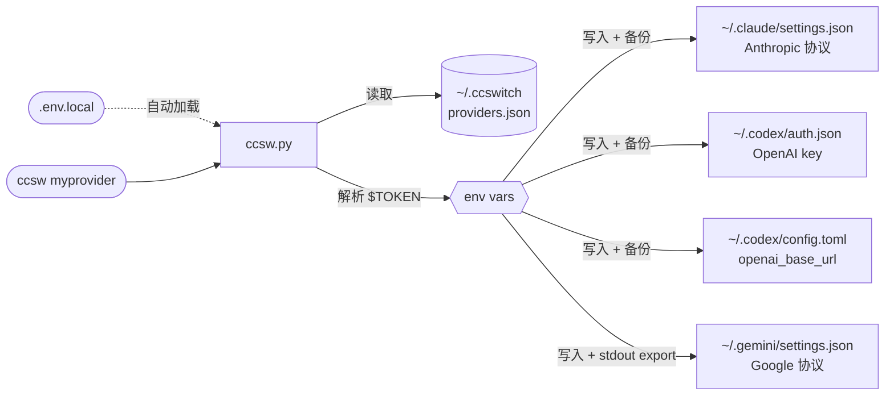

<div align="center">

# ccswitch--terminal

**Claude Code + Codex CLI + Gemini CLI 三端统一 API 服务商切换工具**

[](LICENSE)
[](https://www.python.org/)
[](#快速安装)

[English](README_EN.md) | 简体中文

</div>

---

## 简介

你同时在用 Claude Code、Codex CLI、Gemini CLI 吗？每次更换 API 服务商时，是否都要手动修改多个配置文件、记住不同格式的 token 字段？**ccswitch** 正是为此而生。

- **一键切换**：`ccsw myprovider` 即完成 Claude 切换；`ccsw all myprovider` 三端同步
- **配置隔离**：每个服务商为三套协议（Anthropic / OpenAI / Google）各自维护独立的 URL 和 Token
- **安全优先**：Token 以 `$ENV_VAR` 形式引用，从不写入配置文件；写入前自动备份
- **无缝衔接**：Claude Code 对话中实时热切换，Gemini 环境变量自动激活，无需重启

---

## 快速安装

**通过 Claude Code / Codex 一键安装** — 复制以下提示词，替换 `<...>` 占位符后直接发送：

```
请帮我安装 ccswitch (AI 终端工具 API 切换器)：

仓库：https://github.com/Boulea7/ccswitch--terminal
安装：克隆到 ~/ccsw → 运行 bootstrap.sh → source ~/.zshrc

然后帮我配置一个 provider：
  名称: <供应商名>    别名: <简称>
  Claude URL:   <https://api.example.com/anthropic>
  Claude Token: <your-claude-token>
  Codex URL:    <https://api.example.com/openai/v1>
  Codex Token:  <your-codex-token>
  Gemini Key:   <your-gemini-key 或留空跳过>

token 明文写入 ~/ccsw/.env.local，providers.json 中用 $ENV_VAR 引用。
最后运行 ccsw list 和 ccsw show 确认。
```

<details>
<summary>示例：以自定义 Provider 为例的已填写版本</summary>

```
请帮我安装 ccswitch (AI 终端工具 API 切换器)：

仓库：https://github.com/Boulea7/ccswitch--terminal
安装：克隆到 ~/ccsw → 运行 bootstrap.sh → source ~/.zshrc

然后帮我配置一个 provider：
  名称: myprovider    别名: mp
  Claude URL:   https://api.example.com/anthropic
  Claude Token: <your-claude-token>
  Codex URL:    https://api.example.com/openai/v1
  Codex Token:  <your-codex-token>
  Gemini Key:   留空跳过

token 明文写入 ~/ccsw/.env.local，providers.json 中用 $ENV_VAR 引用。
最后运行 ccsw list 和 ccsw show 确认。
```

</details>

**手动安装（3 行命令）：**

```bash
git clone https://github.com/Boulea7/ccswitch--terminal ~/ccsw
bash ~/ccsw/bootstrap.sh
source ~/.zshrc   # 或 source ~/.bashrc
```

`bootstrap.sh` 完成后会注册 `ccsw`、`cxsw`、`gcsw`、`ccswitch` 四个 shell 函数，并配置 Gemini 环境变量与 Codex API key 的开机持久化。

---

## 基础使用

```bash
# -- 切换 --
ccsw myprovider                   # 切换 Claude（省略工具名）
cxsw myprovider                   # 切换 Codex（自动激活 OPENAI_API_KEY，并清理旧 OPENAI_BASE_URL）
gcsw myprovider                   # 切换 Gemini（自动激活环境变量）
ccsw all myprovider               # 三端同时切换

# -- 管理 --
ccsw list                         # 列出所有 Provider
ccsw show                         # 当前激活配置
ccsw add <name>                   # 新增/更新 Provider
ccsw remove <name>                # 删除 Provider
ccsw alias <alias> <provider>     # 添加别名
```

---

## 进阶功能

<details>
<summary><b>本地密钥：.env.local</b></summary>

在 `ccsw.py` 同目录创建 `.env.local` 文件，可以将 token 存放在本地，**无需写入 `~/.zshrc` 或 `~/.bashrc`**。

```bash
# ~/ccsw/.env.local（不会被提交到 git）
MY_PROVIDER_CLAUDE_TOKEN=<your-claude-token>
MY_PROVIDER_CODEX_TOKEN=<your-codex-token>
MY_PROVIDER_GEMINI_KEY=<your-gemini-key>
```

`ccsw` 启动时自动读取此文件，优先级低于已有的 shell 环境变量（不会覆盖已 `export` 的值）。

> [!WARNING]
> `.env.local` 包含明文密钥，请确保已在 `.gitignore` 中忽略此文件。

</details>

<details>
<summary><b>对话中实时热切换</b></summary>

Claude Code 在**每次 API 请求前**都会重新读取 `~/.claude/settings.json` 中的 `env` 块，因此：

> 在另一个终端运行 `ccsw claude <provider>`，当前正在使用的 Claude Code 对话无需重启，**下一条消息就会使用新的 Provider**。

```bash
# 终端 A：Claude Code 正在运行对话中

# 终端 B：切换 provider
ccsw claude myprovider

# 回到终端 A：发下一条消息，已使用 myprovider
```

> [!NOTE]
> Codex CLI 同理，`cxsw <provider>` 切换后下次调用即生效。
> Gemini CLI 依赖 shell 环境变量，需在**同一个** shell 中执行 `gcsw` 才能实时生效。

</details>

<details>
<summary><b>三端独立配置与环境变量</b></summary>

**同一个 Provider 为每个工具维护独立的 URL 和 Token。**

Claude Code 使用 Anthropic 协议，Codex CLI 使用 OpenAI 协议，Gemini CLI 使用 Google 协议——三套协议完全不同，必须各自配置：

```json
{
  "providers": {
    "myprovider": {
      "claude": { "base_url": "https://api.example.com/anthropic", "token": "$MY_PROVIDER_CLAUDE_TOKEN" },
      "codex":  { "base_url": "https://api.example.com/openai/v1", "token": "$MY_PROVIDER_CODEX_TOKEN" },
      "gemini": { "api_key": "$MY_PROVIDER_GEMINI_KEY", "auth_type": "api-key" }
    }
  }
}
```

**Provider 可以只支持 1-2 个工具。** 不支持的工具设置为 `null`，切换时自动跳过：

```
ccsw all claude-only 输出：
[claude] Updated ~/.claude/settings.json
[codex]  Skipped: provider 'claude-only' has no codex config.
[gemini] Skipped: provider 'claude-only' has no gemini config.
```

**Gemini / Codex 环境激活**：`GEMINI_API_KEY` 与 `OPENAI_API_KEY` 都是环境变量，子进程无法直接写入父 shell。`gcsw`、`cxsw` 和 `ccsw gemini/all` 的 shell 函数已内置 `eval`，直接运行即可：

```bash
gcsw myprovider          # 切换 Gemini（环境变量自动激活）
cxsw myprovider          # 切换 Codex（API key 自动激活，并清理旧 OPENAI_BASE_URL）
ccsw all myprovider      # 切换全部工具
```

**在 CI/CD 或 Docker 中直接调用 Python 脚本时**，shell 函数不可用，需手动 `eval`：

```bash
eval "$(python3 ccsw.py gemini myprovider)"
eval "$(python3 ccsw.py all myprovider)"
```

每次成功切换 Gemini provider 时，ccsw 会将 export 语句写入 `~/.ccswitch/active.env`，新开 shell 自动 source，无需重新运行 ccsw。

</details>

---

## 提供商管理

<details>
<summary><b>内置 Provider</b></summary>

| Provider | Claude Code | Codex CLI | Gemini CLI | 别名 | 凭据来源 |
|----------|:-----------:|:---------:|:----------:|------|----------|
| `88code` | ✅ | ✅ | ❌ | `88` | 环境变量或 `.env.local` |
| `zhipu` | ✅ | ❌ | ❌ | `glm` | 环境变量或 `.env.local` |
| `rightcode` | ❌ | ✅ | ❌ | `rc` | 环境变量或 `.env.local` |
| `anyrouter` | ✅ | ❌ | ❌ | `any` | 环境变量或 `.env.local` |

内置 Provider 默认都通过环境变量引用密钥。若你想统一自己的命名方式，推荐用 `ccsw add <name>` 重新保存同名 Provider 配置。

</details>

<details>
<summary><b>配置参考模板</b></summary>

优先推荐从通用模板开始，再按你使用的服务商文档替换 URL 与环境变量名：

```bash
ccsw add myprovider \
  --claude-url   https://api.example.com/anthropic \
  --claude-token '$MY_PROVIDER_CLAUDE_TOKEN' \
  --codex-url    https://api.example.com/openai/v1 \
  --codex-token  '$MY_PROVIDER_CODEX_TOKEN' \
  --gemini-key   '$MY_PROVIDER_GEMINI_KEY'
```

如果你更偏好开箱即用，也可以直接使用内置 Provider：

```bash
ccsw 88code
ccsw glm
cxsw rc
ccsw any
```

> 各服务商的具体 URL 以其官方文档为准。URL 路径因服务商而异，常见模式：
> - Anthropic 协议：`/api`、`/v1`、`/api/anthropic`
> - OpenAI 协议：`/v1`、`/openai/v1`

</details>

<details>
<summary><b>添加自定义 Provider</b></summary>

**交互式（推荐）：**

```bash
ccsw add myprovider
```

按提示逐步输入，留空则跳过该工具。使用 `$ENV_VAR` 语法引用 token。

**命令行参数：**

```bash
ccsw add myprovider \
  --claude-url   https://api.example.com/anthropic \
  --claude-token '$MY_PROVIDER_CLAUDE_TOKEN' \
  --codex-url    https://api.example.com/openai/v1 \
  --codex-token  '$MY_PROVIDER_CODEX_TOKEN' \
  --gemini-key   '$MY_PROVIDER_GEMINI_KEY'
```

**只更新部分字段：**

```bash
ccsw add myprovider --gemini-key '$NEW_KEY'   # 只更新 Gemini key，保留其他配置
```

</details>

---

## 架构与原理

<details>
<summary><b>工作流程与配置写入</b></summary>



> [!NOTE]
> **stdout / stderr 分离**：`ccsw` 所有状态信息写入 stderr（终端可见），Codex / Gemini 的 shell 激活语句写入 stdout（被 `eval` 捕获执行）。

| 工具 | 配置文件 | 写入字段 |
|------|----------|----------|
| Claude Code | `~/.claude/settings.json` | `env.ANTHROPIC_AUTH_TOKEN`, `env.ANTHROPIC_BASE_URL`, extra_env |
| Codex CLI | `~/.codex/auth.json` | `OPENAI_API_KEY` |
| Codex CLI | `~/.codex/config.toml` | `openai_base_url` |
| Codex 环境变量 | `~/.ccswitch/codex.env` | `OPENAI_API_KEY`，并 `unset OPENAI_BASE_URL` |
| Gemini CLI | `~/.gemini/settings.json` | `security.auth.selectedType` |
| Gemini 环境变量 | stdout + `~/.ccswitch/active.env` | `GEMINI_API_KEY` |

</details>

<details>
<summary><b>providers.json 结构</b></summary>

位于 `~/.ccswitch/providers.json`：

```json
{
  "version": 1,
  "active": { "claude": "myprovider", "codex": "myprovider", "gemini": null },
  "aliases": { "mp": "myprovider" },
  "providers": {
    "myprovider": {
      "claude": {
        "base_url": "https://api.example.com/anthropic",
        "token": "$MY_PROVIDER_CLAUDE_TOKEN",
        "extra_env": {
          "API_TIMEOUT_MS": null,
          "CLAUDE_CODE_DISABLE_NONESSENTIAL_TRAFFIC": null
        }
      },
      "codex": {
        "base_url": "https://api.example.com/openai/v1",
        "token": "$MY_PROVIDER_CODEX_TOKEN"
      },
      "gemini": {
        "api_key": "$MY_PROVIDER_GEMINI_KEY",
        "auth_type": "api-key"
      }
    }
  }
}
```

`extra_env` 中值为 `null` 表示**删除该键**（用于覆盖其他 provider 留下的残留配置）。

</details>

<details>
<summary><b>使用场景：SSH / Docker / CI-CD</b></summary>

**SSH 远程服务器**

```bash
ssh user@server
# 进入远程 shell 后：
eval "$(ccsw all myprovider)"
```

**Docker 容器**

```dockerfile
COPY ccsw.py /usr/local/bin/ccsw.py
RUN chmod +x /usr/local/bin/ccsw.py
ENV MY_PROVIDER_CODEX_TOKEN=<your-codex-token>
ENV MY_PROVIDER_CLAUDE_TOKEN=<your-claude-token>
```

```bash
docker exec -it mycontainer bash -c \
  'python3 /usr/local/bin/ccsw.py claude myprovider && eval "$(python3 /usr/local/bin/ccsw.py codex myprovider)"'
```

**CI/CD 流水线（GitHub Actions）**

```yaml
- name: Configure AI tool providers
  env:
    MY_PROVIDER_CLAUDE_TOKEN: ${{ secrets.MY_PROVIDER_CLAUDE_TOKEN }}
    MY_PROVIDER_CODEX_TOKEN: ${{ secrets.MY_PROVIDER_CODEX_TOKEN }}
  run: |
    python ccsw.py claude myprovider
    python ccsw.py codex myprovider
```

</details>

---

## FAQ

<details>
<summary><b>Q: 运行 gcsw 后 $GEMINI_API_KEY 还是空的？</b></summary>

检查：
1. 是否通过 bootstrap.sh 安装了 shell 函数？运行 `type gcsw` 确认
2. 是否在同一个 shell session 中执行（子 shell 不继承父 shell 的变量）
3. 若绕过 shell 函数直接调用 Python 脚本，仍需手动 `eval "$(python3 ccsw.py gemini ...)"`

</details>

<details>
<summary><b>Q: <code>[claude] Skipped: token unresolved</code> 是什么意思？</b></summary>

Token 配置为 `$MY_ENV_VAR`，但该环境变量当前未设置。

两种解决方式：
- `export MY_ENV_VAR=your_token`（当前 shell 临时生效）
- 将 `MY_ENV_VAR=your_token` 写入 `ccsw.py` 同目录的 `.env.local` 文件（推荐）

</details>

<details>
<summary><b>Q: 我的 ~/.claude/settings.json 被覆盖了怎么办？</b></summary>

每次写入前 ccsw 会创建时间戳备份，例如 `settings.json.bak-20260313-120000`，直接 `cp` 回去即可。

</details>

<details>
<summary><b>Q: .env.local 和 ~/.zshrc 中的 export 有什么区别？</b></summary>

`.env.local` 的 token 只在 `ccsw` 运行时加载，不会污染全局 shell 环境；写入 `~/.zshrc` 的 `export` 在每个新 shell 中都存在。对于 AI 工具 token，推荐 `.env.local`：更安全，不会被意外打印到终端。

</details>

---

## 依赖

Python 3.8+（仅标准库，无需 `pip install`）

## License

MIT

---

<div align="right">

[⬆ 返回顶部](#ccswitch--terminal)

</div>
