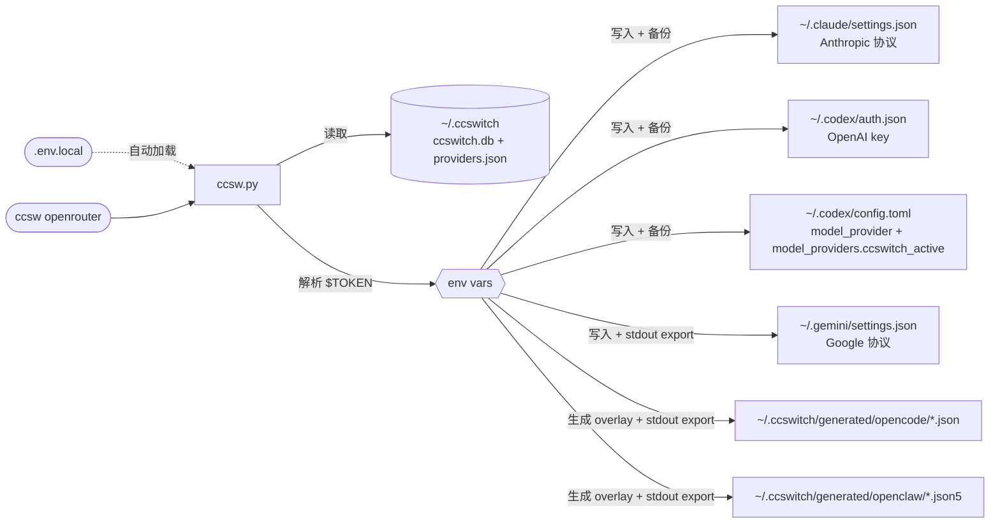

<div align="center">


# ccswitch-terminal

**Claude Code + Codex CLI + Gemini CLI + OpenCode + OpenClaw 五端统一 API 服务商切换工具**

[](LICENSE)
[](https://github.com/Boulea7/ccswitch-terminal/actions/workflows/ci.yml)
[](https://www.python.org/)
[](#快速安装)

[English](README_EN.md) | 简体中文 | [日本語](README_JA.md) | [Español](README_ES.md) | [Português](README_PT.md) | [Русский](README_RU.md)

[CI 工作流](https://github.com/Boulea7/ccswitch-terminal/actions/workflows/ci.yml) | [CodeQL](https://github.com/Boulea7/ccswitch-terminal/actions/workflows/codeql.yml) | [Issue 模板](https://github.com/Boulea7/ccswitch-terminal/issues/new/choose) | [变更日志](CHANGELOG.md) | [发布流程](RELEASING.md) | [贡献指南](CONTRIBUTING.md) | [安全说明](SECURITY.md) | [支持](SUPPORT.md)

</div>

---

## 简介

你同时在用 Claude Code、Codex CLI、Gemini CLI、OpenCode、OpenClaw 吗？每次更换 API 服务商时，是否都要手动修改多个配置文件、记住不同格式的 token 字段？**ccswitch** 正是为此而生。

- **一键切换**：`ccsw openrouter` 即完成 Claude 切换；`ccsw all openrouter` 会先做全量预检，再严格 fail-closed 地切换已配置工具
- **五工具统一控制面**：对 `Claude / Codex / Gemini` 直接写 live config，对 `OpenCode / OpenClaw` 生成受控 overlay 并自动激活
- **CLI-only 产品化**：新增 `profile`、`doctor`、`run`、`history`、`rollback`、`settings`，不引入 GUI；`doctor --json` 按工具逐条输出 NDJSON，并保留稳定顶层结构，便于脚本消费
- **运行期边界明确**：`run` 会把 `managed_targets` lease / manifest 持久化到 SQLite，用于 stale runtime 诊断；它仍只对当前这一次命令做临时 fallback 包装，命令结束后 active provider 不会被悄悄改掉
- **安全边界清晰**：主状态保存在 `SQLite + JSON snapshot`，目录 / 状态文件会显式收紧权限；store 提交现在带 revision 保护，减少陈旧快照互相覆盖；新增 secret 默认要求 env-ref；probe cache / history / `run` 历史会做脱敏；`managed_targets` 为了支持 restore 仍会临时持久化 live 文件快照，但旧格式 inline `content_b64` 会在 load / repair 阶段尽量外置到 runtime snapshot 文件或 scrub 掉，不再长期留在 SQLite
- **Shell 激活更保守**：若 SQLite 已提交但 `providers.json` snapshot 同步失败，命令会显式失败，且不再向 stdout 发 `export`，避免 `eval "$(python3 ccsw.py ...)"` 把父 shell 切到半成功状态
- **Linux / WSL 友好**：支持配置目录覆盖，便于把目标 CLI 指向不同 home、不同工作区、不同 WSL 发行版下的配置目录

---

## 快速安装

<details>
<summary><b>快速导航</b></summary>

- 快速安装：先看手动安装；已有 AI 助手时再看一键安装提示词
- 基础使用：切换、profile、doctor、run、rollback、repair
- 进阶功能：source-chain、runtime lease、history schema、Codex deep doctor
- 开发与验证：最小验证 + CLI smoke

</details>

> [!IMPORTANT]
> `ccswitch` 只负责管理已经装好的 Claude Code、Codex CLI、Gemini CLI、OpenCode、OpenClaw，不会代替你安装这些 CLI。要管理哪个工具，先把那个工具装到本机，再运行 `bootstrap.sh`、`doctor` 或切换命令。

**手动安装（推荐先看）**

```bash
git clone https://github.com/Boulea7/ccswitch-terminal ~/ccsw
bash ~/ccsw/bootstrap.sh
source ~/.zshrc   # 或 source ~/.bashrc
python3 ~/ccsw/ccsw.py -h
```

`bootstrap.sh` 当前会自动接入 `bash` / `zsh` 的 rc 文件，注册 `ccsw`、`cxsw`、`gcsw`、`opsw`、`clawsw`、`ccswitch` 六个 shell 函数，并配置 Gemini / Codex / OpenCode / OpenClaw 的激活环境持久化。其他兼容 POSIX 的 shell 一般也可以直接运行 `python3 ccsw.py ...`，必要时再用 `.` / `source` 手动加载生成的 `~/.ccswitch/*.env`。如果你用的是 `fish`、PowerShell 这类非 POSIX shell，不要直接 `source` 这些文件，改用 `python3 ccsw.py ...`，再把输出的 `export` 按对应 shell 语法处理。

如需只验证安装脚本本身而不改写真实 shell 配置，可先执行：

```bash
bash ~/ccsw/bootstrap.sh --dry-run
```

`--dry-run` 只输出将要发生的操作，不会写入文件；也可以通过 `BOOTSTRAP_HOME`、`BOOTSTRAP_RC_FILE` 把 bootstrap 输出重定向到临时目录和临时 rc 文件。

如果之后你想取消 bootstrap 接入，需要手动删除 rc 文件中 `# >>> ccsw bootstrap >>>` 到 `# <<< ccsw bootstrap <<<` 之间的受管代码块，再移除 bootstrap 追加的 `active.env` / `codex.env` / `opencode.env` / `openclaw.env` source 行，重新加载 shell；如果本地 store、历史和生成的 overlay 也不再需要，可以再手动删除 `~/ccsw` 与 `~/.ccswitch`。当前 `bootstrap.sh` 还没有单独的卸载参数。

<details>
<summary><b>通过 Claude Code / Codex 一键安装</b></summary>

复制以下提示词，替换 `<...>` 占位符后直接发送：

```text
请帮我安装 ccswitch (AI 终端工具 API 切换器)：

仓库：https://github.com/Boulea7/ccswitch-terminal
安装：克隆到 ~/ccsw → 运行 bootstrap.sh → source ~/.zshrc
前提：要管理的 CLI 已经安装在这台机器上。

然后帮我配置一个 provider：
  名称: <供应商名>    别名: <简称>
  Claude URL:   <https://api.example.com/anthropic>
  Claude Token: <your-claude-token>
  Codex URL:    <https://api.example.com/openai/v1>
  Codex Token:  <your-codex-token>
  Gemini Key:   <your-gemini-key 或留空跳过>

token 明文写入 ~/ccsw/.env.local，providers.json 中用 $ENV_VAR 引用。
最后运行 python3 ~/ccsw/ccsw.py list 和 python3 ~/ccsw/ccsw.py show 确认。
```

<details>
<summary>示例：以自定义 Provider 为例的已填写版本</summary>

```text
请帮我安装 ccswitch (AI 终端工具 API 切换器)：

仓库：https://github.com/Boulea7/ccswitch-terminal
安装：克隆到 ~/ccsw → 运行 bootstrap.sh → source ~/.zshrc
前提：要管理的 CLI 已经安装在这台机器上。

然后帮我配置一个 provider：
  名称: openrouter    别名: demo
  Claude URL:   https://api.example.com/anthropic
  Claude Token: <your-claude-token>
  Codex URL:    https://api.example.com/openai/v1
  Codex Token:  <your-codex-token>
  Gemini Key:   留空跳过

token 明文写入 ~/ccsw/.env.local，providers.json 中用 $ENV_VAR 引用。
最后运行 python3 ~/ccsw/ccsw.py list 和 python3 ~/ccsw/ccsw.py show 确认。
```

</details>
</details>

---

## 基础使用

```bash
# -- 切换 --
ccsw openrouter                   # 切换 Claude（省略工具名）
cxsw openrouter                   # 切换 Codex（自动激活 OPENAI_API_KEY，并更新自定义 model_provider）
gcsw openrouter                   # 切换 Gemini（自动激活环境变量）
opsw openrouter                   # 切换 OpenCode（自动激活 OPENCODE_CONFIG）
clawsw openrouter                 # 切换 OpenClaw（自动激活 OPENCLAW_CONFIG_PATH）
ccsw all openrouter               # 五端同时切换

# -- 管理 --
ccsw list                         # 列出所有 Provider
ccsw show                         # 当前激活配置
ccsw add <name>                   # 新增/更新 Provider
ccsw remove <name>                # 删除 Provider，并修剪 profile 里对应的队列项
ccsw alias <alias> <provider>     # 添加别名
ccsw profile add <name> --codex a,b --opencode c
ccsw profile use <name>           # 先预检队列，再按各工具首个候选切换
ccsw settings get                 # 查看当前 settings
ccsw settings set codex_config_dir ~/.codex-alt
ccsw import current codex rescued-codex
ccsw doctor all                   # 做配置校验 + probe + runtime lease 诊断
ccsw history --limit 20           # 查看切换和 run 历史
ccsw rollback codex               # live config 漂移时 fail-closed；结果会写 rollback-result
ccsw repair codex                 # 修复该工具遗留的 stale runtime lease / restore 现场
ccsw run codex work -- codex exec "hello"   # 仅这一次命令会临时 fallback；run lease/manifest 会持久化到 SQLite
```

---

## 进阶功能

<details>
<summary><b>本地密钥：.env.local</b></summary>

在 `ccsw.py` 同目录创建 `.env.local` 文件，可以将 token 存放在本地，**无需写入 `~/.zshrc` 或 `~/.bashrc`**。

```bash
# ~/ccsw/.env.local（不会被提交到 git）
MY_PROVIDER_CLAUDE_TOKEN=<your-claude-token>
MY_PROVIDER_CODEX_TOKEN=<your-codex-token>
MY_PROVIDER_GEMINI_KEY=<your-gemini-key>
```

`ccsw` 启动时自动读取此文件，优先级低于已有的 shell 环境变量（不会覆盖已 `export` 的值）。

> [!IMPORTANT]
> `.env.local` 解决的是“如何在 `providers.json` 与 shell 启动文件中引用密钥”这个问题；一旦执行切换，解析出的密钥仍会写入对应工具的配置文件或激活文件。对 `run` 来说，为了支持 restore，运行期 lease / manifest 还会暂存受管 live 文件快照，这意味着密钥副本也可能短暂出现在 SQLite 的 `managed_targets` 中。

> [!WARNING]
> `.env.local` 包含明文密钥，请确保已在 `.gitignore` 中忽略此文件。

> [!NOTE]
> 从当前版本开始，`ccsw add` / `import current` 默认不再接受新的 literal secret 长期写回 store。请优先使用 `$ENV_VAR` 或 `.env.local`；只有显式传入 `--allow-literal-secrets` 时才会覆盖这一保护。

</details>

<details>
<summary><b>对话中实时热切换</b></summary>

Claude Code 在**每次 API 请求前**都会重新读取 `~/.claude/settings.json` 中的 `env` 块，因此：

> 在另一个终端运行 `ccsw claude <provider>`，当前正在使用的 Claude Code 对话无需重启，**下一条消息就会使用新的 Provider**。

```bash
# 终端 A：Claude Code 正在运行对话中

# 终端 B：切换 provider
ccsw claude openrouter

# 回到终端 A：发下一条消息，已使用 openrouter
```

> [!NOTE]
> Codex CLI 同理，`cxsw <provider>` 切换后下次调用即生效。
> Gemini CLI 依赖 shell 环境变量，需在**同一个** shell 中执行 `gcsw` 才能实时生效。

</details>

<details>
<summary><b>五端独立配置与环境变量</b></summary>

**同一个 Provider 为每个工具维护独立的 URL、Token、模型或 overlay 参数。**

Claude Code 使用 Anthropic 协议，Codex CLI 使用 OpenAI 协议，Gemini CLI 使用 Google 协议——三套协议完全不同，必须各自配置：

```json
{
  "providers": {
    "openrouter": {
      "claude": { "base_url": "https://api.example.com/anthropic", "token": "$MY_PROVIDER_CLAUDE_TOKEN" },
      "codex":  { "base_url": "https://api.example.com/openai/v1", "fallback_base_url": "https://backup.example.com/openai/v1", "token": "$MY_PROVIDER_CODEX_TOKEN" },
      "gemini": { "api_key": "$MY_PROVIDER_GEMINI_KEY", "auth_type": "api-key" }
    }
  }
}
```

**Provider 可以只覆盖部分工具。** 不支持的工具设置为 `null`，切换时自动跳过：

```
ccsw all partial-provider 输出：
[claude] Updated ~/.claude/settings.json
[codex]  Skipped: provider 'partial-provider' has no codex config.
[gemini] Skipped: provider 'partial-provider' has no gemini config.
```

**Gemini / Codex 环境激活**：`GEMINI_API_KEY` 与 `OPENAI_API_KEY` 都是环境变量，子进程无法直接写入父 shell。`gcsw`、`cxsw` 和 `ccsw gemini/all` 的 shell 函数已内置 `eval`，直接运行即可：

```bash
gcsw openrouter          # 切换 Gemini（环境变量自动激活）
cxsw openrouter          # 切换 Codex（API key 自动激活，并更新自定义 model_provider）
ccsw all openrouter      # 切换全部工具
```

**在 CI/CD 或 Docker 中直接调用 Python 脚本时**，shell 函数不可用，需手动 `eval`：

```bash
eval "$(python3 ccsw.py gemini openrouter)"
eval "$(python3 ccsw.py all openrouter)"
```

每次成功切换 Gemini provider 时，ccsw 会将 export 语句写入 `~/.ccswitch/active.env`，新开 shell 自动 source，无需重新运行 ccsw。

</details>

<details>
<summary><b>Profile / Settings / Import / Doctor / Run</b></summary>

`ccswitch-terminal` 现在不仅能“切到某个 provider”，还能把一组 provider 队列组织成可复用的 CLI profile。

```bash
ccsw profile add work \
  --claude openrouter \
  --codex openrouter,secondary-codex \
  --gemini gemini-official \
  --opencode opencode-primary \
  --openclaw openclaw-primary

ccsw profile show work
ccsw profile use work
```

`profile use` 现在会先把所有已配置工具的队列和激活前提都校验一遍，再开始切换。只要遇到缺失 provider、失效 alias、无法解析的 secret、缺失的必填地址或空队列，命令会直接 fail-closed，不会先切一部分再报错。若 profile 本身没有任何已配置工具队列，也会直接报错退出，而不是静默 no-op。

`settings` 用于管理设备级目录覆盖。当前支持这 5 个 key：

- `claude_config_dir`
- `codex_config_dir`
- `gemini_config_dir`
- `opencode_config_dir`
- `openclaw_config_dir`

```bash
ccsw settings get
ccsw settings get codex_config_dir
ccsw settings set codex_config_dir ~/.codex-alt
ccsw settings set codex_config_dir null
```

> [!NOTE]
> `opencode_config_dir` / `openclaw_config_dir` 当前用于 live config 发现、`import current` 回退读取和 `doctor` 路径诊断；其中 OpenCode 的 fallback `auth.json` 现在也会跟随 `opencode_config_dir` 一起查找。generated overlay 仍统一写入 `~/.ccswitch/generated/...`，不会跟着这些目录覆盖一起迁移。WSL 下请优先传 `/mnt/<drive>/...` 这类 POSIX 路径；`doctor` 会对 `C:\...` 风格路径给出单独提示，但不会自动转换。

`import` 用于把当前 live config 回收进 provider store，当前覆盖全部五个工具：

- `ccsw import current claude <name>`：导入 `~/.claude/settings.json` 中当前生效的 token 和可选 base URL
- `ccsw import current codex <name>`：导入 `~/.codex/auth.json` 中的 `OPENAI_API_KEY`，并优先读取当前 `model_provider` 选中的 provider block；若不存在，再退回 legacy `openai_base_url`
- `ccsw import current gemini <name>`：导入 `GEMINI_API_KEY` 和可选 `security.auth.selectedType`
- `ccsw import current opencode <name>`：优先导入当前 overlay 中的 `baseURL`、`apiKey`、`model`，必要时再回退读 `opencode.json` / `auth.json`；只接受 `provider_id` / `npm` / allowlist 内的 `headers` 这类受控 metadata；如果 overlay 里有多个 provider，只有已有 `provider_id` 能消歧时才允许导入
- `ccsw import current openclaw <name>`：优先导入当前 overlay 中的 provider id、`baseUrl`、`apiKey`、主模型，以及安全 metadata `api` / `profile`；如果当前激活 overlay 存在但字段不完整，会继续回退到 config-dir 下的 live config / `.env`；如果 overlay 里有多个 provider，只有已有 `provider_id` 能消歧时才允许导入

```bash
ccsw import current claude rescued-claude
ccsw import current codex rescued-codex
ccsw import current gemini rescued-gemini
ccsw import current opencode rescued-opencode
ccsw import current openclaw rescued-openclaw
```

只有当该 provider 该字段原本就已经保存为 `$ENV_VAR` / `{"env":[...]}` 引用，且该引用当前解析值与 live secret 一致时，`import current` 才会保留原引用；它不会主动从当前环境或 `.env.local` 反推新的 env-ref。若当前 live secret 只能以 literal 形式导入，默认会直接拒绝；只有显式传入 `--allow-literal-secrets` 才会写回 store。

`doctor` 现在默认是 **安全模式**：做配置校验、目标路径校验、overlay 激活校验，以及只读 probe。只有显式 `--deep` 才会尝试更强的协议探测。

```bash
ccsw doctor all
ccsw doctor codex openrouter
ccsw doctor codex openrouter --deep
ccsw doctor codex openrouter --json
ccsw doctor codex openrouter --cached
ccsw doctor codex openrouter --clear-cache --json
ccsw doctor codex openrouter --history --limit 5
```

它会报告当前目标是 `ok`、`degraded`、`failed`、`missing` 中的哪一种；`doctor all` 只要任一工具不是 `ok`，整体就会返回非零退出码。它不会再额外生成一个聚合的 `mixed/partial` 枚举，脚本侧应逐条消费每个工具的 payload。当前默认检查包括：

- 所有工具：先检查 `managed_targets` 中是否遗留 runtime lease；只要这条 lease 仍会阻塞该工具新的 `run/repair`，doctor 就不会把结果报成 `ok`。如果 lease 与当前 target 不同，或缺少 target identity，会分别保留 `lease_for_other_target` / `lease_target_unknown` 这样的 reason code，但状态仍会降级，避免“doctor 显示健康、run 仍被旧 lease 拦住”的口径分裂。runtime lease 还会继续区分 `stale_lease`、`dangling_runtime_dir`、`runtime_pid_dead`、`runtime_child_running`、`runtime_busy`、`runtime_phase_stuck`、`invalid_phase`
- `codex`：拆分 `primary` / `fallback` / `selected` 三组 `/models` probe，并检查 live `auth.json` 与 `config.toml` 中 `ccswitch_active` provider block 是否一致；显式 `--deep` 时，再补 `GET /responses` / `POST /responses` probe，并给出更明确的 HTTP Responses compatibility signal。顶层 `summary_reason` 现在会优先保留更有操作意义的 `auth_error` / `config_mismatch` / `unsafe_transport` / `model_unresolved`，不会再被 transport 汇总原因覆盖；`POST /responses` 仍会把 `400/422` 标成 `probe_payload_rejected`，把 `408/429` 标成瞬时退化
- `claude`：token 是否可解析，以及 live `settings.json` 是否与 store 里的 base URL / token 一致
- `gemini`：API key 是否可解析、`settings.json` 中的 `selectedType` 是否与 provider 一致
- `opencode/openclaw`：overlay 是否存在、激活路径在 resolve 后是否与预期一致、目标配置目录路径是否可用，以及当前 overlay 内容是否与 store 中的 provider 配置一致；`mismatch_fields` 会列出具体不一致字段，OpenCode 现覆盖 `npm`，OpenClaw 现覆盖 `profile`。`import current` 现已统一成“activation overlay 优先、缺失或单 provider 残缺时才安全回退”的 source-chain：多 provider 且无法用既有 `provider_id` 消歧时会直接 fail-closed；OpenCode 默认 auth fallback 也已回到 XDG data home，而不是误读 config 目录
- 所有工具：如果 store 中对应 secret 仍是 literal 而不是 env-ref，doctor 不只会在子检查里标出 `store_literal_secret`，还会把顶层结果一并降级，便于慢慢清理老数据
- `--cached`：只读取最近一次 probe cache，不发网络请求，也不会重新合并当前 runtime lease / live drift 状态
- `--history`：读取 probe 历史，不发新的 probe；这是审计视图，不做健康判定，成功执行时退出码为 `0`
- `--json`：按工具逐条输出 newline-delimited JSON，没有总数组；每条 payload 都只对应一个 tool，顶层稳定包含 `schema_version`、`checked_at`、`checks`、`detail`、`history`，同时保留 `summary_reason` 和 `probe_mode`

> [!NOTE]
> 刚安装完、还没激活任何 provider 时，`ccsw doctor all` 返回 `inactive` / 非零退出码是正常现象，不代表安装失败。

probe cache / history 现在只保存脱敏后的结果，不再回显原始响应 body sample、Authorization、`api_key`、`token`、`secret`、常见 token/secret 变体，或携带凭证的 URL / overlay 路径。`run` 写入的 `argv` / `error` / `restore_error` 也会在落库前做脱敏，避免 `history --verbose` 直接泄漏命令行里的密钥。

`run` 现在是“带全局锁、带临时 overlay”的 managed-restore 临时切换执行，已经更接近隔离态，但仍不是完全 isolate。它会锁住整个 `snapshot -> activate -> subprocess -> restore` 链路；对 OpenCode / OpenClaw 都会为当前命令单独生成临时 overlay，减少对真实 live 激活文件的临时改写。如果遇到连接失败、超时、`5xx` 之类的可重试错误，会尝试队列里的下一个候选：

```bash
ccsw run codex work -- codex exec "hello"
```

> [!IMPORTANT]
> `run` 的 fallback 只对当前这一条命令生效。即使它临时用了下一个候选 provider，命令结束后 active provider 仍保持原值，不会被自动改写。

`run` 现在会把 `lease_id`、`owner_pid`、`child_pid`、`last_child_pid`、`child_status`、`phase`、`runtime_root`、`snapshots`、`written_states`、`restore_groups`、`ephemeral_paths`、`snapshot_written`、`restore_status`、`cleanup_status`、`stale_reason` 等状态写进 SQLite 的 `managed_targets`。正常结束时会清掉；如果恢复失败、恢复冲突、清理失败、中断，或 lease manifest 自身损坏，这条 lease / manifest 会保留下来，供后续 `doctor` 诊断与 `repair` 重放恢复。

现在真实的 stale `run` 现场会保留 repair 所需的 runtime snapshot 目录，直到恢复成功或 cleanup 完成；这避免了“lease 还在，但恢复所需 snapshot 已经先被删掉”的假恢复能力。与之对应，如果 `run` 已经明确检测到 ownership conflict，后续 `repair` 仍会保持 fail-closed，而不是强行覆盖已经被外部改动过的 live 文件。

如果同一工具已经留有 stale runtime lease，新的 `run` 会直接 fail-closed，要求先显式执行：

```bash
ccsw repair codex
ccsw repair all
```

`repair` 会读取已持久化的 manifest；若 child PID 仍在运行，或 owner 进程仍处于未完成的 restore / cleanup 阶段，则拒绝修复；否则会按 manifest 中的 `snapshots / written_states / restore_groups / ephemeral_paths` 重放 restore，并在 cleanup 成功后清掉 lease。runtime 进程身份现在按 `owner_started_at` / `child_started_at` 与 PID 一起判断，不再只看 PID 是否存在。当前还会对白名单路径做校验：只允许恢复该工具受管 live 文件和本次 lease 的 runtime 目录；若 manifest 自身 decode 失败、路径越界，或 `runtime_root` 不在 `~/.ccswitch/tmp/run-*` 下，也会明确报错并保留现场，而不是继续猜测性恢复。坏 manifest 现在也会稳定记成 `repair_status=manifest_decode_failed`，便于 `history` / `doctor` 一起排查。

对于旧版本遗留的 inline `content_b64` snapshot，当前版本会在 load / repair 阶段优先尝试把它们外置到 runtime snapshot 文件；如果已经无法安全迁移，就会改成更明确的 fail-closed stale manifest，而不是继续把 secret-bearing blob 长期留在 SQLite 里。

> 这仍不等于完全隔离执行。`ccsw` 自己的并发互相覆盖风险已经显著收紧，但异常中断、外部强杀，或其他非 `ccsw` 进程直接改同一组 live 文件时，仍可能留下尚未恢复的状态。当前版本在 restore 阶段会按工具配置组做 ownership / conflict 检测；如果一组 live 文件里有任一项已被外部改动，该组会整体保留现场并让这次 `run` 非零退出，而不是只恢复其中一部分。

临时 `run` 结束后，Codex / Claude / Gemini 管理文件也会被恢复；OpenCode / OpenClaw 的临时 overlay 目录也会被清理，不再额外留下 `.bak-*` writer 副产物。OpenClaw 现在和 OpenCode 一样，runtime overlay 自己的内容变更不会误报成 `restore_conflict`，而且不会回写持久 generated overlay。若 runtime overlay 清理失败，当前命令也会非零退出，并把 `cleanup_status=cleanup_failed` 记录到 `run-result`。`run-result` 现在还会记录 `restore_conflicts`、`post_restore_validation`、`cleanup_status`，便于区分“恢复失败”“恢复冲突”“清理失败”“恢复后本地 live 状态仍不一致”。

`history` 现在可以配合这些筛选一起看 `switch` / `run-attempt` / `run-result` / `rollback-result` / `repair-result`：

```bash
ccsw history --tool codex --action run-result
ccsw history --tool codex --action rollback-result
ccsw history --tool codex --action repair-result
ccsw history --tool codex --subject codex-primary
ccsw history --failed-only
```

其中 `run-attempt` 现在会记录 `candidate`、`source_kind`、`attempt_index`、`attempt_count`、`failure_type`、`retryable`、`phase`；`run-result` 会记录 `source_kind`、`attempt_count`、`final_failure_type`、`restore_status`、`restore_error`、`backup_artifacts_cleaned`、`temp_paths_cleaned`、`cleanup_status` 等字段，便于区分 setup 失败、子进程失败、恢复结果和清理结果。若 `run` 一开始就被旧 lease 拦住，`run-result` 现在也会稳定写成 `final_failure_type=lease_blocked`、`restore_status=not_run`、`cleanup_status=not_run`。`history --failed-only` 现在也会把 `rollback-result`、`repair-result`、`batch-result` 里的失败状态一起筛出来，而不只看 `returncode`；对 `batch-result` 来说，只要 `failed_tool` 非空，即使最终已回滚恢复，也仍会被视为失败。`rollback-result` 会记录 `active_before`、`target_provider`、`subject_kind`、`rollback_status`、`target_validation`、`post_restore_validation`、`snapshot_sync`；若 SQLite 已提交但 snapshot 同步失败，会显式落成 `snapshot_degraded`。`repair-result` 会记录 repair 是否真正完成。多工具批量切换还会追加 `batch-result`，用于记录 fail-closed 批次是否发生回滚、哪些工具真正变化、哪些只是 no-op，以及失败回滚后的 `post_restore_validation`；当前会稳定补齐 `requested_target_kind`、`restored_tools`、`conflicted_tools`、`restore_error`、`snapshot_sync` 这些字段。非 verbose 摘要现在也会直接带上 `final_failure_type`、`restore_status`、`cleanup_status`，更容易一眼看出 `lease_blocked`、`restore_conflict`、`cleanup_failed` 这类结果。

这不是本地代理式的透明故障转移，而是 **CLI 级命令包装重试**。profile 存在但未为目标工具配置队列时，`run` 会直接报错，不会把 profile 名误当成 provider 名继续尝试。

`rollback` 只会采信那些 `current` 仍与当前 active 一致的 `switch` 历史，但在真正恢复前，还会先对当前 active 做本地 live validation。若 live config 已漂移，命令会以 `live_drift` fail-closed 退出，并写一条 `rollback-result`，而不是继续覆盖现场。恢复链路现在也收口为 ownership-aware staged restore：即使目标 provider 激活过程中只写了一半，也会优先尝试按已记录的 restore group 回滚现场；history 会分别记录 `target_validation` 和真正恢复后的 `post_restore_validation`，避免把“目标校验失败”和“恢复后现场仍不一致”混成一个结果。

删除 provider 时，也会把各个 profile 队列里同名的候选一起修剪掉。这样能减少死队列残留；如果之后有人手工写入了失效队列，`profile use` 和 `run` 仍会按 fail-closed 直接报错。

</details>

<details>
<summary><b>Codex 0.116+ 兼容性说明</b></summary>

从 `codex-cli 0.116.0` 开始，仅覆写根级 `openai_base_url` 对部分 OpenAI 兼容代理已经不够可靠。CLI 仍可能把第三方代理当成支持 Responses WebSocket 的内置 OpenAI provider，进而在会话初始化时发起 WebSocket / `GET` 握手。

这会让只支持 HTTP Responses 的代理在新会话时直接报错，例如：

- `relay: Request method 'GET' is not supported`
- `GET /openai/v1/models` 返回 404

因此，`ccsw` 对 Codex 的写入方式已经调整为：

```toml
model_provider = "ccswitch_active"

[model_providers.ccswitch_active]
name = "ccswitch: openrouter"
base_url = "https://api.example.com/openai/v1"
env_key = "OPENAI_API_KEY"
supports_websockets = false
wire_api = "responses"
```

这样 Codex 会把目标中转站当成一个显式声明“不支持 WebSocket”的自定义 provider，从而优先走纯 HTTP Responses 路径。

如果某个 provider 的 Codex 配置同时带有 `fallback_base_url`，`ccsw` 会在**切换时**先探测主地址；当主地址连接失败，或 `/models` probe 未返回 `200/401/403` 时，再自动把备选地址写入 `~/.codex/config.toml`。当前这还只是“切换时自动降级”，**尚未实现 Codex 运行过程中的自动切换**。

</details>

---

## 提供商管理

<details>
<summary><b>内置 Provider</b></summary>

公开版仓库不再内置 relay-specific provider 预设。请通过 `ccsw add ...` 或 `ccsw import current ...` 管理你自己的 provider。

下面只保留中性示例，方便理解配置形态：

| 示例名 | Claude Code | Codex CLI | Gemini CLI | 凭据来源 |
|--------|:-----------:|:---------:|:----------:|----------|
| `provider-a` | ✅ | ✅ | ✅ | 环境变量或 `.env.local` |
| `provider-b` | ❌ | ✅ | ❌ | 环境变量或 `.env.local` |
| `provider-c` | ✅ | ❌ | ❌ | 环境变量或 `.env.local` |

</details>

<details>
<summary><b>配置参考模板</b></summary>

优先推荐从通用模板开始，再按你使用的服务商文档替换 URL 与环境变量名：

```bash
ccsw add openrouter \
  --claude-url   https://api.example.com/anthropic \
  --claude-token '$MY_PROVIDER_CLAUDE_TOKEN' \
  --codex-url    https://api.example.com/openai/v1 \
  --codex-fallback-url https://backup.example.com/openai/v1 \
  --codex-token  '$MY_PROVIDER_CODEX_TOKEN' \
  --gemini-key   '$MY_PROVIDER_GEMINI_KEY'
```

如果你想要近似“开箱即用”的体验，可以先把常用 relay 写成你自己的 provider，再直接切换：

```bash
ccsw add provider-a --claude-url https://api.example.com/anthropic --claude-token '$CLAUDE_TOKEN'
ccsw provider-a
```

> 各服务商的具体 URL 以其官方文档为准。URL 路径因服务商而异，常见模式：
> - Anthropic 协议：`/api`、`/v1`、`/api/anthropic`
> - OpenAI 协议：`/v1`、`/openai/v1`

</details>

<details>
<summary><b>添加自定义 Provider</b></summary>

**交互式（推荐）：**

```bash
ccsw add openrouter
```

按提示逐步输入，留空则跳过该工具。使用 `$ENV_VAR` 语法引用 token。

**命令行参数：**

```bash
ccsw add openrouter \
  --claude-url   https://api.example.com/anthropic \
  --claude-token '$MY_PROVIDER_CLAUDE_TOKEN' \
  --codex-url    https://api.example.com/openai/v1 \
  --codex-fallback-url https://backup.example.com/openai/v1 \
  --codex-token  '$MY_PROVIDER_CODEX_TOKEN' \
  --gemini-key   '$MY_PROVIDER_GEMINI_KEY' \
  --opencode-url https://api.example.com/openai/v1 \
  --opencode-token '$MY_PROVIDER_OPENCODE_TOKEN' \
  --opencode-model gpt-5.4 \
  --openclaw-url https://api.example.com/openai/v1 \
  --openclaw-token '$MY_PROVIDER_OPENCLAW_TOKEN' \
  --openclaw-model claude-sonnet-4
```

可选补充参数：

- `--codex-fallback-url <URL>`：为 Codex provider 设置备选 OpenAI 兼容地址。若同时配置了 `base_url` 与 `fallback_base_url`，切换时会优先探测主地址，失败后自动写入备选地址。
- `--gemini-auth-type <TYPE>`：设置 provider 中 Gemini 的 `auth_type`。切换时会写入 `~/.gemini/settings.json` 的 `security.auth.selectedType`。若未显式设置，则保留 provider 中已有值；若 provider 中也没有，则运行时默认使用 `api-key`。
- `--opencode-url / --opencode-token / --opencode-model`：配置 OpenCode overlay。
- `--openclaw-url / --openclaw-token / --openclaw-model`：配置 OpenClaw overlay。

**只更新部分字段：**

```bash
ccsw add openrouter --gemini-key '$NEW_KEY'   # 只更新 Gemini key，保留其他配置
```

</details>

---

## 架构与原理

<details>
<summary><b>工作流程与配置写入</b></summary>



> [!NOTE]
> **stdout / stderr 分离**：`ccsw` 所有状态信息写入 stderr（终端可见），Codex / Gemini / OpenCode / OpenClaw 的 shell 激活语句写入 stdout（被 `eval` 捕获执行）。若命令最终落到 `StoreSnapshotSyncError`，stdout export 会被抑制，避免父 shell 被切到半成功状态。

| 工具 | 配置文件 | 写入字段 |
|------|----------|----------|
| Claude Code | `~/.claude/settings.json` | `env.ANTHROPIC_AUTH_TOKEN`, `env.ANTHROPIC_BASE_URL`, extra_env |
| Codex CLI | `~/.codex/auth.json` | `OPENAI_API_KEY` |
| Codex CLI | `~/.codex/config.toml` | `model_provider`, `[model_providers.ccswitch_active]` |
| Codex 环境变量 | `~/.ccswitch/codex.env` | `OPENAI_API_KEY`，并 `unset OPENAI_BASE_URL` |
| Gemini CLI | `~/.gemini/settings.json` | `security.auth.selectedType` |
| Gemini 环境变量 | stdout + `~/.ccswitch/active.env` | `GEMINI_API_KEY` |
| OpenCode | `~/.ccswitch/generated/opencode/<name>.json` | overlay config |
| OpenCode 环境变量 | stdout + `~/.ccswitch/opencode.env` | `OPENCODE_CONFIG` |
| OpenClaw | `~/.ccswitch/generated/openclaw/<name>.json5` | overlay config |
| OpenClaw 环境变量 | stdout + `~/.ccswitch/openclaw.env` | `OPENCLAW_CONFIG_PATH` |

> [!IMPORTANT]
> `ccswitch.db` 是主状态库；`providers.json` 继续保留为兼容快照。真正执行切换时，解析出的密钥会按上表写入各工具的运行时配置或激活文件。若 SQLite 已提交但 `providers.json` 同步失败，命令会明确报错提示“状态已提交但快照未同步”，此时仍以 SQLite 为准，且不会继续输出 shell export。

> [!NOTE]
> `~/.ccswitch`、`ccswitch.db`、`providers.json`、`*.env` 和生成的 overlay 现在都会显式收紧到私有权限；但如果你显式使用 `--allow-literal-secrets`，明文 secret 仍会进入主状态库。

> [!NOTE]
> 对 Codex CLI，`ccswitch` 现在会写入一个自定义 `model_provider`，并显式设置 `supports_websockets = false`。这样可以兼容只支持 HTTP Responses、但不支持 Responses WebSocket 的 OpenAI 兼容代理。

</details>

<details>
<summary><b>ccswitch.db / providers.json 结构</b></summary>

主状态位于 `~/.ccswitch/ccswitch.db`，同时保留 `~/.ccswitch/providers.json` 兼容快照。除 store / history 外，SQLite 现在也会持久化 `managed_targets`，用于保存 `run` 的 runtime lease / manifest，供 stale runtime 诊断与恢复可见性使用：

```json
{
  "version": 2,
  "active": { "claude": "openrouter", "codex": "openrouter", "gemini": null, "opencode": null, "openclaw": null },
  "aliases": { "demo": "openrouter" },
  "profiles": {
    "work": {
      "codex": ["openrouter", "backup"],
      "opencode": ["openrouter"]
    }
  },
  "settings": {
    "claude_config_dir": null,
    "codex_config_dir": null,
    "gemini_config_dir": null,
    "opencode_config_dir": null,
    "openclaw_config_dir": null
  },
  "providers": {
    "openrouter": {
      "claude": {
        "base_url": "https://api.example.com/anthropic",
        "token": "$MY_PROVIDER_CLAUDE_TOKEN",
        "extra_env": {
          "API_TIMEOUT_MS": null,
          "CLAUDE_CODE_DISABLE_NONESSENTIAL_TRAFFIC": null
        }
      },
      "codex": {
        "base_url": "https://api.example.com/openai/v1",
        "fallback_base_url": "https://backup.example.com/openai/v1",
        "token": "$MY_PROVIDER_CODEX_TOKEN"
      },
      "gemini": {
        "api_key": "$MY_PROVIDER_GEMINI_KEY",
        "auth_type": "api-key"
      },
      "opencode": {
        "base_url": "https://api.example.com/openai/v1",
        "token": "$MY_PROVIDER_OPENCODE_TOKEN",
        "model": "gpt-5.4"
      },
      "openclaw": {
        "base_url": "https://api.example.com/openai/v1",
        "token": "$MY_PROVIDER_OPENCLAW_TOKEN",
        "model": "claude-sonnet-4"
      }
    }
  }
}
```

`extra_env` 中值为 `null` 表示**删除该键**（用于覆盖其他 provider 留下的残留配置）。

> [!NOTE]
> 这里展示的是 `ccswitch` 自己维护的 provider store 快照。SQLite 是主状态源；JSON 主要用于兼容和快速检查。执行切换后，解析出的密钥会写入上文列出的目标配置文件。对 Codex 来说，真正写入的是 `~/.codex/config.toml` 里的 `model_provider = "ccswitch_active"` 与 `[model_providers.ccswitch_active]`，不是把 `providers.json` 原样拷贝过去。

> [!NOTE]
> `fallback_base_url` 只影响 Codex 的**切换时** URL 选择：探测主地址失败后改写为备选地址。它当前不会在 Codex 已经启动后继续监测或自动回切。

</details>

<details>
<summary><b>使用场景：SSH / Docker / CI-CD</b></summary>

**SSH 远程服务器**

```bash
ssh user@server
# 进入远程 shell 后：
ccsw all openrouter
```

**Docker 容器**

```dockerfile
COPY ccsw.py /usr/local/bin/ccsw.py
RUN chmod +x /usr/local/bin/ccsw.py
ENV MY_PROVIDER_CODEX_TOKEN=<your-codex-token>
ENV MY_PROVIDER_CLAUDE_TOKEN=<your-claude-token>
```

```bash
docker exec -it mycontainer bash -c \
  'python3 /usr/local/bin/ccsw.py claude openrouter && eval "$(python3 /usr/local/bin/ccsw.py codex openrouter)"'
```

**CI/CD 流水线（GitHub Actions）**

```yaml
- name: Configure AI tool providers
  env:
    MY_PROVIDER_CLAUDE_TOKEN: ${{ secrets.MY_PROVIDER_CLAUDE_TOKEN }}
    MY_PROVIDER_CODEX_TOKEN: ${{ secrets.MY_PROVIDER_CODEX_TOKEN }}
  run: |
    python3 ccsw.py claude openrouter
    eval "$(python3 ccsw.py codex openrouter)"
```

</details>

---

## 开发与验证

如果你修改了脚本或文档，至少执行以下最小验证：

```bash
bash bootstrap.sh --dry-run
python3 ccsw.py -h
python3 ccsw.py list
python3 -m unittest discover -s tests -q
```

如果你改动了 `bootstrap`、CLI 命令链路、runtime lease、overlay/source-chain，建议再补一轮真实一些的本地 smoke：

```bash
python3 -m unittest -q tests.test_bootstrap tests.test_cli_smoke
```

这些 subprocess smoke 会在临时目录里切换 `CCSW_HOME`、`CCSW_FAKE_HOME`、`XDG_CONFIG_HOME`、`XDG_DATA_HOME`、`BOOTSTRAP_HOME`、`BOOTSTRAP_RC_FILE`，尽量避免碰真实 `~/.ccswitch`、`~/.codex`、`~/.claude`、`~/.gemini`。

安装后的轻量 smoke check 可以优先使用这些不会改写目标工具配置的命令：

```bash
command -v ccsw
command -v cxsw
command -v gcsw
python3 ccsw.py list
python3 ccsw.py show
```

> [!NOTE]
> 真正的 `switch` 命令会写入 `~/.claude`、`~/.codex`、`~/.gemini` 或 `~/.ccswitch` 下的配置或激活文件；如只想验证安装是否成功，优先使用上面的只读检查命令。

仓库自动化入口目前集中在：

- [`CI`](https://github.com/Boulea7/ccswitch-terminal/actions/workflows/ci.yml)：docs consistency、bootstrap dry-run、CLI help、测试矩阵、ShellCheck、actionlint
- [`CodeQL`](https://github.com/Boulea7/ccswitch-terminal/actions/workflows/codeql.yml)：面向 Python 的 PR / 定时静态分析

---

## FAQ

<details>
<summary><b>Q: 运行 gcsw 后 $GEMINI_API_KEY 还是空的？</b></summary>

检查：
1. 是否通过 bootstrap.sh 安装了 shell 函数？运行 `command -v gcsw` 确认
2. 是否在同一个 shell session 中执行（子 shell 不继承父 shell 的变量）
3. 若绕过 shell 函数直接调用 Python 脚本，仍需手动 `eval "$(python3 ccsw.py gemini ...)"`

</details>

<details>
<summary><b>Q: <code>[claude] Skipped: token unresolved</code> 是什么意思？</b></summary>

Token 配置为 `$MY_ENV_VAR`，但该环境变量当前未设置。

两种解决方式：
- `export MY_ENV_VAR=your_token`（当前 shell 临时生效）
- 将 `MY_ENV_VAR=your_token` 写入 `ccsw.py` 同目录的 `.env.local` 文件（推荐）

</details>

<details>
<summary><b>Q: 我的 ~/.claude/settings.json 被覆盖了怎么办？</b></summary>

持久化写入前，ccsw 仍会创建时间戳备份，例如 `settings.json.bak-20260313-120000`，直接 `cp` 回去即可。对于 `run` 的临时执行，管理文件会在命令结束后恢复，Codex / Claude / Gemini 相关的临时 `.bak-*` writer 副产物也会被清理，不应残留在配置目录中。

</details>

<details>
<summary><b>Q: .env.local 和 ~/.zshrc 中的 export 有什么区别？</b></summary>

`.env.local` 的 token 只在 `ccsw` 运行时加载，不会污染全局 shell 环境；写入 `~/.zshrc` 的 `export` 在每个新 shell 中都存在。对于 AI 工具 token，推荐 `.env.local`：它能减少全局 shell 暴露面，但成功切换后解析出的密钥仍会写入目标工具配置或激活文件。

</details>

---

## 依赖

Python 3.9+（仅标准库，无需 `pip install`）

## 社区与支持

- 贡献指南：[CONTRIBUTING.md](CONTRIBUTING.md)
- 安全报告：[SECURITY.md](SECURITY.md)
- 使用支持：[SUPPORT.md](SUPPORT.md)
- 变更日志：[CHANGELOG.md](CHANGELOG.md)
- 发布流程：[RELEASING.md](RELEASING.md)
- 行为准则：[CODE_OF_CONDUCT.md](CODE_OF_CONDUCT.md)

## License

MIT

---

<div align="right">

[⬆ 返回顶部](#ccswitch-terminal)

</div>
