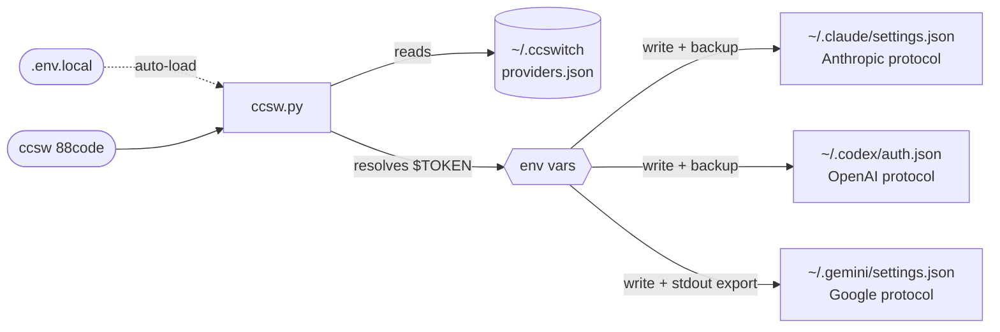

<div align="center">

# ccswitch--terminal

**Unified API provider switcher for Claude Code + Codex CLI + Gemini CLI**

Switch API backends for all three AI terminal tools with one command.
Manage credentials for Anthropic, OpenAI, and Google protocols from a unified config center, with automatic timestamped backups before every write.

[](LICENSE)
[](https://www.python.org/)
[](#installation)

[简体中文](README.md) | English

</div>

---

## Table of Contents

- [Features](#features)
- [How It Works](#how-it-works)
- [Installation](#installation)
- [Quick Start](#quick-start)
- [Local Secrets: .env.local](#local-secrets-envlocal)
- [Live Switching](#live-switching)
- [Per-Tool Independent Config](#per-tool-independent-config)
- [Partial Tool Support](#partial-tool-support)
- [Gemini eval Mode](#gemini-eval-mode)
- [Built-in Providers](#built-in-providers)
- [Adding Providers](#adding-providers)
- [Management Commands](#management-commands)
- [providers.json Schema](#providersjson-schema)
- [Config Write Targets](#config-write-targets)
- [Usage Scenarios](#usage-scenarios)
- [FAQ](#faq)
- [AI Install Prompt](#ai-install-prompt)

---

## Features

- Switch API backends for Claude Code, Codex CLI, and Gemini CLI with one command
- Shortcut commands: `ccsw <provider>` defaults to Claude; `cxsw` for Codex (auto-activates env vars); `gcsw` for Gemini
- `.env.local` support: store tokens in a local file without touching shell config
- Provider configs persisted to `~/.ccswitch/providers.json`
- Tokens stored as `$ENV_VAR` references — secrets never enter the config file
- Gemini API key activated immediately in the current shell via `eval "$(gcsw ...)"`
- Each tool has **independent** base_url and token — three protocols, three configs
- Providers can support 1, 2, or all 3 tools; unsupported tools are silently skipped without touching their active status
- Claude Code re-reads `settings.json` before each request — **live switching without restart**
- Built-in providers: `88code`, `zhipu`, `rightcode`
- Alias support (`88` → `88code`, `rc` → `rightcode`)
- Timestamped backups before every config write
- Zero dependency — Python 3.8+ stdlib only, no pip install needed

---

## How It Works



> [!NOTE]
> **stdout / stderr separation**: all status messages go to stderr (visible in terminal), while `export GEMINI_API_KEY=...` goes to stdout (captured and executed by `eval`). This separation is what makes the Gemini eval mode work correctly.

---

## Installation

```bash
git clone https://github.com/YOUR/ccsw ~/ccsw
bash ~/ccsw/bootstrap.sh
source ~/.zshrc   # or source ~/.bashrc
```

`bootstrap.sh` will:
1. Register `ccsw`, `cxsw`, `gcsw`, and `ccswitch` as shell functions
2. Add `source ~/.ccswitch/active.env` to your shell rc for persistent Gemini env vars
3. Add `source ~/.ccswitch/codex.env` to your shell rc for persistent Codex env vars

Expected output:
```
[ok]   Added ccsw/cxsw/gcsw functions to ~/.zshrc
[ok]   Added active.env source line to ~/.zshrc
[ok]   Added codex.env source line to ~/.zshrc

Installation complete!

Reload your shell:
  source ~/.zshrc

Quick start:
  ccsw list                         # List available providers
  ccsw 88code                       # Switch Claude Code (short form)
  ccsw claude 88code                # Switch Claude Code (explicit)
  cxsw 88code                       # Switch Codex
  gcsw myprovider                   # Switch Gemini
  ccsw all 88code                   # Switch all tools
  ccsw add myprovider               # Add new provider (interactive)
```

---

## Quick Start

> [!TIP]
> `ccsw <provider>` with no tool name defaults to Claude. Full subcommands (`list`, `show`, `add`, etc.) pass through normally.

```bash
# Switch Claude Code (short form — tool name optional)
ccsw 88code

# Switch Claude Code (explicit)
ccsw claude 88code

# Switch Codex CLI (automatically activates OPENAI env vars in current shell)
cxsw 88code

# Switch Gemini CLI (GEMINI_API_KEY activated automatically)
gcsw myprovider

# Switch all three tools at once
ccsw all 88code

# List all providers and active status
ccsw list

# Show currently active config per tool
ccsw show
```

### Shortcut Commands

| Command | Equivalent | Description |
|---------|------------|-------------|
| `ccsw <provider>` | `ccsw claude <provider>` | Omit tool name to default to Claude |
| `cxsw <provider>` | `ccsw codex <provider>` | Codex shortcut, auto-activates OPENAI env vars |
| `gcsw <provider>` | `ccsw gemini <provider>` | Gemini shortcut, auto-activates GEMINI_API_KEY |
| `ccsw all <provider>` | — | Switch all three tools, all env vars activated |
| `ccsw <subcommand>` | — | `list` / `show` / `add` / `remove` / `alias` pass-through |

---

## Local Secrets: .env.local

Create a `.env.local` file in the same directory as `ccsw.py` to store tokens locally — **no need to add exports to `~/.zshrc` or `~/.bashrc`**.

```bash
# ~/ccsw/.env.local  (excluded from git)
CODE88_ANTHROPIC_AUTH_TOKEN=sk-ant-xxxx
CODE88_OPENAI_API_KEY=sk-xxxx
ZHIPU_ANTHROPIC_AUTH_TOKEN=sk-xxxx
```

ccsw loads this file automatically at startup. It only sets variables that are not already present in the environment (existing shell exports take precedence).

Supported syntax:

```bash
KEY=value with spaces           # bare value
KEY="quoted value"              # double-quoted (supports \" and \\ escapes)
KEY='literal value'             # single-quoted (no escape processing)
KEY="line1
line2"                          # multi-line value
export KEY=value                # export prefix (stripped automatically)
# comment line                  # lines starting with # are skipped
```

> [!WARNING]
> `.env.local` contains plaintext secrets. Make sure it is listed in `.gitignore`.

---

## Live Switching

Claude Code re-reads the `env` block of `~/.claude/settings.json` **before every API request**, which means:

> Running `ccsw claude <provider>` in another terminal takes effect on the **very next message** in the active Claude Code session — no restart required.

Steps:

```bash
# Terminal A: Claude Code session is running

# Terminal B: switch provider
ccsw claude zhipu

# Back in Terminal A: send the next message — it uses zhipu provider
```

> [!NOTE]
> The same applies to Codex CLI — `cxsw <provider>` takes effect on the next Codex invocation.
> For Gemini CLI, the env var must be activated in the **same shell** via `eval "$(gcsw ...)"` to take effect immediately.

---

## Per-Tool Independent Config

**Each provider maintains separate URL and token for each tool.**

This is the core design of ccsw: Claude Code uses the Anthropic protocol, Codex CLI uses the OpenAI protocol, and Gemini CLI uses the Google protocol. These are entirely different and must be configured independently.

```json
{
  "providers": {
    "myprovider": {
      "claude": {
        "base_url": "https://api.example.com/anthropic",
        "token": "$MY_CLAUDE_TOKEN"
      },
      "codex": {
        "base_url": "https://api.example.com/openai/v1",
        "token": "$MY_OPENAI_KEY"
      },
      "gemini": {
        "api_key": "$MY_GEMINI_KEY",
        "auth_type": "api-key"
      }
    }
  }
}
```

`ccsw claude myprovider` uses only the `claude` block. `ccsw codex myprovider` uses only the `codex` block. They are fully independent.

---

## Partial Tool Support

**A provider can support only 1 or 2 tools.** Set unsupported tools to `null` — ccsw skips them automatically without modifying their config or updating their active status.

```json
{
  "providers": {
    "claude-only": {
      "claude": { "base_url": "https://api.example.com/anthropic", "token": "$MY_TOKEN" },
      "codex": null,
      "gemini": null
    }
  }
}
```

Running `ccsw all claude-only`:
```
[claude] Updated ~/.claude/settings.json
[codex] Skipped: provider 'claude-only' has no codex config.
[gemini] Skipped: provider 'claude-only' has no gemini config.
```

> [!NOTE]
> The active status for codex and gemini remains unchanged in `ccsw show`. Only a successful write updates the active state, keeping it perfectly in sync with what was actually written to disk.

---

## Gemini Env Activation

`GEMINI_API_KEY` is an environment variable — a child process cannot write it into the parent shell. The `gcsw` and `ccsw gemini/all` shell functions handle `eval` internally, so you can run them directly without any wrapper.

```bash
# Switch Gemini (env var activated automatically)
gcsw myprovider

# Switch all tools (GEMINI_API_KEY and OPENAI vars all activated)
ccsw all 88code
```

### When Calling the Python Script Directly (CI/CD or Docker)

When the shell functions are not available, `eval` is still required:

```bash
eval "$(python3 ccsw.py gemini myprovider)"
eval "$(python3 ccsw.py all 88code)"
```

### active.env Persistence

Every successful Gemini provider switch writes the export statement to `~/.ccswitch/active.env`. After bootstrap.sh configures your shell, new shell sessions automatically source this file — no need to re-run ccsw.

---

## Built-in Providers

| Provider    | Claude Code | Codex CLI | Gemini CLI | Alias |
|-------------|:-----------:|:---------:|:----------:|-------|
| `88code`    | ✅ | ✅ | ❌ | `88` |
| `zhipu`     | ✅ | ❌ | ❌ | `glm` |
| `rightcode` | ❌ | ✅ | ❌ | `rc` |

Token environment variables (resolved from the current shell at switch time, or loaded from `.env.local`):

| Provider | Tool | Environment Variable |
|----------|------|----------------------|
| `88code` | Claude Code | `$CODE88_ANTHROPIC_AUTH_TOKEN` |
| `88code` | Codex CLI | `$CODE88_OPENAI_API_KEY` |
| `zhipu` | Claude Code | `$ZHIPU_ANTHROPIC_AUTH_TOKEN` |
| `rightcode` | Codex CLI | `$RIGHTCODE_API_KEY` |

---

## Adding Providers

### Interactive (no flags)

```bash
ccsw add myprovider
```

Follow the prompts for each tool. Leave blank to skip. Use `$ENV_VAR` syntax for tokens.

### Via CLI Flags

```bash
ccsw add myprovider \
  --claude-url   https://api.example.com/anthropic \
  --claude-token '$MY_CLAUDE_TOKEN' \
  --codex-url    https://api.example.com/openai/v1 \
  --codex-token  '$MY_OPENAI_KEY' \
  --gemini-key   '$MY_GEMINI_KEY'
```

Values prefixed with `$` are resolved from the environment at switch time. Other values are used as literals.

### Update a Single Field

```bash
# Update only the Gemini key, preserving the existing auth_type
ccsw add myprovider --gemini-key '$NEW_KEY'
```

---

## Management Commands

```bash
ccsw list                         # List all providers with active status
ccsw show                         # Show active config details per tool
ccsw add <name> [flags]           # Add or update a provider
ccsw remove <name>                # Remove a provider
ccsw alias <alias> <provider>     # Create an alias
```

---

## providers.json Schema

<details>
<summary><b>Expand to view the full providers.json structure</b></summary>

Located at `~/.ccswitch/providers.json`:

```json
{
  "version": 1,
  "active": { "claude": "88code", "codex": "88code", "gemini": null },
  "aliases": { "88": "88code", "glm": "zhipu", "rc": "rightcode" },
  "providers": {
    "88code": {
      "claude": {
        "base_url": "https://www.88code.ai/api",
        "token": "$CODE88_ANTHROPIC_AUTH_TOKEN",
        "extra_env": {
          "API_TIMEOUT_MS": null,
          "CLAUDE_CODE_DISABLE_NONESSENTIAL_TRAFFIC": null
        }
      },
      "codex": {
        "base_url": "https://www.88code.ai/openai/v1",
        "token": "$CODE88_OPENAI_API_KEY"
      },
      "gemini": null
    }
  }
}
```

`extra_env` values of `null` **remove** that key from the target config — used to clean up residual settings left by other providers.

</details>

---

## Config Write Targets

| Tool | Config File | Fields Written |
|------|-------------|----------------|
| Claude Code | `~/.claude/settings.json` | `env.ANTHROPIC_AUTH_TOKEN`, `env.ANTHROPIC_BASE_URL`, extra_env |
| Codex CLI | `~/.codex/auth.json` | `OPENAI_API_KEY`, `OPENAI_BASE_URL` |
| Codex env | `~/.ccswitch/codex.env` | `OPENAI_API_KEY`, `OPENAI_BASE_URL` |
| Gemini CLI | `~/.gemini/settings.json` | `security.auth.selectedType` |
| Gemini env | stdout + `~/.ccswitch/active.env` | `GEMINI_API_KEY` |

---

## Usage Scenarios

### SSH Remote Server

```bash
ssh user@server
# Once in the remote shell:
eval "$(ccsw all 88code)"
```

### Docker Container

```dockerfile
COPY ccsw.py /usr/local/bin/ccsw.py
RUN chmod +x /usr/local/bin/ccsw.py
ENV CODE88_ANTHROPIC_AUTH_TOKEN=your_token_here
```

```bash
docker exec -it mycontainer bash -c \
  'eval "$(python3 /usr/local/bin/ccsw.py all 88code)"'
```

### CI/CD Pipeline

```yaml
# GitHub Actions
- name: Configure AI tool providers
  env:
    CODE88_ANTHROPIC_AUTH_TOKEN: ${{ secrets.CODE88_TOKEN }}
    CODE88_OPENAI_API_KEY: ${{ secrets.CODE88_OPENAI_KEY }}
  run: |
    python ccsw.py claude 88code
    python ccsw.py codex 88code
```

---

## FAQ

<details>
<summary><b>Q: What does <code>[claude] Skipped: token unresolved</code> mean?</b></summary>

The token is configured as `$MY_ENV_VAR`, but that variable is not set in the current environment.

Two ways to fix:
- `export MY_ENV_VAR=your_token` (temporary, current shell only)
- Add `MY_ENV_VAR=your_token` to `.env.local` in the ccsw directory (recommended)

</details>

<details>
<summary><b>Q: What's the difference between .env.local and exporting in ~/.zshrc?</b></summary>

`.env.local` tokens are only loaded when ccsw runs — they don't pollute the global shell environment. Exports in `~/.zshrc` are present in every shell session. For AI tool tokens, `.env.local` is safer: the values won't accidentally appear in `env` output or other tools.

</details>

<details>
<summary><b>Q: Does switching providers mid-conversation work in Claude Code?</b></summary>

Yes. Claude Code re-reads the `env` block of `~/.claude/settings.json` before each API request. Run `ccsw claude <provider>` in another terminal and the very next message in your active Claude Code session will use the new provider — **no restart required**.

</details>

<details>
<summary><b>Q: After running gcsw, $GEMINI_API_KEY is still empty?</b></summary>

Check:
1. Are the shell functions installed? Run `type gcsw` to confirm.
2. Are you running it in the same shell session? (subshells do not inherit)
3. If calling the Python script directly (bypassing the shell function), you still need `eval "$(python3 ccsw.py gemini ...)"`.

</details>

<details>
<summary><b>Q: Will ccsw all fail if a provider only supports some tools?</b></summary>

No. Set unsupported tools to `null` and ccsw prints a `Skipped` message then continues. Other tools switch normally and the skipped tools' active status is unchanged.

</details>

<details>
<summary><b>Q: How do I verify what config is actually active?</b></summary>

```bash
ccsw show                       # active provider + URL/token reference
cat ~/.claude/settings.json     # actual Claude config written to disk
cat ~/.codex/auth.json          # actual Codex config written to disk
```

</details>

<details>
<summary><b>Q: My ~/.claude/settings.json was overwritten — how do I recover?</b></summary>

ccsw creates a timestamped backup before every write, e.g. `settings.json.bak-20260313-120000`. Copy it back with `cp`.

</details>

<details>
<summary><b>Q: How is ccsw &lt;provider&gt; different from ccsw claude &lt;provider&gt;?</b></summary>

They are identical. The `ccsw` shell function (installed by bootstrap.sh) detects when the first argument is not a known subcommand (`claude`, `codex`, `gemini`, `all`, `list`, `show`, `add`, `remove`, `alias`) and automatically prepends `claude`.

</details>

---

## AI Install Prompt

If you're using Claude Code or another AI tool, send the following prompt to have the AI set it up for you:

```
Please install the ccsw provider switcher tool:
1. Clone the repo to ~/ccsw (skip if it already exists)
2. Run bash ~/ccsw/bootstrap.sh
3. source ~/.zshrc (or ~/.bashrc)
4. Write my token environment variables to ~/ccsw/.env.local
5. Add my provider config to ~/.ccswitch/providers.json
6. Run ccsw list to confirm installation, ccsw show to verify current state
Note: use $ENV_VAR format for tokens in providers.json — never hardcode secrets.
```

---

## Requirements

Python 3.8+ (stdlib only — no `pip install` needed)

## License

MIT

---

<div align="right">

[⬆ Back to top](#ccswitch--terminal)

</div>
