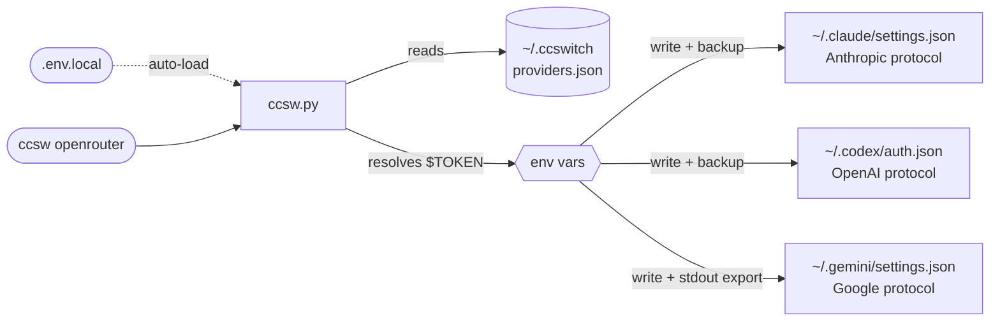

<div align="center">

# ccswitch--terminal

**Unified API provider switcher for Claude Code + Codex CLI + Gemini CLI**

[](LICENSE)
[](https://www.python.org/)
[](#installation)

[简体中文](README.md) | English

</div>

---

## Introduction

Using Claude Code, Codex CLI, and Gemini CLI simultaneously? Tired of manually editing multiple config files and remembering different token field formats every time you switch API providers? **ccswitch** solves exactly this.

- **One-click switching**: `ccsw 88code` switches Claude; `ccsw all 88code` syncs all three tools at once
- **Config isolation**: each provider maintains independent URLs and tokens for all three protocols (Anthropic / OpenAI / Google)
- **Security first**: tokens are stored as `$ENV_VAR` references — secrets never enter config files; automatic backup before every write
- **Seamless integration**: live switching in active Claude Code sessions; Gemini env vars auto-activated; no restarts needed

---

## Installation

**One-click install via Claude Code / Codex** — copy the prompt below, fill in the `<...>` placeholders, and send it directly:

```
Please install ccswitch (AI terminal tool API switcher):

Repo: https://github.com/Boulea7/ccswitch--terminal
Setup: clone to ~/ccsw → run bootstrap.sh → source ~/.zshrc

Then configure a provider for me:
  Name: <provider-name>    Alias: <short-name>
  Claude URL:   <https://api.example.com/anthropic>
  Claude Token: <sk-ant-xxxx>
  Codex URL:    <https://api.example.com/openai/v1>
  Codex Token:  <sk-xxxx>
  Gemini Key:   <gm-xxxx or leave blank to skip>

Write tokens in plaintext to ~/ccsw/.env.local, reference them as $ENV_VAR in providers.json.
Finally run ccsw list and ccsw show to confirm.
```

<details>
<summary>Example: pre-filled version using OpenRouter</summary>

```
Please install ccswitch (AI terminal tool API switcher):

Repo: https://github.com/Boulea7/ccswitch--terminal
Setup: clone to ~/ccsw → run bootstrap.sh → source ~/.zshrc

Then configure a provider for me:
  Name: openrouter    Alias: or
  Claude URL:   https://openrouter.ai/api
  Claude Token: sk-or-v1-xxxx
  Codex URL:    https://openrouter.ai/api/v1
  Codex Token:  sk-or-v1-xxxx
  Gemini Key:   leave blank to skip

Write tokens in plaintext to ~/ccsw/.env.local, reference them as $ENV_VAR in providers.json.
Finally run ccsw list and ccsw show to confirm.
```

</details>

**Manual install (3 commands):**

```bash
git clone https://github.com/Boulea7/ccswitch--terminal ~/ccsw
bash ~/ccsw/bootstrap.sh
source ~/.zshrc   # or source ~/.bashrc
```

After `bootstrap.sh`, four shell functions are registered (`ccsw`, `cxsw`, `gcsw`, `ccswitch`) and Gemini / Codex env var persistence is configured.

---

## Basic Usage

```bash
# -- switch --
ccsw openrouter                   # Switch Claude (tool name optional)
cxsw openrouter                   # Switch Codex (auto-activates OPENAI env vars)
gcsw myprovider                   # Switch Gemini (auto-activates GEMINI_API_KEY)
ccsw all openrouter               # Switch all three tools at once

# -- manage --
ccsw list                         # List all providers
ccsw show                         # Show active config
ccsw add <name>                   # Add or update a provider
ccsw remove <name>                # Remove a provider
ccsw alias <alias> <provider>     # Create an alias
```

---

## Advanced Features

<details>
<summary><b>Local Secrets: .env.local</b></summary>

Create a `.env.local` file in the same directory as `ccsw.py` to store tokens locally — **no need to add exports to `~/.zshrc` or `~/.bashrc`**.

```bash
# ~/ccsw/.env.local  (excluded from git)
OPENROUTER_API_KEY=sk-or-v1-xxxx
AIHUBMIX_API_KEY=sk-xxxx
CODE88_ANTHROPIC_AUTH_TOKEN=sk-ant-xxxx
CODE88_OPENAI_API_KEY=sk-xxxx
```

ccsw loads this file automatically at startup. It only sets variables not already present in the environment (existing shell exports take precedence).

> [!WARNING]
> `.env.local` contains plaintext secrets. Make sure it is listed in `.gitignore`.

</details>

<details>
<summary><b>Live Switching Mid-Conversation</b></summary>

Claude Code re-reads the `env` block of `~/.claude/settings.json` **before every API request**, which means:

> Running `ccsw claude <provider>` in another terminal takes effect on the **very next message** in the active Claude Code session — no restart required.

```bash
# Terminal A: Claude Code session is running

# Terminal B: switch provider
ccsw claude openrouter

# Back in Terminal A: send the next message — it uses openrouter provider
```

> [!NOTE]
> The same applies to Codex CLI — `cxsw <provider>` takes effect on the next Codex invocation.
> For Gemini CLI, the env var must be activated in the **same shell** by running `gcsw` to take effect immediately.

</details>

<details>
<summary><b>Per-Tool Config & Env Vars</b></summary>

**Each provider maintains separate URL and token for each tool.**

Claude Code uses the Anthropic protocol, Codex CLI uses the OpenAI protocol, and Gemini CLI uses the Google protocol — entirely different, configured independently:

```json
{
  "providers": {
    "myprovider": {
      "claude": { "base_url": "https://api.example.com/anthropic", "token": "$MY_CLAUDE_TOKEN" },
      "codex":  { "base_url": "https://api.example.com/openai/v1", "token": "$MY_OPENAI_KEY" },
      "gemini": { "api_key": "$MY_GEMINI_KEY", "auth_type": "api-key" }
    }
  }
}
```

**A provider can support only 1 or 2 tools.** Set unsupported tools to `null` — they are skipped automatically:

```
ccsw all claude-only output:
[claude] Updated ~/.claude/settings.json
[codex]  Skipped: provider 'claude-only' has no codex config.
[gemini] Skipped: provider 'claude-only' has no gemini config.
```

**Gemini env var activation**: `GEMINI_API_KEY` is an environment variable — a child process cannot write it into the parent shell. The `gcsw` and `ccsw gemini/all` shell functions handle `eval` internally:

```bash
gcsw myprovider          # Switch Gemini (env var activated automatically)
ccsw all 88code          # Switch all tools (GEMINI_API_KEY and OPENAI vars all activated)
```

**When calling the Python script directly (CI/CD or Docker)**, `eval` is still required:

```bash
eval "$(python3 ccsw.py gemini myprovider)"
eval "$(python3 ccsw.py all 88code)"
```

Every successful Gemini switch writes the export statement to `~/.ccswitch/active.env`. New shell sessions source this file automatically — no need to re-run ccsw.

</details>

---

## Provider Management

<details>
<summary><b>Built-in Providers</b></summary>

| Provider | Claude Code | Codex CLI | Gemini CLI | Alias | Token Env Vars |
|----------|:-----------:|:---------:|:----------:|-------|----------------|
| `88code` | ✅ | ✅ | ❌ | `88` | `$CODE88_ANTHROPIC_AUTH_TOKEN` / `$CODE88_OPENAI_API_KEY` |
| `zhipu` | ✅ | ❌ | ❌ | `glm` | `$ZHIPU_ANTHROPIC_AUTH_TOKEN` |
| `rightcode` | ❌ | ✅ | ❌ | `rc` | `$RIGHTCODE_API_KEY` |
| `anyrouter` | ✅ | ❌ | ❌ | `any` | `$ANYROUTER_ANTHROPIC_AUTH_TOKEN` |

Tokens are resolved from the current shell at switch time, or loaded from `.env.local`.

</details>

<details>
<summary><b>Common Provider Reference</b></summary>

Popular third-party providers and their typical configurations. Once you have an API key, add them with `ccsw add`:

**OpenRouter** (international, recommended)
```bash
ccsw add openrouter \
  --claude-url   https://openrouter.ai/api \
  --claude-token '$OPENROUTER_API_KEY' \
  --codex-url    https://openrouter.ai/api/v1 \
  --codex-token  '$OPENROUTER_API_KEY'
```

**AiHubMix** (international)
```bash
ccsw add aihubmix \
  --claude-url   https://aihubmix.com/v1 \
  --claude-token '$AIHUBMIX_API_KEY' \
  --codex-url    https://aihubmix.com/v1 \
  --codex-token  '$AIHUBMIX_API_KEY'
```

**88code** (China market)
```bash
# Already built-in — just run: ccsw 88code
# To add manually:
ccsw add 88code \
  --claude-url   https://www.88code.ai/api \
  --claude-token '$CODE88_ANTHROPIC_AUTH_TOKEN' \
  --codex-url    https://www.88code.ai/openai/v1 \
  --codex-token  '$CODE88_OPENAI_API_KEY'
```

**One API / New API** (self-hosted)
```bash
ccsw add my-oneapi \
  --claude-url   https://your-oneapi-domain.com/anthropic \
  --claude-token '$ONEAPI_API_KEY' \
  --codex-url    https://your-oneapi-domain.com/v1 \
  --codex-token  '$ONEAPI_API_KEY'
```

**AnyRouter** (Claude Code relay)
```bash
# Already built-in — just run: ccsw any
# To add manually:
ccsw add anyrouter \
  --claude-url   https://anyrouter.top \
  --claude-token '$ANYROUTER_ANTHROPIC_AUTH_TOKEN'
ccsw alias any anyrouter
```

> Exact URLs vary by provider — always check their official documentation. Common patterns:
> - Anthropic protocol: `/api`, `/v1`, `/api/anthropic`
> - OpenAI protocol: `/v1`, `/openai/v1`

</details>

<details>
<summary><b>Adding Custom Providers</b></summary>

**Interactive (recommended):**

```bash
ccsw add myprovider
```

Follow the prompts for each tool. Leave blank to skip. Use `$ENV_VAR` syntax for tokens.

**Via CLI flags:**

```bash
ccsw add myprovider \
  --claude-url   https://api.example.com/anthropic \
  --claude-token '$MY_CLAUDE_TOKEN' \
  --codex-url    https://api.example.com/openai/v1 \
  --codex-token  '$MY_OPENAI_KEY' \
  --gemini-key   '$MY_GEMINI_KEY'
```

**Update a single field:**

```bash
ccsw add myprovider --gemini-key '$NEW_KEY'   # Update only the Gemini key
```

</details>

---

## Architecture

<details>
<summary><b>How It Works & Config Write Targets</b></summary>



> [!NOTE]
> **stdout / stderr separation**: all status messages go to stderr (visible in terminal), while `export GEMINI_API_KEY=...` goes to stdout (captured and executed by `eval`).

| Tool | Config File | Fields Written |
|------|-------------|----------------|
| Claude Code | `~/.claude/settings.json` | `env.ANTHROPIC_AUTH_TOKEN`, `env.ANTHROPIC_BASE_URL`, extra_env |
| Codex CLI | `~/.codex/auth.json` | `OPENAI_API_KEY`, `OPENAI_BASE_URL` |
| Codex env | `~/.ccswitch/codex.env` | `OPENAI_API_KEY`, `OPENAI_BASE_URL` |
| Gemini CLI | `~/.gemini/settings.json` | `security.auth.selectedType` |
| Gemini env | stdout + `~/.ccswitch/active.env` | `GEMINI_API_KEY` |

</details>

<details>
<summary><b>providers.json Schema</b></summary>

Located at `~/.ccswitch/providers.json`:

```json
{
  "version": 1,
  "active": { "claude": "88code", "codex": "88code", "gemini": null },
  "aliases": { "88": "88code", "glm": "zhipu", "rc": "rightcode" },
  "providers": {
    "88code": {
      "claude": {
        "base_url": "https://www.88code.ai/api",
        "token": "$CODE88_ANTHROPIC_AUTH_TOKEN",
        "extra_env": {
          "API_TIMEOUT_MS": null,
          "CLAUDE_CODE_DISABLE_NONESSENTIAL_TRAFFIC": null
        }
      },
      "codex": {
        "base_url": "https://www.88code.ai/openai/v1",
        "token": "$CODE88_OPENAI_API_KEY"
      },
      "gemini": null
    }
  }
}
```

`extra_env` values of `null` **remove** that key from the target config — used to clean up residual settings left by other providers.

</details>

<details>
<summary><b>Usage Scenarios: SSH / Docker / CI-CD</b></summary>

**SSH Remote Server**

```bash
ssh user@server
# Once in the remote shell:
eval "$(ccsw all openrouter)"
```

**Docker Container**

```dockerfile
COPY ccsw.py /usr/local/bin/ccsw.py
RUN chmod +x /usr/local/bin/ccsw.py
ENV OPENROUTER_API_KEY=your_token_here
```

```bash
docker exec -it mycontainer bash -c \
  'eval "$(python3 /usr/local/bin/ccsw.py all openrouter)"'
```

**CI/CD Pipeline (GitHub Actions)**

```yaml
- name: Configure AI tool providers
  env:
    OPENROUTER_API_KEY: ${{ secrets.OPENROUTER_API_KEY }}
  run: |
    python ccsw.py claude openrouter
    python ccsw.py codex openrouter
```

</details>

---

## FAQ

<details>
<summary><b>Q: After running gcsw, $GEMINI_API_KEY is still empty?</b></summary>

Check:
1. Are the shell functions installed? Run `type gcsw` to confirm.
2. Are you running it in the same shell session? (subshells do not inherit parent shell variables)
3. If calling the Python script directly (bypassing the shell function), you still need `eval "$(python3 ccsw.py gemini ...)"`.

</details>

<details>
<summary><b>Q: What does <code>[claude] Skipped: token unresolved</code> mean?</b></summary>

The token is configured as `$MY_ENV_VAR`, but that variable is not set in the current environment.

Two ways to fix:
- `export MY_ENV_VAR=your_token` (temporary, current shell only)
- Add `MY_ENV_VAR=your_token` to `.env.local` in the ccsw directory (recommended)

</details>

<details>
<summary><b>Q: My ~/.claude/settings.json was overwritten — how do I recover?</b></summary>

ccsw creates a timestamped backup before every write, e.g. `settings.json.bak-20260313-120000`. Copy it back with `cp`.

</details>

<details>
<summary><b>Q: What's the difference between .env.local and exporting in ~/.zshrc?</b></summary>

`.env.local` tokens are only loaded when ccsw runs — they don't pollute the global shell environment. Exports in `~/.zshrc` are present in every shell session. For AI tool tokens, `.env.local` is safer: the values won't accidentally appear in `env` output or other tools.

</details>

---

## Requirements

Python 3.8+ (stdlib only — no `pip install` needed)

## License

MIT

---

<div align="right">

[⬆ Back to top](#ccswitch--terminal)

</div>
