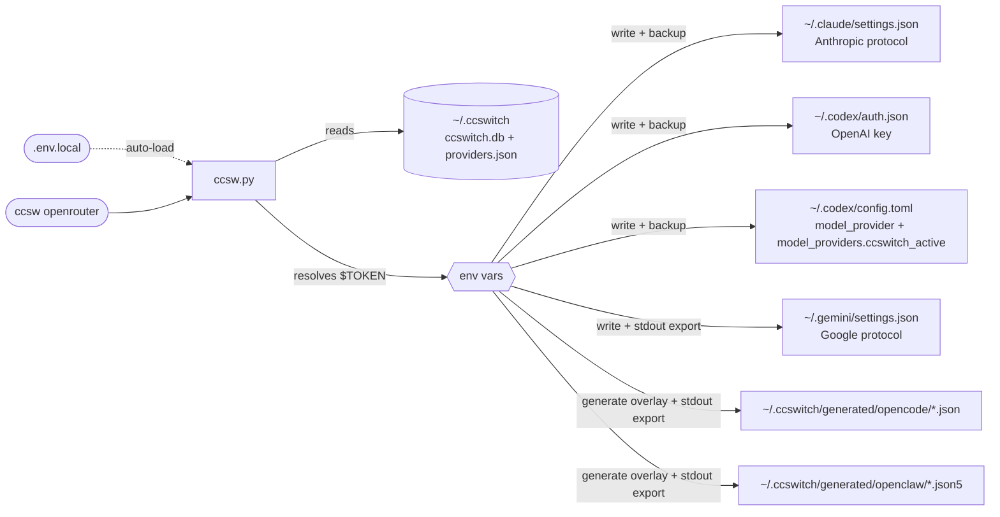

<div align="center">


# ccswitch-terminal

**Unified API provider switcher for Claude Code + Codex CLI + Gemini CLI + OpenCode + OpenClaw**

[](LICENSE)
[](https://github.com/Boulea7/ccswitch-terminal/actions/workflows/ci.yml)
[](https://www.python.org/)
[](#installation)

[简体中文](README.md) | English | [日本語](README_JA.md) | [Español](README_ES.md) | [Português](README_PT.md) | [Русский](README_RU.md)

[CI workflow](https://github.com/Boulea7/ccswitch-terminal/actions/workflows/ci.yml) | [CodeQL](https://github.com/Boulea7/ccswitch-terminal/actions/workflows/codeql.yml) | [Issue templates](https://github.com/Boulea7/ccswitch-terminal/issues/new/choose) | [Changelog](CHANGELOG.md) | [Releasing](RELEASING.md) | [Contributing](CONTRIBUTING.md) | [Security](SECURITY.md) | [Support](SUPPORT.md)

</div>

---

## Introduction

Using Claude Code, Codex CLI, Gemini CLI, OpenCode, and OpenClaw simultaneously? Tired of manually editing multiple config files and remembering different token field formats every time you switch API providers? **ccswitch** solves exactly this.

- **One-click switching**: `ccsw openrouter` switches Claude; `ccsw all openrouter` now preflights the whole batch and then switches configured tools in a strict fail-closed way
- **Five-tool control plane**: direct live-config writes for `Claude / Codex / Gemini`, generated overlays for `OpenCode / OpenClaw`
- **CLI-only productization**: adds `profile`, `doctor`, `run`, `history`, `rollback`, and `settings` without adding a GUI; `doctor --json` emits one NDJSON payload per tool with a stable top-level shape for automation
- **Clear runtime boundary**: `run` now persists a `managed_targets` lease/manifest in SQLite for stale runtime diagnostics; it is still a temporary fallback wrapper for the current command and does not silently change the active provider afterwards
- **Clear security boundary**: primary state lives in `SQLite + JSON snapshot`; store commits are now revision-guarded to reduce stale overwrite risks, state directories/files use explicit private permissions, new secrets default to env refs, probe/history payloads are redacted before persistence, and `managed_targets` may still temporarily retain live-file snapshots for restore, but legacy inline `content_b64` snapshots are now scrubbed or externalized during load / repair instead of lingering in SQLite indefinitely
- **More conservative shell activation**: if SQLite commit succeeds but `providers.json` snapshot sync fails, the command exits explicitly and no longer emits stdout `export` lines, so `eval "$(python3 ccsw.py ...)"` cannot leave the parent shell in a half-switched state
- **Linux / WSL friendly**: supports config directory overrides so each managed CLI can point at a different home, workspace, or WSL distribution config root

---

## Installation

<details>
<summary><b>Quick Navigation</b></summary>

- Installation: start with manual install; use the AI-assisted prompt as an optional shortcut
- Basic Usage: switching, profiles, doctor, run, rollback, repair
- Advanced Features: source-chain, runtime lease, history schema, Codex deep doctor
- Develop & Verify: minimum verification plus CLI smoke

</details>

> [!IMPORTANT]
> `ccswitch` manages existing Claude Code, Codex CLI, Gemini CLI, OpenCode, and OpenClaw installations. It does not install those CLIs for you. Install any tool you want to manage before running `bootstrap.sh`, `doctor`, or a switch command for that tool.

**Manual install first**

```bash
git clone https://github.com/Boulea7/ccswitch-terminal ~/ccsw
bash ~/ccsw/bootstrap.sh
source ~/.zshrc   # or source ~/.bashrc
python3 ~/ccsw/ccsw.py -h
```

`bootstrap.sh` currently auto-configures `bash` / `zsh` rc files, registers `ccsw`, `cxsw`, `gcsw`, `opsw`, `clawsw`, and `ccswitch`, and wires Gemini / Codex / OpenCode / OpenClaw activation env persistence. In other POSIX-compatible shells, you can usually run `python3 ccsw.py ...` directly and, if needed, load the generated `~/.ccswitch/*.env` snippets with `.`/`source`. In non-POSIX shells such as `fish` or PowerShell, do not source those files directly; run `python3 ccsw.py ...` and translate the emitted exports into your shell's syntax instead.

If you want to validate the installer itself without touching your real shell config first, run:

```bash
bash ~/ccsw/bootstrap.sh --dry-run
```

`--dry-run` only prints the actions it would take and writes no files. You can also redirect bootstrap output to temporary targets with `BOOTSTRAP_HOME` and `BOOTSTRAP_RC_FILE`.

If you later want to remove the bootstrap integration, delete the managed block between `# >>> ccsw bootstrap >>>` and `# <<< ccsw bootstrap <<<` from your rc file, remove the `active.env` / `codex.env` / `opencode.env` / `openclaw.env` source lines that bootstrap added, reload the shell, and optionally delete `~/ccsw` plus `~/.ccswitch` if you no longer need the local store or generated overlays. `bootstrap.sh` does not currently ship an uninstall flag.

<details>
<summary><b>One-click install via Claude Code / Codex</b></summary>

Copy the prompt below, fill in the `<...>` placeholders, and send it directly:

```text
Please install ccswitch (AI terminal tool API switcher):

Repo: https://github.com/Boulea7/ccswitch-terminal
Setup: clone to ~/ccsw → run bootstrap.sh → source ~/.zshrc
Prerequisite: the managed CLIs are already installed on this machine.

Then configure a provider for me:
  Name: <provider-name>    Alias: <short-name>
  Claude URL:   <https://api.example.com/anthropic>
  Claude Token: <your-claude-token>
  Codex URL:    <https://api.example.com/openai/v1>
  Codex Token:  <your-codex-token>
  Gemini Key:   <your-gemini-key or leave blank to skip>

Write tokens in plaintext to ~/ccsw/.env.local, reference them as $ENV_VAR in providers.json.
Finally run python3 ~/ccsw/ccsw.py list and python3 ~/ccsw/ccsw.py show to confirm.
```

<details>
<summary>Example: pre-filled version using a custom provider</summary>

```text
Please install ccswitch (AI terminal tool API switcher):

Repo: https://github.com/Boulea7/ccswitch-terminal
Setup: clone to ~/ccsw → run bootstrap.sh → source ~/.zshrc
Prerequisite: the managed CLIs are already installed on this machine.

Then configure a provider for me:
  Name: openrouter    Alias: demo
  Claude URL:   https://api.example.com/anthropic
  Claude Token: <your-claude-token>
  Codex URL:    https://api.example.com/openai/v1
  Codex Token:  <your-codex-token>
  Gemini Key:   leave blank to skip

Write tokens in plaintext to ~/ccsw/.env.local, reference them as $ENV_VAR in providers.json.
Finally run python3 ~/ccsw/ccsw.py list and python3 ~/ccsw/ccsw.py show to confirm.
```

</details>
</details>

---

## Basic Usage

```bash
# -- switch --
ccsw openrouter                   # Switch Claude (tool name optional)
cxsw openrouter                   # Switch Codex (activates OPENAI_API_KEY and updates the custom model_provider)
gcsw openrouter                   # Switch Gemini (auto-activates GEMINI_API_KEY)
opsw openrouter                   # Switch OpenCode (activates OPENCODE_CONFIG)
clawsw openrouter                 # Switch OpenClaw (activates OPENCLAW_CONFIG_PATH)
ccsw all openrouter               # Switch all five tools at once

# -- manage --
ccsw list                         # List all providers
ccsw show                         # Show active config
ccsw add <name>                   # Add or update a provider
ccsw remove <name>                # Remove a provider and prune matching profile queues
ccsw alias <alias> <provider>     # Create an alias
ccsw profile add <name> --codex a,b --opencode c
ccsw profile use <name>           # Preflight queues, then use the first candidate per configured tool
ccsw settings get                 # Show current settings
ccsw settings set codex_config_dir ~/.codex-alt
ccsw import current codex rescued-codex
ccsw doctor all                   # Config validation + probe + runtime lease diagnostics
ccsw history --limit 20           # Show switch and run history
ccsw rollback codex               # Fail closed on live drift; results are written as rollback-result
ccsw repair codex                 # Repair a stale runtime lease / restore scene for one tool
ccsw run codex work -- codex exec "hello"   # Temporary fallback for this command only; the run lease/manifest is persisted in SQLite
```

---

## Advanced Features

<details>
<summary><b>Local Secrets: .env.local</b></summary>

Create a `.env.local` file in the same directory as `ccsw.py` to store tokens locally — **no need to add exports to `~/.zshrc` or `~/.bashrc`**.

```bash
# ~/ccsw/.env.local  (excluded from git)
MY_PROVIDER_CLAUDE_TOKEN=<your-claude-token>
MY_PROVIDER_CODEX_TOKEN=<your-codex-token>
MY_PROVIDER_GEMINI_KEY=<your-gemini-key>
```

ccsw loads this file automatically at startup. It only sets variables not already present in the environment (existing shell exports take precedence).

> [!IMPORTANT]
> `.env.local` solves how secrets are referenced from `providers.json` and shell startup files; once you run a switch, the resolved secrets are still written into the target tool config or activation files. For `run`, runtime lease/manifest state may also temporarily keep managed live-file snapshots so restore can succeed after interruption.

> [!WARNING]
> `.env.local` contains plaintext secrets. Make sure it is listed in `.gitignore`.

> [!NOTE]
> `ccsw add` and `import current` now reject new literal secrets by default. Prefer `$ENV_VAR` or `.env.local`; only pass `--allow-literal-secrets` if you intentionally want plaintext stored in the provider store.

</details>

<details>
<summary><b>Live Switching Mid-Conversation</b></summary>

Claude Code re-reads the `env` block of `~/.claude/settings.json` **before every API request**, which means:

> Running `ccsw claude <provider>` in another terminal takes effect on the **very next message** in the active Claude Code session — no restart required.

```bash
# Terminal A: Claude Code session is running

# Terminal B: switch provider
ccsw claude openrouter

# Back in Terminal A: send the next message — it uses openrouter
```

> [!NOTE]
> The same applies to Codex CLI — `cxsw <provider>` takes effect on the next Codex invocation.
> For Gemini CLI, the env var must be activated in the **same shell** by running `gcsw` to take effect immediately.

</details>

<details>
<summary><b>Per-Tool Config & Env Vars</b></summary>

**Each provider maintains separate URL, token, model, or overlay fields for each tool.**

Claude Code uses the Anthropic protocol, Codex CLI uses the OpenAI protocol, and Gemini CLI uses the Google protocol — entirely different, configured independently:

```json
{
  "providers": {
    "openrouter": {
      "claude": { "base_url": "https://api.example.com/anthropic", "token": "$MY_PROVIDER_CLAUDE_TOKEN" },
      "codex":  { "base_url": "https://api.example.com/openai/v1", "fallback_base_url": "https://backup.example.com/openai/v1", "token": "$MY_PROVIDER_CODEX_TOKEN" },
      "gemini": { "api_key": "$MY_PROVIDER_GEMINI_KEY", "auth_type": "api-key" }
    }
  }
}
```

**A provider can cover only a subset of tools.** Set unsupported tools to `null` — they are skipped automatically:

```
ccsw all partial-provider output:
[claude] Updated ~/.claude/settings.json
[codex]  Skipped: provider 'partial-provider' has no codex config.
[gemini] Skipped: provider 'partial-provider' has no gemini config.
```

**Gemini / Codex env activation**: `GEMINI_API_KEY` and `OPENAI_API_KEY` are environment variables — a child process cannot write them into the parent shell. The `gcsw`, `cxsw`, and `ccsw gemini/all` shell functions handle `eval` internally:

```bash
gcsw openrouter          # Switch Gemini (env var activated automatically)
cxsw openrouter          # Switch Codex (API key activated and the custom model_provider refreshed)
ccsw all openrouter      # Switch all tools
```

**When calling the Python script directly (CI/CD or Docker)**, `eval` is still required:

```bash
eval "$(python3 ccsw.py gemini openrouter)"
eval "$(python3 ccsw.py all openrouter)"
```

Every successful Gemini switch writes the export statement to `~/.ccswitch/active.env`. New shell sessions source this file automatically — no need to re-run ccsw.

</details>

<details>
<summary><b>Profile / Settings / Import / Doctor / Run</b></summary>

`ccswitch-terminal` can now store reusable multi-tool profiles instead of switching only one provider at a time.

```bash
ccsw profile add work \
  --claude openrouter \
  --codex openrouter,secondary-codex \
  --gemini gemini-official \
  --opencode opencode-primary \
  --openclaw openclaw-primary

ccsw profile show work
ccsw profile use work
```

`profile use` now validates every configured queue and activation prerequisite before switching anything. Missing providers, stale aliases, unresolved secrets, missing required URLs, or empty queues stop the command before any partial activation is written. A profile with no configured tool queues now also fails closed instead of becoming a silent no-op.

Use `settings` to manage device-level config directory overrides. The currently supported keys are:

- `claude_config_dir`
- `codex_config_dir`
- `gemini_config_dir`
- `opencode_config_dir`
- `openclaw_config_dir`

```bash
ccsw settings get
ccsw settings get codex_config_dir
ccsw settings set codex_config_dir ~/.codex-alt
ccsw settings set codex_config_dir null
```

> [!NOTE]
> `opencode_config_dir` / `openclaw_config_dir` currently affect live-config discovery, `import current` fallback reads, and `doctor` path diagnostics. OpenCode fallback `auth.json` discovery now follows `opencode_config_dir` as well. Generated overlays still live under `~/.ccswitch/generated/...`. On WSL, prefer POSIX paths like `/mnt/<drive>/...`; `doctor` will warn on `C:\...` style paths but will not rewrite them automatically.

Use `import` to pull live config back into the provider store. Coverage currently exists for all five tools:

- `ccsw import current claude <name>`: imports the current token and optional base URL from `~/.claude/settings.json`
- `ccsw import current codex <name>`: imports `OPENAI_API_KEY` from `~/.codex/auth.json` plus the provider block selected by the current root `model_provider`; if none is selected, it falls back to legacy `openai_base_url`
- `ccsw import current gemini <name>`: imports `GEMINI_API_KEY` and optional `security.auth.selectedType`
- `ccsw import current opencode <name>`: imports `baseURL`, `apiKey`, and `model` from the active overlay first, then falls back to `opencode.json` / `auth.json` when needed; only controlled metadata is accepted (`provider_id`, `npm`, allowlisted `headers`); multi-provider overlays are rejected unless an existing stored `provider_id` disambiguates them
- `ccsw import current openclaw <name>`: imports provider id, `baseUrl`, `apiKey`, primary model, and safe overlay metadata (`api`, `profile`) from the active overlay first; if the active overlay exists but is partial, it now falls back to the live config-dir files and `.env`; multi-provider overlays are rejected unless an existing stored `provider_id` disambiguates them

```bash
ccsw import current claude rescued-claude
ccsw import current codex rescued-codex
ccsw import current gemini rescued-gemini
ccsw import current opencode rescued-opencode
ccsw import current openclaw rescued-openclaw
```

`import current` keeps an existing `$ENV_VAR` or `{"env":[...]}` reference only when that exact provider field already stores the ref and its resolved value matches the live secret. It does not infer new env refs from the current environment or `.env.local`. If a live secret would need to be imported as plaintext, the command now fails by default unless `--allow-literal-secrets` is explicitly provided.

Use `doctor` in **safe mode** by default: config validation, target-path checks, overlay activation checks, and read-only probes. Only explicit `--deep` requests trigger stronger protocol probing.

```bash
ccsw doctor all
ccsw doctor codex openrouter
ccsw doctor codex openrouter --deep
ccsw doctor codex openrouter --json
ccsw doctor codex openrouter --cached
ccsw doctor codex openrouter --clear-cache --json
ccsw doctor codex openrouter --history --limit 5
```

It reports `ok`, `degraded`, `failed`, or `missing`; `doctor all` returns a non-zero exit code as soon as any tool is not `ok`. It does not add a separate aggregated `mixed/partial` enum, so automation should consume each per-tool payload directly. The default checks now include:

- all tools: a `managed_targets` runtime lease check first; if a persisted lease would still block a fresh `run` / `repair`, doctor no longer reports `ok`. When the blocking lease belongs to another target or lacks target identity, doctor preserves `lease_for_other_target` / `lease_target_unknown` as the reason code instead of hiding the problem. The runtime lease check still distinguishes `stale_lease`, `dangling_runtime_dir`, `runtime_pid_dead`, `runtime_child_running`, `runtime_busy`, `runtime_phase_stuck`, and `invalid_phase`
- `codex`: separate `primary` / `fallback` / `selected` `/models` probes plus validation of live `auth.json` and the `ccswitch_active` provider block inside `config.toml`; explicit `--deep` adds `GET /responses` / `POST /responses` probes and clearer HTTP Responses compatibility signals. Top-level `summary_reason` now keeps higher-value causes such as `auth_error`, `config_mismatch`, `unsafe_transport`, or `model_unresolved` instead of overwriting them with transport rollups; `POST /responses` still classifies `400/422` as `probe_payload_rejected` and `408/429` as transient degradation
- `claude`: token resolution plus detection of live `settings.json` mismatches against the stored base URL / token
- `gemini`: API key resolution plus `settings.json` auth-type alignment
- `opencode/openclaw`: generated overlay presence, resolved-path activation matching, target config-dir path diagnostics, and active overlay content checks against the stored provider config; `mismatch_fields` now lists the exact differing keys, including `npm` for OpenCode and `profile` for OpenClaw. `import current` now follows a unified source-chain: activation overlay first, safe fallback only when the overlay is missing or single-provider-but-partial, and fail-closed when a multi-provider overlay cannot be disambiguated via an existing `provider_id`. OpenCode auth fallback also returns to the default XDG data home instead of incorrectly reading the config directory
- all tools: if the stored secret is still literal instead of an env ref, doctor now degrades the top-level result as well as the nested check with `store_literal_secret`, so older store entries can be cleaned up gradually
- `--cached`: reads only the latest probe cache and does not recompute current runtime-lease or live-drift state
- `--history`: shows recorded probe history; this is an audit view rather than a health verdict, so a successful history read exits `0`
- `--json`: emits newline-delimited JSON with exactly one payload per tool and no wrapping array; each payload now stably includes `schema_version`, `checked_at`, `checks`, `detail`, and `history`, while still exposing `summary_reason` and `probe_mode`

> [!NOTE]
> On a fresh install with no active provider yet, `ccsw doctor all` returning `inactive` / a non-zero exit code is expected and does not mean bootstrap failed.

Probe cache/history now store redacted results only, not raw response samples, Authorization headers, `api_key`, `token`, `secret`, common token/secret variants, or credential-bearing URLs / overlay paths. `run` history also redacts `argv`, `error`, and `restore_error` before persistence so `history --verbose` does not echo secrets from command lines.

`run` is now a globally locked, temp-overlay managed-restore execution path. It is closer to isolated execution than before, but it is still not a full isolate. The command locks the whole `snapshot -> activate -> subprocess -> restore` chain; for OpenCode / OpenClaw it also generates per-run temporary overlays to avoid rewriting the persistent activation files for that command. If the command fails with retryable transport errors such as connection failures, timeouts, or `5xx`, `ccsw` will try the next candidate in the queue:

```bash
ccsw run codex work -- codex exec "hello"
```

> [!IMPORTANT]
> Fallback inside `run` applies only to the current command. Even if it temporarily uses the next provider, the stored active provider remains unchanged after the command exits.

`run` now persists `lease_id`, `owner_pid`, `child_pid`, `last_child_pid`, `child_status`, `phase`, `runtime_root`, `snapshots`, `written_states`, `restore_groups`, `ephemeral_paths`, `snapshot_written`, `restore_status`, `cleanup_status`, and `stale_reason` into SQLite `managed_targets`. Successful completion clears the lease; failed restore, restore conflict, cleanup failure, interrupted execution, or even a malformed persisted manifest can leave a stale lease/manifest behind for later `doctor` inspection and `repair` replay.

Real stale `run` scenes now keep the runtime snapshot directory that `repair` needs until restore or cleanup actually succeeds; this avoids leaving behind a stale lease whose restore data has already been deleted. If `run` already detected an ownership conflict, `repair` still stays fail-closed and does not overwrite live files that were modified externally.

If the same tool already has a stale runtime lease, a new `run` now fails closed until you explicitly repair it:

```bash
ccsw repair codex
ccsw repair all
```

`repair` replays restore from the persisted manifest. If the recorded child PID is still running, or the owner process is still in an unfinished restore / cleanup phase, repair refuses to continue; otherwise it uses the saved `snapshots / written_states / restore_groups / ephemeral_paths` to replay restore and clean up the runtime directory. Runtime identity now checks `owner_started_at` / `child_started_at` together with the PID instead of trusting PID existence alone. It now also validates a whitelist first: only tool-managed live files plus the current lease runtime directory may be restored; malformed manifests, path escape attempts, or a `runtime_root` outside `~/.ccswitch/tmp/run-*` all fail closed and leave the live scene untouched. Broken manifests are now recorded with a stable `repair_status=manifest_decode_failed` so history and doctor stay aligned.

For legacy inline `content_b64` snapshots, the current version tries to externalize them into runtime snapshot files during load / repair; when that is no longer safe, it rewrites the lease into an explicit fail-closed stale manifest instead of keeping the secret-bearing blob in SQLite.

> The active provider stays unchanged, but the execution is still not fully isolated; interrupted runs, external kills, or non-`ccsw` processes that rewrite the same managed files can still leave drift behind. The current release now performs restore conflict checks per managed config group; if any file in a group was changed externally, the whole group is left in place and the `run` exits non-zero instead of partially restoring it.

Temporary `run` execution now restores managed Codex / Claude / Gemini files, cleans up temporary OpenCode / OpenClaw overlay directories, and avoids leaving timestamped `.bak-*` writer artifacts behind. OpenClaw now follows the same per-run temp-overlay contract as OpenCode: runtime overlay mutations do not count as `restore_conflict`, and the persistent generated overlay is left untouched. If runtime cleanup itself fails, the command now exits non-zero and records `cleanup_status=cleanup_failed`. `run-result` also records `restore_conflicts`, `post_restore_validation`, and `cleanup_status` so restore failures, restore conflicts, cleanup failures, and post-restore local drift remain distinguishable.

`history` can now be filtered more precisely when reviewing `switch`, `run-attempt`, `run-result`, `rollback-result`, and `repair-result` entries:

```bash
ccsw history --tool codex --action run-result
ccsw history --tool codex --action rollback-result
ccsw history --tool codex --action repair-result
ccsw history --tool codex --subject codex-primary
ccsw history --failed-only
```

`run-attempt` now records fields such as `candidate`, `source_kind`, `attempt_index`, `attempt_count`, `failure_type`, `retryable`, and `phase`; `run-result` records `source_kind`, `attempt_count`, `final_failure_type`, `restore_status`, `restore_error`, `backup_artifacts_cleaned`, `temp_paths_cleaned`, and `cleanup_status` so setup failures, subprocess failures, restore outcomes, and cleanup outcomes stay distinguishable in history. When `run` is blocked before execution by an existing lease, `run-result` now stabilizes that path as `final_failure_type=lease_blocked`, `restore_status=not_run`, and `cleanup_status=not_run`. `history --failed-only` now also includes failed `rollback-result`, `repair-result`, and `batch-result` entries instead of looking only at `returncode`; for `batch-result`, any non-empty `failed_tool` is treated as failure even if rollback later succeeds. `rollback-result` records `active_before`, `target_provider`, `subject_kind`, `rollback_status`, `target_validation`, `post_restore_validation`, and `snapshot_sync`; if SQLite commit succeeds but the JSON snapshot sync fails, the history status is explicitly marked as degraded. `repair-result` records whether repair actually completed. Multi-tool fail-closed batches also append `batch-result` entries so rollback outcomes, changed tools, no-op tools, and post-restore validation remain visible; the payload now keeps stable fields including `requested_target_kind`, `restored_tools`, `conflicted_tools`, `restore_error`, and `snapshot_sync`. Non-verbose history summaries now also include `final_failure_type`, `restore_status`, and `cleanup_status`, making `lease_blocked`, `restore_conflict`, and `cleanup_failed` easier to spot.

This is **CLI-level command wrapping with retries**, not a transparent local proxy. If a profile exists but has no queue for the requested tool, `run` now fails explicitly instead of treating the profile name like a provider name.

`rollback` only trusts `switch` history entries whose recorded `current` still matches the live active provider, but it now validates the current live state before attempting the restore. If the live config has already drifted, the command fails closed with `live_drift` and records a `rollback-result` instead of overwriting the scene. The restore path is now ownership-aware and staged: even when target activation partially writes files before failing, ccsw first tries to restore by the recorded restore groups. History now keeps `target_validation` separate from the real post-restore validation so “target provider failed validation” and “restored live scene is still inconsistent” are not conflated.

Removing a provider also prunes that provider from any saved profile queues. This keeps `profile use` and `run` from silently carrying dead entries forward, but stale queue items caused by later manual edits still fail closed.

</details>

<details>
<summary><b>Codex 0.116+ Compatibility Note</b></summary>

Starting with `codex-cli 0.116.0`, overriding only the root `openai_base_url` is no longer reliable for some OpenAI-compatible relays. The CLI may still treat the endpoint as a built-in OpenAI provider and attempt the Responses WebSocket transport during session startup.

For relays that only support HTTP Responses, this shows up as startup failures such as:

- `relay: Request method 'GET' is not supported`
- `GET /openai/v1/models` returning 404

To avoid that, `ccsw` now writes Codex config in this shape:

```toml
model_provider = "ccswitch_active"

[model_providers.ccswitch_active]
name = "ccswitch: openrouter"
base_url = "https://api.example.com/openai/v1"
env_key = "OPENAI_API_KEY"
supports_websockets = false
wire_api = "responses"
```

This tells Codex to treat the relay as an explicit custom provider that does **not** support the Responses WebSocket transport, so it prefers the HTTP Responses path instead.

If a provider's Codex config also includes `fallback_base_url`, `ccsw` now probes the primary URL **during switching** and writes the fallback URL into `~/.codex/config.toml` only when the primary connection fails or `/models` does not return `200/401/403`. This is currently a switch-time fallback only; **runtime auto-failover inside an already running Codex session is not implemented yet**.

</details>

---

## Provider Management

<details>
<summary><b>Built-in Providers</b></summary>

The public repository no longer ships relay-specific built-in provider presets. Use `ccsw add ...` or `ccsw import current ...` to manage your own providers.

The table below keeps only neutral examples to show the shape of a provider setup:

| Example | Claude Code | Codex CLI | Gemini CLI | Credential Source |
|---------|:-----------:|:---------:|:----------:|-------------------|
| `provider-a` | ✅ | ✅ | ✅ | Environment variables or `.env.local` |
| `provider-b` | ❌ | ✅ | ❌ | Environment variables or `.env.local` |
| `provider-c` | ✅ | ❌ | ❌ | Environment variables or `.env.local` |

</details>

<details>
<summary><b>Configuration Template</b></summary>

Start from a generic template, then replace the URLs and env var names according to your provider's docs:

```bash
ccsw add openrouter \
  --claude-url   https://api.example.com/anthropic \
  --claude-token '$MY_PROVIDER_CLAUDE_TOKEN' \
  --codex-url    https://api.example.com/openai/v1 \
  --codex-fallback-url https://backup.example.com/openai/v1 \
  --codex-token  '$MY_PROVIDER_CODEX_TOKEN' \
  --gemini-key   '$MY_PROVIDER_GEMINI_KEY'
```

If you want a ready-made shortcut for your own environment, add a provider once and then switch by name:

```bash
ccsw add provider-a --claude-url https://api.example.com/anthropic --claude-token '$CLAUDE_TOKEN'
ccsw provider-a
```

> Exact URLs vary by provider — always check their official documentation. Common patterns:
> - Anthropic protocol: `/api`, `/v1`, `/api/anthropic`
> - OpenAI protocol: `/v1`, `/openai/v1`

</details>

<details>
<summary><b>Adding Custom Providers</b></summary>

**Interactive (recommended):**

```bash
ccsw add openrouter
```

Follow the prompts for each tool. Leave blank to skip. Use `$ENV_VAR` syntax for tokens.

**Via CLI flags:**

```bash
ccsw add openrouter \
  --claude-url   https://api.example.com/anthropic \
  --claude-token '$MY_PROVIDER_CLAUDE_TOKEN' \
  --codex-url    https://api.example.com/openai/v1 \
  --codex-fallback-url https://backup.example.com/openai/v1 \
  --codex-token  '$MY_PROVIDER_CODEX_TOKEN' \
  --gemini-key   '$MY_PROVIDER_GEMINI_KEY' \
  --opencode-url https://api.example.com/openai/v1 \
  --opencode-token '$MY_PROVIDER_OPENCODE_TOKEN' \
  --opencode-model gpt-5.4 \
  --openclaw-url https://api.example.com/openai/v1 \
  --openclaw-token '$MY_PROVIDER_OPENCLAW_TOKEN' \
  --openclaw-model claude-sonnet-4
```

Optional extra flag:

- `--codex-fallback-url <URL>`: sets a backup OpenAI-compatible endpoint for Codex. When both `base_url` and `fallback_base_url` exist, switching probes the primary first and writes the fallback only if the primary is unavailable.
- `--gemini-auth-type <TYPE>`: sets the Gemini `auth_type` stored in the provider. During switching it is written to `security.auth.selectedType` in `~/.gemini/settings.json`. If omitted, the existing provider value is kept; if the provider has no value yet, runtime falls back to `api-key`.
- `--opencode-url / --opencode-token / --opencode-model`: configure an OpenCode overlay target.
- `--openclaw-url / --openclaw-token / --openclaw-model`: configure an OpenClaw overlay target.

**Update a single field:**

```bash
ccsw add openrouter --gemini-key '$NEW_KEY'   # Update only the Gemini key
```

</details>

---

## Architecture

<details>
<summary><b>How It Works & Config Write Targets</b></summary>



> [!NOTE]
> **stdout / stderr separation**: all status messages go to stderr (visible in terminal), while Codex / Gemini / OpenCode / OpenClaw shell activation statements go to stdout (captured and executed by `eval`). If the command ends in `StoreSnapshotSyncError`, stdout exports are suppressed so the parent shell does not end up half-switched.

| Tool | Config File | Fields Written |
|------|-------------|----------------|
| Claude Code | `~/.claude/settings.json` | `env.ANTHROPIC_AUTH_TOKEN`, `env.ANTHROPIC_BASE_URL`, extra_env |
| Codex CLI | `~/.codex/auth.json` | `OPENAI_API_KEY` |
| Codex CLI | `~/.codex/config.toml` | `model_provider`, `[model_providers.ccswitch_active]` |
| Codex env | `~/.ccswitch/codex.env` | `OPENAI_API_KEY`, plus `unset OPENAI_BASE_URL` |
| Gemini CLI | `~/.gemini/settings.json` | `security.auth.selectedType` |
| Gemini env | stdout + `~/.ccswitch/active.env` | `GEMINI_API_KEY` |
| OpenCode | `~/.ccswitch/generated/opencode/<name>.json` | overlay config |
| OpenCode env | stdout + `~/.ccswitch/opencode.env` | `OPENCODE_CONFIG` |
| OpenClaw | `~/.ccswitch/generated/openclaw/<name>.json5` | overlay config |
| OpenClaw env | stdout + `~/.ccswitch/openclaw.env` | `OPENCLAW_CONFIG_PATH` |

> [!IMPORTANT]
> `ccswitch.db` is now the primary state store, while `providers.json` remains as a compatibility snapshot. When a switch actually runs, the resolved secrets are written into the runtime config or activation files listed above. If SQLite commit succeeds but `providers.json` snapshot sync fails, the command now reports that degraded state explicitly; SQLite remains authoritative, and shell exports are not emitted.

> [!NOTE]
> `~/.ccswitch`, `ccswitch.db`, `providers.json`, `*.env`, and generated overlays now use explicit private permissions. If you intentionally use `--allow-literal-secrets`, plaintext secrets can still end up in the primary store.

> [!NOTE]
> For Codex CLI, `ccswitch` now writes a custom `model_provider` and explicitly sets `supports_websockets = false`. This keeps Codex compatible with OpenAI-compatible relays that support HTTP Responses but not the Responses WebSocket transport.

</details>

<details>
<summary><b>ccswitch.db / providers.json Schema</b></summary>

Primary state lives in `~/.ccswitch/ccswitch.db`, with a compatibility snapshot kept at `~/.ccswitch/providers.json`. Beyond store/history records, SQLite now also persists `managed_targets`, which holds `run` runtime leases/manifests for stale-runtime diagnostics and restore visibility:

```json
{
  "version": 2,
  "active": { "claude": "openrouter", "codex": "openrouter", "gemini": null, "opencode": null, "openclaw": null },
  "aliases": { "demo": "openrouter" },
  "profiles": {
    "work": {
      "codex": ["openrouter", "backup"],
      "opencode": ["openrouter"]
    }
  },
  "settings": {
    "claude_config_dir": null,
    "codex_config_dir": null,
    "gemini_config_dir": null,
    "opencode_config_dir": null,
    "openclaw_config_dir": null
  },
  "providers": {
    "openrouter": {
      "claude": {
        "base_url": "https://api.example.com/anthropic",
        "token": "$MY_PROVIDER_CLAUDE_TOKEN",
        "extra_env": {
          "API_TIMEOUT_MS": null,
          "CLAUDE_CODE_DISABLE_NONESSENTIAL_TRAFFIC": null
        }
      },
      "codex": {
        "base_url": "https://api.example.com/openai/v1",
        "fallback_base_url": "https://backup.example.com/openai/v1",
        "token": "$MY_PROVIDER_CODEX_TOKEN"
      },
      "gemini": {
        "api_key": "$MY_PROVIDER_GEMINI_KEY",
        "auth_type": "api-key"
      },
      "opencode": {
        "base_url": "https://api.example.com/openai/v1",
        "token": "$MY_PROVIDER_OPENCODE_TOKEN",
        "model": "gpt-5.4"
      },
      "openclaw": {
        "base_url": "https://api.example.com/openai/v1",
        "token": "$MY_PROVIDER_OPENCLAW_TOKEN",
        "model": "claude-sonnet-4"
      }
    }
  }
}
```

`extra_env` values of `null` **remove** that key from the target config — used to clean up residual settings left by other providers.

> [!NOTE]
> This example shows the `ccswitch` provider snapshot. SQLite is the source of truth; the JSON file is mainly for compatibility and inspection. After a switch, the resolved secrets are written to the target config files listed above. For Codex specifically, the runtime config written to `~/.codex/config.toml` uses `model_provider = "ccswitch_active"` plus `[model_providers.ccswitch_active]`.

> [!NOTE]
> `fallback_base_url` only affects Codex URL selection at switch time. It does not keep monitoring an already running Codex session or switch it again automatically later.

</details>

<details>
<summary><b>Usage Scenarios: SSH / Docker / CI-CD</b></summary>

**SSH Remote Server**

```bash
ssh user@server
# Once in the remote shell:
ccsw all openrouter
```

**Docker Container**

```dockerfile
COPY ccsw.py /usr/local/bin/ccsw.py
RUN chmod +x /usr/local/bin/ccsw.py
ENV MY_PROVIDER_CODEX_TOKEN=<your-codex-token>
ENV MY_PROVIDER_CLAUDE_TOKEN=<your-claude-token>
```

```bash
docker exec -it mycontainer bash -c \
  'python3 /usr/local/bin/ccsw.py claude openrouter && eval "$(python3 /usr/local/bin/ccsw.py codex openrouter)"'
```

**CI/CD Pipeline (GitHub Actions)**

```yaml
- name: Configure AI tool providers
  env:
    MY_PROVIDER_CLAUDE_TOKEN: ${{ secrets.MY_PROVIDER_CLAUDE_TOKEN }}
    MY_PROVIDER_CODEX_TOKEN: ${{ secrets.MY_PROVIDER_CODEX_TOKEN }}
  run: |
    python3 ccsw.py claude openrouter
    eval "$(python3 ccsw.py codex openrouter)"
```

</details>

---

## Develop & Verify

After changing the script or documentation, run at least this minimal verification set:

```bash
bash bootstrap.sh --dry-run
python3 ccsw.py -h
python3 ccsw.py list
python3 -m unittest discover -s tests -q
```

If you changed `bootstrap`, CLI command flows, runtime leases, or overlay/source-chain behavior, add the subprocess smoke layer too:

```bash
python3 -m unittest -q tests.test_bootstrap tests.test_cli_smoke
```

Those smoke tests switch `CCSW_HOME`, `CCSW_FAKE_HOME`, `XDG_CONFIG_HOME`, `XDG_DATA_HOME`, `BOOTSTRAP_HOME`, and `BOOTSTRAP_RC_FILE` into temp directories so the real `~/.ccswitch`, `~/.codex`, `~/.claude`, and `~/.gemini` stay untouched.

For a lightweight post-install smoke check, prefer commands that do not rewrite tool configs:

```bash
command -v ccsw
command -v cxsw
command -v gcsw
python3 ccsw.py list
python3 ccsw.py show
```

> [!NOTE]
> Actual `switch` commands write files under `~/.claude`, `~/.codex`, `~/.gemini`, or `~/.ccswitch`. If you only want to confirm the installation worked, start with the read-only checks above.

Repository automation currently lives in:

- [`CI`](https://github.com/Boulea7/ccswitch-terminal/actions/workflows/ci.yml): docs consistency, bootstrap dry-run, CLI help, test matrix, ShellCheck, and actionlint
- [`CodeQL`](https://github.com/Boulea7/ccswitch-terminal/actions/workflows/codeql.yml): scheduled and PR-time static analysis for Python

---

## FAQ

<details>
<summary><b>Q: After running gcsw, $GEMINI_API_KEY is still empty?</b></summary>

Check:
1. Are the shell functions installed? Run `command -v gcsw` to confirm.
2. Are you running it in the same shell session? (subshells do not inherit parent shell variables)
3. If calling the Python script directly (bypassing the shell function), you still need `eval "$(python3 ccsw.py gemini ...)"`.

</details>

<details>
<summary><b>Q: What does <code>[claude] Skipped: token unresolved</code> mean?</b></summary>

The token is configured as `$MY_ENV_VAR`, but that variable is not set in the current environment.

Two ways to fix:
- `export MY_ENV_VAR=your_token` (temporary, current shell only)
- Add `MY_ENV_VAR=your_token` to `.env.local` in the ccsw directory (recommended)

</details>

<details>
<summary><b>Q: My ~/.claude/settings.json was overwritten — how do I recover?</b></summary>

For persistent writes, ccsw still creates a timestamped backup first, e.g. `settings.json.bak-20260313-120000`, and you can copy it back with `cp`. For temporary `run` execution, the managed files are restored afterwards and Codex / Claude / Gemini writer-side `.bak-*` artifacts are cleaned up instead of being left behind.

</details>

<details>
<summary><b>Q: What's the difference between .env.local and exporting in ~/.zshrc?</b></summary>

`.env.local` tokens are only loaded when ccsw runs — they don't pollute the global shell environment. Exports in `~/.zshrc` are present in every shell session. For AI tool tokens, `.env.local` reduces global shell exposure, but a successful switch still writes the resolved secrets into the target tool config or activation files.

</details>

---

## Requirements

Python 3.9+ (stdlib only — no `pip install` needed)

## Community & Support

- Contributing guide: [CONTRIBUTING.md](CONTRIBUTING.md)
- Security policy: [SECURITY.md](SECURITY.md)
- Support resources: [SUPPORT.md](SUPPORT.md)
- Changelog: [CHANGELOG.md](CHANGELOG.md)
- Releasing guide: [RELEASING.md](RELEASING.md)
- Code of conduct: [CODE_OF_CONDUCT.md](CODE_OF_CONDUCT.md)

## License

MIT

---

<div align="right">

[⬆ Back to top](#ccswitch-terminal)

</div>
