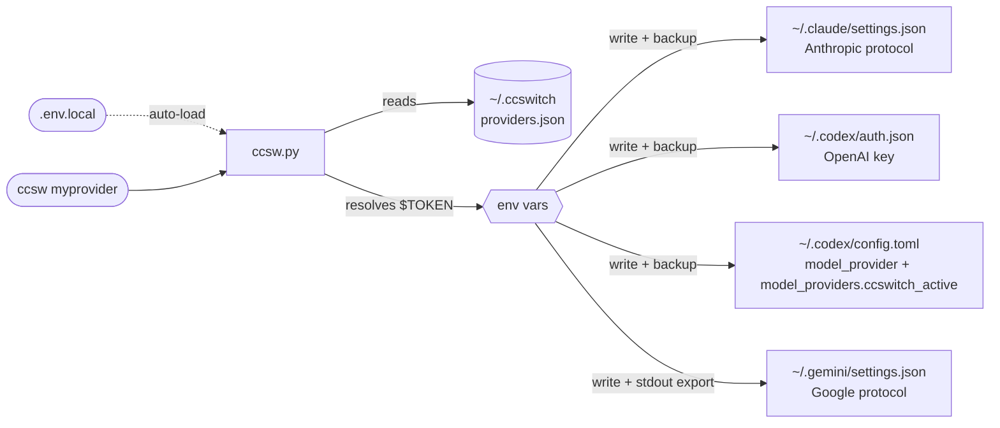

<div align="center">


# ccswitch-terminal

**Unified API provider switcher for Claude Code + Codex CLI + Gemini CLI**

[](LICENSE)
[](https://www.python.org/)
[](#installation)

[简体中文](README.md) | English | [日本語](README_JA.md) | [Español](README_ES.md) | [Português](README_PT.md) | [Русский](README_RU.md)

</div>

---

## Introduction

Using Claude Code, Codex CLI, and Gemini CLI simultaneously? Tired of manually editing multiple config files and remembering different token field formats every time you switch API providers? **ccswitch** solves exactly this.

- **One-click switching**: `ccsw myprovider` switches Claude; `ccsw all myprovider` syncs all three tools at once
- **Config isolation**: each provider maintains independent URLs and tokens for all three protocols (Anthropic / OpenAI / Google)
- **Clear security boundary**: `providers.json` stores only `$ENV_VAR` references; switching writes the resolved secrets into the target tool config or activation files, with backups created before overwriting existing files
- **Seamless integration**: live switching in active Claude Code sessions; Gemini env vars auto-activated; no restarts needed

---

## Installation

**One-click install via Claude Code / Codex** — copy the prompt below, fill in the `<...>` placeholders, and send it directly:

```
Please install ccswitch (AI terminal tool API switcher):

Repo: https://github.com/Boulea7/ccswitch-terminal
Setup: clone to ~/ccsw → run bootstrap.sh → source ~/.zshrc

Then configure a provider for me:
  Name: <provider-name>    Alias: <short-name>
  Claude URL:   <https://api.example.com/anthropic>
  Claude Token: <your-claude-token>
  Codex URL:    <https://api.example.com/openai/v1>
  Codex Token:  <your-codex-token>
  Gemini Key:   <your-gemini-key or leave blank to skip>

Write tokens in plaintext to ~/ccsw/.env.local, reference them as $ENV_VAR in providers.json.
Finally run ccsw list and ccsw show to confirm.
```

<details>
<summary>Example: pre-filled version using a custom provider</summary>

```
Please install ccswitch (AI terminal tool API switcher):

Repo: https://github.com/Boulea7/ccswitch-terminal
Setup: clone to ~/ccsw → run bootstrap.sh → source ~/.zshrc

Then configure a provider for me:
  Name: myprovider    Alias: mp
  Claude URL:   https://api.example.com/anthropic
  Claude Token: <your-claude-token>
  Codex URL:    https://api.example.com/openai/v1
  Codex Token:  <your-codex-token>
  Gemini Key:   leave blank to skip

Write tokens in plaintext to ~/ccsw/.env.local, reference them as $ENV_VAR in providers.json.
Finally run ccsw list and ccsw show to confirm.
```

</details>

**Manual install (3 commands):**

```bash
git clone https://github.com/Boulea7/ccswitch-terminal ~/ccsw
bash ~/ccsw/bootstrap.sh
source ~/.zshrc   # or source ~/.bashrc
```

After `bootstrap.sh`, four shell functions are registered (`ccsw`, `cxsw`, `gcsw`, `ccswitch`) and Gemini env plus Codex API key persistence is configured.

---

## Basic Usage

```bash
# -- switch --
ccsw myprovider                   # Switch Claude (tool name optional)
cxsw myprovider                   # Switch Codex (activates OPENAI_API_KEY and updates the custom model_provider)
gcsw myprovider                   # Switch Gemini (auto-activates GEMINI_API_KEY)
ccsw all myprovider               # Switch all three tools at once

# -- manage --
ccsw list                         # List all providers
ccsw show                         # Show active config
ccsw add <name>                   # Add or update a provider
ccsw remove <name>                # Remove a provider
ccsw alias <alias> <provider>     # Create an alias
```

---

## Advanced Features

<details>
<summary><b>Local Secrets: .env.local</b></summary>

Create a `.env.local` file in the same directory as `ccsw.py` to store tokens locally — **no need to add exports to `~/.zshrc` or `~/.bashrc`**.

```bash
# ~/ccsw/.env.local  (excluded from git)
MY_PROVIDER_CLAUDE_TOKEN=<your-claude-token>
MY_PROVIDER_CODEX_TOKEN=<your-codex-token>
MY_PROVIDER_GEMINI_KEY=<your-gemini-key>
```

ccsw loads this file automatically at startup. It only sets variables not already present in the environment (existing shell exports take precedence).

> [!IMPORTANT]
> `.env.local` solves how secrets are referenced from `providers.json` and shell startup files; once you run a switch, the resolved secrets are still written into the target tool config or activation files.

> [!WARNING]
> `.env.local` contains plaintext secrets. Make sure it is listed in `.gitignore`.

</details>

<details>
<summary><b>Live Switching Mid-Conversation</b></summary>

Claude Code re-reads the `env` block of `~/.claude/settings.json` **before every API request**, which means:

> Running `ccsw claude <provider>` in another terminal takes effect on the **very next message** in the active Claude Code session — no restart required.

```bash
# Terminal A: Claude Code session is running

# Terminal B: switch provider
ccsw claude myprovider

# Back in Terminal A: send the next message — it uses myprovider
```

> [!NOTE]
> The same applies to Codex CLI — `cxsw <provider>` takes effect on the next Codex invocation.
> For Gemini CLI, the env var must be activated in the **same shell** by running `gcsw` to take effect immediately.

</details>

<details>
<summary><b>Per-Tool Config & Env Vars</b></summary>

**Each provider maintains separate URL and token for each tool.**

Claude Code uses the Anthropic protocol, Codex CLI uses the OpenAI protocol, and Gemini CLI uses the Google protocol — entirely different, configured independently:

```json
{
  "providers": {
    "myprovider": {
      "claude": { "base_url": "https://api.example.com/anthropic", "token": "$MY_PROVIDER_CLAUDE_TOKEN" },
      "codex":  { "base_url": "https://api.example.com/openai/v1", "token": "$MY_PROVIDER_CODEX_TOKEN" },
      "gemini": { "api_key": "$MY_PROVIDER_GEMINI_KEY", "auth_type": "api-key" }
    }
  }
}
```

**A provider can support only 1 or 2 tools.** Set unsupported tools to `null` — they are skipped automatically:

```
ccsw all claude-only output:
[claude] Updated ~/.claude/settings.json
[codex]  Skipped: provider 'claude-only' has no codex config.
[gemini] Skipped: provider 'claude-only' has no gemini config.
```

**Gemini / Codex env activation**: `GEMINI_API_KEY` and `OPENAI_API_KEY` are environment variables — a child process cannot write them into the parent shell. The `gcsw`, `cxsw`, and `ccsw gemini/all` shell functions handle `eval` internally:

```bash
gcsw myprovider          # Switch Gemini (env var activated automatically)
cxsw myprovider          # Switch Codex (API key activated and the custom model_provider refreshed)
ccsw all myprovider      # Switch all tools
```

**When calling the Python script directly (CI/CD or Docker)**, `eval` is still required:

```bash
eval "$(python3 ccsw.py gemini myprovider)"
eval "$(python3 ccsw.py all myprovider)"
```

Every successful Gemini switch writes the export statement to `~/.ccswitch/active.env`. New shell sessions source this file automatically — no need to re-run ccsw.

</details>

<details>
<summary><b>Codex 0.116+ Compatibility Note</b></summary>

Starting with `codex-cli 0.116.0`, overriding only the root `openai_base_url` is no longer reliable for some OpenAI-compatible relays. The CLI may still treat the endpoint as a built-in OpenAI provider and attempt the Responses WebSocket transport during session startup.

For relays that only support HTTP Responses, this shows up as startup failures such as:

- `relay: Request method 'GET' is not supported`
- `GET /openai/v1/models` returning 404

To avoid that, `ccsw` now writes Codex config in this shape:

```toml
model_provider = "ccswitch_active"

[model_providers.ccswitch_active]
name = "ccswitch: myprovider"
base_url = "https://api.example.com/openai/v1"
env_key = "OPENAI_API_KEY"
supports_websockets = false
wire_api = "responses"
```

This tells Codex to treat the relay as an explicit custom provider that does **not** support the Responses WebSocket transport, so it prefers the HTTP Responses path instead.

</details>

---

## Provider Management

<details>
<summary><b>Built-in Providers</b></summary>

| Provider | Claude Code | Codex CLI | Gemini CLI | Alias | Credential Source |
|----------|:-----------:|:---------:|:----------:|-------|-------------------|
| `88code` | ✅ | ✅ | ❌ | `88` | Environment variables or `.env.local` |
| `zhipu` | ✅ | ❌ | ❌ | `glm` | Environment variables or `.env.local` |
| `rightcode` | ❌ | ✅ | ❌ | `rc` | Environment variables or `.env.local` |
| `anyrouter` | ✅ | ❌ | ❌ | `any` | Environment variables or `.env.local` |

Built-in providers use environment-backed secret references by default. If you want your own naming convention, re-save the same provider name with `ccsw add <name>`.

</details>

<details>
<summary><b>Configuration Template</b></summary>

Start from a generic template, then replace the URLs and env var names according to your provider's docs:

```bash
ccsw add myprovider \
  --claude-url   https://api.example.com/anthropic \
  --claude-token '$MY_PROVIDER_CLAUDE_TOKEN' \
  --codex-url    https://api.example.com/openai/v1 \
  --codex-token  '$MY_PROVIDER_CODEX_TOKEN' \
  --gemini-key   '$MY_PROVIDER_GEMINI_KEY'
```

If you prefer ready-made shortcuts, you can use the built-ins directly:

```bash
ccsw 88code
ccsw glm
cxsw rc
ccsw any
```

> Exact URLs vary by provider — always check their official documentation. Common patterns:
> - Anthropic protocol: `/api`, `/v1`, `/api/anthropic`
> - OpenAI protocol: `/v1`, `/openai/v1`

</details>

<details>
<summary><b>Adding Custom Providers</b></summary>

**Interactive (recommended):**

```bash
ccsw add myprovider
```

Follow the prompts for each tool. Leave blank to skip. Use `$ENV_VAR` syntax for tokens.

**Via CLI flags:**

```bash
ccsw add myprovider \
  --claude-url   https://api.example.com/anthropic \
  --claude-token '$MY_PROVIDER_CLAUDE_TOKEN' \
  --codex-url    https://api.example.com/openai/v1 \
  --codex-token  '$MY_PROVIDER_CODEX_TOKEN' \
  --gemini-key   '$MY_PROVIDER_GEMINI_KEY'
```

Optional extra flag:

- `--gemini-auth-type <TYPE>`: sets the Gemini `auth_type` stored in the provider. During switching it is written to `security.auth.selectedType` in `~/.gemini/settings.json`. If omitted, the existing provider value is kept; if the provider has no value yet, runtime falls back to `api-key`.

**Update a single field:**

```bash
ccsw add myprovider --gemini-key '$NEW_KEY'   # Update only the Gemini key
```

</details>

---

## Architecture

<details>
<summary><b>How It Works & Config Write Targets</b></summary>



> [!NOTE]
> **stdout / stderr separation**: all status messages go to stderr (visible in terminal), while Codex / Gemini shell activation statements go to stdout (captured and executed by `eval`).

| Tool | Config File | Fields Written |
|------|-------------|----------------|
| Claude Code | `~/.claude/settings.json` | `env.ANTHROPIC_AUTH_TOKEN`, `env.ANTHROPIC_BASE_URL`, extra_env |
| Codex CLI | `~/.codex/auth.json` | `OPENAI_API_KEY` |
| Codex CLI | `~/.codex/config.toml` | `model_provider`, `[model_providers.ccswitch_active]` |
| Codex env | `~/.ccswitch/codex.env` | `OPENAI_API_KEY`, plus `unset OPENAI_BASE_URL` |
| Gemini CLI | `~/.gemini/settings.json` | `security.auth.selectedType` |
| Gemini env | stdout + `~/.ccswitch/active.env` | `GEMINI_API_KEY` |

> [!IMPORTANT]
> `providers.json` stores provider definitions and `$ENV_VAR` references; when a switch actually runs, the resolved secrets are written into the runtime config or activation files listed above.

> [!NOTE]
> For Codex CLI, `ccswitch` now writes a custom `model_provider` and explicitly sets `supports_websockets = false`. This keeps Codex compatible with OpenAI-compatible relays that support HTTP Responses but not the Responses WebSocket transport.

</details>

<details>
<summary><b>providers.json Schema</b></summary>

Located at `~/.ccswitch/providers.json`:

```json
{
  "version": 1,
  "active": { "claude": "myprovider", "codex": "myprovider", "gemini": null },
  "aliases": { "mp": "myprovider" },
  "providers": {
    "myprovider": {
      "claude": {
        "base_url": "https://api.example.com/anthropic",
        "token": "$MY_PROVIDER_CLAUDE_TOKEN",
        "extra_env": {
          "API_TIMEOUT_MS": null,
          "CLAUDE_CODE_DISABLE_NONESSENTIAL_TRAFFIC": null
        }
      },
      "codex": {
        "base_url": "https://api.example.com/openai/v1",
        "token": "$MY_PROVIDER_CODEX_TOKEN"
      },
      "gemini": {
        "api_key": "$MY_PROVIDER_GEMINI_KEY",
        "auth_type": "api-key"
      }
    }
  }
}
```

`extra_env` values of `null` **remove** that key from the target config — used to clean up residual settings left by other providers.

> [!NOTE]
> This example shows the `ccswitch` provider store. It keeps provider definitions and `$ENV_VAR` references; after a switch, the resolved secrets are written to the target config files listed above. For Codex specifically, the runtime config written to `~/.codex/config.toml` uses `model_provider = "ccswitch_active"` plus `[model_providers.ccswitch_active]`.

</details>

<details>
<summary><b>Usage Scenarios: SSH / Docker / CI-CD</b></summary>

**SSH Remote Server**

```bash
ssh user@server
# Once in the remote shell:
eval "$(ccsw all myprovider)"
```

**Docker Container**

```dockerfile
COPY ccsw.py /usr/local/bin/ccsw.py
RUN chmod +x /usr/local/bin/ccsw.py
ENV MY_PROVIDER_CODEX_TOKEN=<your-codex-token>
ENV MY_PROVIDER_CLAUDE_TOKEN=<your-claude-token>
```

```bash
docker exec -it mycontainer bash -c \
  'python3 /usr/local/bin/ccsw.py claude myprovider && eval "$(python3 /usr/local/bin/ccsw.py codex myprovider)"'
```

**CI/CD Pipeline (GitHub Actions)**

```yaml
- name: Configure AI tool providers
  env:
    MY_PROVIDER_CLAUDE_TOKEN: ${{ secrets.MY_PROVIDER_CLAUDE_TOKEN }}
    MY_PROVIDER_CODEX_TOKEN: ${{ secrets.MY_PROVIDER_CODEX_TOKEN }}
  run: |
    python ccsw.py claude myprovider
    python ccsw.py codex myprovider
```

</details>

---

## Develop & Verify

After changing the script or documentation, run at least this minimal verification set:

```bash
python3 ccsw.py -h
python3 ccsw.py list
python3 -m unittest discover -s tests -q
```

For a lightweight post-install smoke check, prefer commands that do not rewrite tool configs:

```bash
type ccsw
type cxsw
type gcsw
ccsw list
ccsw show
```

> [!NOTE]
> Actual `switch` commands write files under `~/.claude`, `~/.codex`, `~/.gemini`, or `~/.ccswitch`. If you only want to confirm the installation worked, start with the read-only checks above.

---

## FAQ

<details>
<summary><b>Q: After running gcsw, $GEMINI_API_KEY is still empty?</b></summary>

Check:
1. Are the shell functions installed? Run `type gcsw` to confirm.
2. Are you running it in the same shell session? (subshells do not inherit parent shell variables)
3. If calling the Python script directly (bypassing the shell function), you still need `eval "$(python3 ccsw.py gemini ...)"`.

</details>

<details>
<summary><b>Q: What does <code>[claude] Skipped: token unresolved</code> mean?</b></summary>

The token is configured as `$MY_ENV_VAR`, but that variable is not set in the current environment.

Two ways to fix:
- `export MY_ENV_VAR=your_token` (temporary, current shell only)
- Add `MY_ENV_VAR=your_token` to `.env.local` in the ccsw directory (recommended)

</details>

<details>
<summary><b>Q: My ~/.claude/settings.json was overwritten — how do I recover?</b></summary>

ccsw creates a timestamped backup before every write, e.g. `settings.json.bak-20260313-120000`. Copy it back with `cp`.

</details>

<details>
<summary><b>Q: What's the difference between .env.local and exporting in ~/.zshrc?</b></summary>

`.env.local` tokens are only loaded when ccsw runs — they don't pollute the global shell environment. Exports in `~/.zshrc` are present in every shell session. For AI tool tokens, `.env.local` reduces global shell exposure, but a successful switch still writes the resolved secrets into the target tool config or activation files.

</details>

---

## Requirements

Python 3.8+ (stdlib only — no `pip install` needed)

## License

MIT

---

<div align="right">

[⬆ Back to top](#ccswitch-terminal)

</div>
