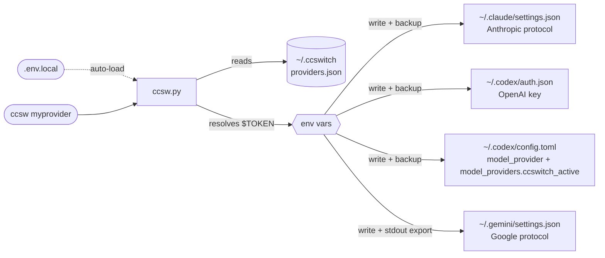

<div align="center">

# ccswitch--terminal

**Conmutador unificado de proveedores API para Claude Code + Codex CLI + Gemini CLI**

[](LICENSE)
[](https://www.python.org/)
[](#instalación)

[简体中文](README.md) | [English](README_EN.md) | [日本語](README_JA.md) | Español | [Português](README_PT.md) | [Русский](README_RU.md)

</div>

---

## Introducción

Si usas Claude Code, Codex CLI y Gemini CLI al mismo tiempo, cambiar de proveedor API suele implicar editar varios archivos de configuración y recordar campos de token distintos para cada herramienta. **ccswitch** simplifica ese cambio.

- **Cambio con un solo comando**: `ccsw myprovider` cambia Claude; `ccsw all myprovider` sincroniza las tres herramientas
- **Configuración aislada**: cada provider mantiene URLs y tokens independientes para Anthropic / OpenAI / Google
- **Límite de seguridad claro**: `providers.json` solo guarda referencias `$ENV_VAR`; al cambiar, los secretos resueltos se escriben en los archivos de configuración o activación del destino y se hace backup antes de sobrescribir
- **Integración natural**: permite cambiar Claude Code en caliente y activar automáticamente las variables de Gemini

---

## Instalación

**Prompt listo para pegar en Claude Code / Codex**. Sustituye los `<...>` y envíalo tal cual.

```
Por favor instala ccswitch (conmutador API para herramientas terminales de IA):

Repositorio: https://github.com/Boulea7/ccswitch--terminal
Instalación: clonar en ~/ccsw → ejecutar bootstrap.sh → source ~/.zshrc

Luego configura un provider:
  Nombre: <provider-name>    Alias: <short-name>
  Claude URL:   <https://api.example.com/anthropic>
  Claude Token: <your-claude-token>
  Codex URL:    <https://api.example.com/openai/v1>
  Codex Token:  <your-codex-token>
  Gemini Key:   <your-gemini-key o vacío para omitir>

Guarda los tokens en texto plano en ~/ccsw/.env.local y usa referencias $ENV_VAR en providers.json.
Al final ejecuta ccsw list y ccsw show para confirmar.
```

<details>
<summary>Ejemplo: versión completada con un provider personalizado</summary>

```
Por favor instala ccswitch (conmutador API para herramientas terminales de IA):

Repositorio: https://github.com/Boulea7/ccswitch--terminal
Instalación: clonar en ~/ccsw → ejecutar bootstrap.sh → source ~/.zshrc

Luego configura un provider:
  Nombre: myprovider    Alias: mp
  Claude URL:   https://api.example.com/anthropic
  Claude Token: <your-claude-token>
  Codex URL:    https://api.example.com/openai/v1
  Codex Token:  <your-codex-token>
  Gemini Key:   dejar en blanco para omitir

Guarda los tokens en texto plano en ~/ccsw/.env.local y usa referencias $ENV_VAR en providers.json.
Al final ejecuta ccsw list y ccsw show para confirmar.
```

</details>

**Instalación manual (3 comandos):**

```bash
git clone https://github.com/Boulea7/ccswitch--terminal ~/ccsw
bash ~/ccsw/bootstrap.sh
source ~/.zshrc   # o source ~/.bashrc
```

Después de `bootstrap.sh` se registran cuatro funciones de shell (`ccsw`, `cxsw`, `gcsw`, `ccswitch`) y también se configura la carga automática de los archivos de activación de Gemini y Codex.

---

## Uso básico

```bash
# -- switch --
ccsw myprovider                   # Cambia Claude (nombre de herramienta opcional)
cxsw myprovider                   # Cambia Codex (activa OPENAI_API_KEY y actualiza el model_provider personalizado)
gcsw myprovider                   # Cambia Gemini (activa GEMINI_API_KEY automáticamente)
ccsw all myprovider               # Cambia las tres herramientas a la vez

# -- manage --
ccsw list                         # Lista todos los providers
ccsw show                         # Muestra la configuración activa
ccsw add <name>                   # Añade o actualiza un provider
ccsw remove <name>                # Elimina un provider
ccsw alias <alias> <provider>     # Crea un alias
```

---

## Funciones avanzadas

<details>
<summary><b>Secretos locales: .env.local</b></summary>

Crea un archivo `.env.local` en el mismo directorio que `ccsw.py` para guardar tokens localmente, sin añadir exports a `~/.zshrc` o `~/.bashrc`.

```bash
# ~/ccsw/.env.local  (ignorado por git)
MY_PROVIDER_CLAUDE_TOKEN=<your-claude-token>
MY_PROVIDER_CODEX_TOKEN=<your-codex-token>
MY_PROVIDER_GEMINI_KEY=<your-gemini-key>
```

`ccsw` carga este archivo al iniciar y no sobrescribe variables que ya existan en el entorno.

> [!IMPORTANT]
> `.env.local` resuelve cómo se referencian los secretos desde `providers.json` y desde los archivos de arranque del shell; cuando ejecutas un cambio real, los secretos resueltos siguen escribiéndose en los archivos de configuración o activación de la herramienta objetivo.

> [!WARNING]
> `.env.local` contiene secretos en texto plano. Verifica que esté incluido en `.gitignore`.

</details>

<details>
<summary><b>Cambio en caliente durante una conversación</b></summary>

Claude Code relee el bloque `env` de `~/.claude/settings.json` antes de cada petición API.

> Si ejecutas `ccsw claude <provider>` en otra terminal, la sesión actual de Claude Code usará el nuevo provider **en el siguiente mensaje**, sin reiniciar.

```bash
# Terminal A: Claude Code está en uso

# Terminal B: cambiar provider
ccsw claude myprovider

# De vuelta en A: el siguiente mensaje usa myprovider
```

> [!NOTE]
> En Codex CLI ocurre algo similar: `cxsw <provider>` se aplica en la siguiente invocación.
> Gemini CLI necesita que `gcsw` se ejecute en la misma sesión de shell para surtir efecto inmediato.

</details>

<details>
<summary><b>Configuración por herramienta y variables de entorno</b></summary>

**Cada provider mantiene URL y token separados para cada herramienta.**

Claude Code usa Anthropic, Codex CLI usa OpenAI y Gemini CLI usa Google. Por eso cada bloque se configura de forma independiente.

```json
{
  "providers": {
    "myprovider": {
      "claude": { "base_url": "https://api.example.com/anthropic", "token": "$MY_PROVIDER_CLAUDE_TOKEN" },
      "codex":  { "base_url": "https://api.example.com/openai/v1", "token": "$MY_PROVIDER_CODEX_TOKEN" },
      "gemini": { "api_key": "$MY_PROVIDER_GEMINI_KEY", "auth_type": "api-key" }
    }
  }
}
```

**Un provider puede soportar solo 1 o 2 herramientas.** Las no soportadas se dejan en `null` y se omiten automáticamente.

```
Salida de ccsw all claude-only:
[claude] Updated ~/.claude/settings.json
[codex]  Skipped: provider 'claude-only' has no codex config.
[gemini] Skipped: provider 'claude-only' has no gemini config.
```

**Activación de env para Gemini / Codex**: `GEMINI_API_KEY` y `OPENAI_API_KEY` son variables de entorno, así que un proceso hijo no puede reescribir el shell padre. Las funciones `gcsw`, `cxsw` y `ccsw gemini/all` ya incluyen `eval`.

```bash
gcsw myprovider
cxsw myprovider
ccsw all myprovider
```

**Si llamas directamente al script Python** en CI/CD o Docker, debes usar `eval` manualmente:

```bash
eval "$(python3 ccsw.py gemini myprovider)"
eval "$(python3 ccsw.py all myprovider)"
```

Cada cambio exitoso de Gemini escribe la sentencia `export` en `~/.ccswitch/active.env`, que se vuelve a cargar automáticamente en nuevas sesiones.

</details>

<details>
<summary><b>Nota de compatibilidad con Codex 0.116+</b></summary>

Desde `codex-cli 0.116.0`, sobrescribir solo `openai_base_url` a nivel raíz ya no es fiable para algunos relays compatibles con OpenAI. El CLI puede seguir tratándolos como proveedores OpenAI integrados e intentar la ruta Responses WebSocket.

En relays que solo soportan HTTP Responses, eso puede fallar con mensajes como:

- `relay: Request method 'GET' is not supported`
- `GET /openai/v1/models` devolviendo 404

Por eso `ccsw` escribe la configuración de Codex con esta forma:

```toml
model_provider = "ccswitch_active"

[model_providers.ccswitch_active]
name = "ccswitch: myprovider"
base_url = "https://api.example.com/openai/v1"
env_key = "OPENAI_API_KEY"
supports_websockets = false
wire_api = "responses"
```

Así Codex trata el relay como un provider personalizado sin soporte WebSocket y prefiere la ruta HTTP Responses.

</details>

---

## Gestión de providers

<details>
<summary><b>Providers integrados</b></summary>

| Proveedor | Claude Code | Codex CLI | Gemini CLI | Alias | Origen del secreto |
|-----------|:-----------:|:---------:|:----------:|-------|--------------------|
| `88code` | ✅ | ✅ | ❌ | `88` | Variables de entorno o `.env.local` |
| `zhipu` | ✅ | ❌ | ❌ | `glm` | Variables de entorno o `.env.local` |
| `rightcode` | ❌ | ✅ | ❌ | `rc` | Variables de entorno o `.env.local` |
| `anyrouter` | ✅ | ❌ | ❌ | `any` | Variables de entorno o `.env.local` |

Los providers integrados usan referencias a variables de entorno por defecto. Si prefieres tu propio esquema de nombres, puedes volver a guardar el mismo provider con `ccsw add <name>`.

</details>

<details>
<summary><b>Plantilla de configuración</b></summary>

Empieza con una plantilla genérica y sustituye URLs y nombres de variables de entorno según la documentación de tu provider.

```bash
ccsw add myprovider \
  --claude-url   https://api.example.com/anthropic \
  --claude-token '$MY_PROVIDER_CLAUDE_TOKEN' \
  --codex-url    https://api.example.com/openai/v1 \
  --codex-token  '$MY_PROVIDER_CODEX_TOKEN' \
  --gemini-key   '$MY_PROVIDER_GEMINI_KEY'
```

Si prefieres accesos rápidos, puedes usar directamente los integrados:

```bash
ccsw 88code
ccsw glm
cxsw rc
ccsw any
```

> La URL exacta depende de cada provider. Consulta siempre su documentación oficial. Patrones comunes:
> - Anthropic: `/api`, `/v1`, `/api/anthropic`
> - OpenAI: `/v1`, `/openai/v1`

</details>

<details>
<summary><b>Añadir providers personalizados</b></summary>

**Modo interactivo (recomendado):**

```bash
ccsw add myprovider
```

Sigue los prompts para cada herramienta. Deja en blanco para omitir. Usa `$ENV_VAR` para los tokens.

**Con flags de CLI:**

```bash
ccsw add myprovider \
  --claude-url   https://api.example.com/anthropic \
  --claude-token '$MY_PROVIDER_CLAUDE_TOKEN' \
  --codex-url    https://api.example.com/openai/v1 \
  --codex-token  '$MY_PROVIDER_CODEX_TOKEN' \
  --gemini-key   '$MY_PROVIDER_GEMINI_KEY'
```

Parámetro opcional extra:

- `--gemini-auth-type <TYPE>`: establece el `auth_type` de Gemini almacenado en el provider. Durante el cambio se escribe en `security.auth.selectedType` dentro de `~/.gemini/settings.json`. Si no lo indicas, se conserva el valor existente del provider; si tampoco existe, en tiempo de ejecución se usa `api-key`.

**Actualizar un solo campo:**

```bash
ccsw add myprovider --gemini-key '$NEW_KEY'   # Solo actualiza la clave de Gemini
```

</details>

---

## Arquitectura

<details>
<summary><b>Flujo interno y destinos de escritura</b></summary>



> [!NOTE]
> **Separación stdout / stderr**: los mensajes de estado van a stderr; las sentencias de activación para Codex / Gemini van a stdout para que `eval` pueda capturarlas.

| Herramienta | Archivo de configuración | Campos escritos |
|-------------|-------------------------|-----------------|
| Claude Code | `~/.claude/settings.json` | `env.ANTHROPIC_AUTH_TOKEN`, `env.ANTHROPIC_BASE_URL`, extra_env |
| Codex CLI | `~/.codex/auth.json` | `OPENAI_API_KEY` |
| Codex CLI | `~/.codex/config.toml` | `model_provider`, `[model_providers.ccswitch_active]` |
| Entorno de Codex | `~/.ccswitch/codex.env` | `OPENAI_API_KEY`, además de `unset OPENAI_BASE_URL` |
| Gemini CLI | `~/.gemini/settings.json` | `security.auth.selectedType` |
| Entorno de Gemini | stdout + `~/.ccswitch/active.env` | `GEMINI_API_KEY` |

> [!IMPORTANT]
> `providers.json` guarda definiciones de provider y referencias `$ENV_VAR`; cuando se ejecuta un cambio real, los secretos resueltos se escriben en los archivos de configuración o activación listados arriba.

> [!NOTE]
> Para Codex CLI, `ccswitch` escribe un `model_provider` personalizado y fija `supports_websockets = false`, lo que ayuda con relays compatibles con OpenAI que soportan HTTP Responses pero no Responses WebSocket.

</details>

<details>
<summary><b>Esquema de providers.json</b></summary>

Se guarda en `~/.ccswitch/providers.json`:

```json
{
  "version": 1,
  "active": { "claude": "myprovider", "codex": "myprovider", "gemini": null },
  "aliases": { "mp": "myprovider" },
  "providers": {
    "myprovider": {
      "claude": {
        "base_url": "https://api.example.com/anthropic",
        "token": "$MY_PROVIDER_CLAUDE_TOKEN",
        "extra_env": {
          "API_TIMEOUT_MS": null,
          "CLAUDE_CODE_DISABLE_NONESSENTIAL_TRAFFIC": null
        }
      },
      "codex": {
        "base_url": "https://api.example.com/openai/v1",
        "token": "$MY_PROVIDER_CODEX_TOKEN"
      },
      "gemini": {
        "api_key": "$MY_PROVIDER_GEMINI_KEY",
        "auth_type": "api-key"
      }
    }
  }
}
```

Los valores `null` dentro de `extra_env` eliminan esa clave del archivo de configuración de destino.

> [!NOTE]
> Este JSON es el store interno de `ccswitch`. Conserva definiciones de provider y referencias `$ENV_VAR`; después del cambio, los secretos resueltos se escriben en los archivos indicados arriba. En Codex, la configuración real se escribe en `~/.codex/config.toml` mediante `model_provider = "ccswitch_active"` y `[model_providers.ccswitch_active]`.

</details>

<details>
<summary><b>Escenarios de uso: SSH / Docker / CI-CD</b></summary>

**Servidor remoto por SSH**

```bash
ssh user@server
# Ya dentro del shell remoto:
eval "$(ccsw all myprovider)"
```

**Contenedor Docker**

```dockerfile
COPY ccsw.py /usr/local/bin/ccsw.py
RUN chmod +x /usr/local/bin/ccsw.py
ENV MY_PROVIDER_CODEX_TOKEN=<your-codex-token>
ENV MY_PROVIDER_CLAUDE_TOKEN=<your-claude-token>
```

```bash
docker exec -it mycontainer bash -c \
  'python3 /usr/local/bin/ccsw.py claude myprovider && eval "$(python3 /usr/local/bin/ccsw.py codex myprovider)"'
```

**Pipeline CI/CD (GitHub Actions)**

```yaml
- name: Configure AI tool providers
  env:
    MY_PROVIDER_CLAUDE_TOKEN: ${{ secrets.MY_PROVIDER_CLAUDE_TOKEN }}
    MY_PROVIDER_CODEX_TOKEN: ${{ secrets.MY_PROVIDER_CODEX_TOKEN }}
  run: |
    python ccsw.py claude myprovider
    python ccsw.py codex myprovider
```

</details>

---

## Desarrollo y verificación

Después de cambiar el script o la documentación, ejecuta al menos este conjunto mínimo:

```bash
python3 ccsw.py -h
python3 ccsw.py list
python3 -m unittest discover -s tests -q
```

Para un smoke check ligero tras la instalación, prioriza comandos que no reescriban configuraciones:

```bash
type ccsw
type cxsw
type gcsw
ccsw list
ccsw show
```

> [!NOTE]
> Los comandos `switch` reales escriben archivos bajo `~/.claude`, `~/.codex`, `~/.gemini` o `~/.ccswitch`. Si solo quieres confirmar que la instalación quedó bien, empieza por las comprobaciones de solo lectura de arriba.

---

## FAQ

<details>
<summary><b>Q: Después de ejecutar gcsw, $GEMINI_API_KEY sigue vacío</b></summary>

Comprueba:
1. Que las funciones de shell estén instaladas con `type gcsw`
2. Que lo ejecutes en la misma sesión de shell
3. Que, si llamas al script Python directamente, uses `eval "$(python3 ccsw.py gemini ...)"`

</details>

<details>
<summary><b>Q: ¿Qué significa <code>[claude] Skipped: token unresolved</code>?</b></summary>

Significa que el token está guardado como `$MY_ENV_VAR`, pero esa variable no existe en el entorno actual.

Soluciones:
- `export MY_ENV_VAR=your_token`
- Añadir `MY_ENV_VAR=your_token` en `.env.local` dentro del directorio de ccsw

</details>

<details>
<summary><b>Q: Mi ~/.claude/settings.json se sobrescribió. ¿Cómo lo recupero?</b></summary>

Antes de cada escritura, ccsw crea un backup con marca temporal, por ejemplo `settings.json.bak-20260313-120000`. Puedes restaurarlo con `cp`.

</details>

<details>
<summary><b>Q: ¿Qué diferencia hay entre .env.local y exportar en ~/.zshrc?</b></summary>

Los tokens en `.env.local` solo se cargan cuando se ejecuta `ccsw`, así que no ensucian el entorno global del shell. Los exports en `~/.zshrc` viven en cada nueva sesión. `.env.local` reduce la exposición global, pero cuando el cambio se completa, los secretos resueltos se escriben igualmente en los archivos de configuración o activación de la herramienta objetivo.

</details>

---

## Requisitos

Python 3.8+ (solo librería estándar, sin `pip install`)

## License

MIT

---

<div align="right">

[⬆ Volver arriba](#ccswitch--terminal)

</div>
