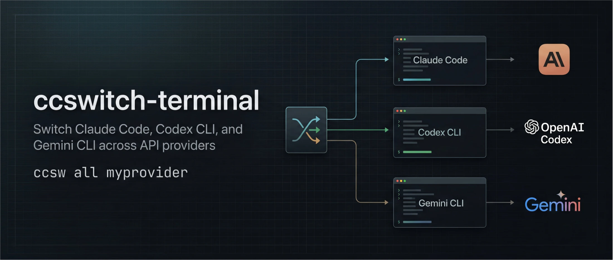

<div align="center">



# ccswitch-terminal

**Claude Code、Codex CLI、Gemini CLI、OpenCode、OpenClaw をまとめて切り替えるための 1 つの窓口**

[](LICENSE)
[](https://github.com/Boulea7/ccswitch-terminal/actions/workflows/ci.yml)
[](https://www.python.org/)
[](#クイックスタート)

[简体中文](README.md) | [English](README_EN.md) | 日本語 | [Español](README_ES.md) | [Português](README_PT.md) | [Русский](README_RU.md)

[CI](https://github.com/Boulea7/ccswitch-terminal/actions/workflows/ci.yml) | [CodeQL](https://github.com/Boulea7/ccswitch-terminal/actions/workflows/codeql.yml) | [Issues](https://github.com/Boulea7/ccswitch-terminal/issues/new/choose) | [Changelog](CHANGELOG.md) | [Releasing](RELEASING.md) | [Contributing](CONTRIBUTING.md) | [Security](SECURITY.md) | [Support](SUPPORT.md)

</div>

---

## 何をするツールか

`ccswitch` は Python 標準ライブラリだけで動く CLI です。複数の AI ターミナルツールを使っていて、provider を切り替えるたびに設定ファイルを手で直したくない人向けのツールです。

- Claude Code、Codex CLI、Gemini CLI、OpenCode、OpenClaw を 1 か所から切り替えます。
- `openrouter -> op` のような短い alias を作って、`ccsw op` や `cxsw op` で切り替えられます。この README では、それを日常的な基本の使い方として扱っています。
- Claude / Codex / Gemini には live config を書き込み、OpenCode / OpenClaw には managed overlay を生成します。
- `profile`、`doctor`、`run`、`history`、`rollback`、`repair`、`import current` を使えます。
- 状態が危ないときは中途半端に進めず、fail-closed で止まります。

この README では `openrouter` を主な例にしていますが、Vertex AI、AWS 系ゲートウェイ、自前 relay にも同じ流れで使えます。

---

## クイックスタート

> [!IMPORTANT]
> `ccswitch` は既にインストール済みの CLI を管理するツールです。Claude Code、Codex CLI、Gemini CLI、OpenCode、OpenClaw 自体は先に入れておいてください。

### Claude Code または Codex でインストール

次のプロンプトを Claude Code または Codex に貼り付けてください。`ccswitch` のインストール、最初の provider 追加、alias 作成、確認までまとめてできます。

```text
ccswitch を次のリポジトリからインストールしてください:
https://github.com/Boulea7/ccswitch-terminal

手順:
1. ~/ccsw に clone
2. bash ~/ccsw/bootstrap.sh を実行
3. source ~/.zshrc で shell を再読み込み
4. python3 ~/ccsw/ccsw.py -h で確認

その後、環境変数参照で provider を 1 つ追加してください:
- provider 名: openrouter
- セットアップ後にこの alias を作成: `op -> openrouter`
- Claude URL: <provider のドキュメントにある Anthropic 互換 URL に置き換える>
- Claude token 用 env var: OR_CLAUDE_TOKEN
- Codex URL: <provider のドキュメントにある OpenAI 互換 URL に置き換える>
- Codex token 用 env var: OR_CODEX_TOKEN
- Gemini key 用 env var: OR_GEMINI_KEY

実際の秘密情報は ~/ccsw/.env.local に書き込んでください。
ccswitch 側には $ENV_VAR 参照だけを保存してください。

その後:
1. `ccsw alias op openrouter` を実行
2. `ccsw op` を実行
3. `cxsw op` を実行
4. `ccsw show` を実行
5. 何が変わったかを短く説明
```

他の例:

- `vertex` に alias `vx`
- `aws` に alias `aws`

### 手動インストール

```bash
git clone https://github.com/Boulea7/ccswitch-terminal ~/ccsw
bash ~/ccsw/bootstrap.sh
source ~/.zshrc   # または source ~/.bashrc
python3 ~/ccsw/ccsw.py -h
```

変更内容だけ先に見たい場合:

```bash
bash ~/ccsw/bootstrap.sh --dry-run
```

<details>
<summary><b>Shell メモ</b></summary>

- `bootstrap.sh` 後の `ccsw <provider>` は `ccsw claude <provider>` と同じです。
- `cxsw`、`gcsw`、`opsw`、`clawsw` には `eval` が組み込まれています。
- `fish` や PowerShell では `python3 ccsw.py ...` を使い、export を各 shell の書式に合わせて扱ってください。

</details>

---

## 最初の Provider を 60 秒で作る

1. `~/ccsw/.env.local` に秘密情報を書く。

```bash
OR_CLAUDE_TOKEN=<your-claude-token>
OR_CODEX_TOKEN=<your-codex-token>
OR_GEMINI_KEY=<your-gemini-key>
```

2. provider を追加する。

```bash
ccsw add openrouter \
  --claude-url '<replace-with-your-anthropic-url>' \
  --claude-token '$OR_CLAUDE_TOKEN' \
  --codex-url '<replace-with-your-openai-url>' \
  --codex-token '$OR_CODEX_TOKEN' \
  --gemini-key '$OR_GEMINI_KEY'
```

3. provider 名をそのまま使うこともできますし、短い alias を作ることもできます。

```bash
ccsw openrouter
cxsw openrouter

ccsw alias op openrouter
ccsw op
cxsw op
gcsw op
ccsw all op
ccsw show
```

4. 他の provider にも同じパターンを使う。

```bash
ccsw alias vx vertex
ccsw alias aws aws
```

### Alias の使い方

`ccswitch` を継続的に使うなら、alias は「あると便利」ではなく、普段の使い方として定着させるのがおすすめです。

おすすめの縮写はこんな形です。

| Provider | 推奨 alias |
|----------|------------|
| `openrouter` | `op` |
| `vertex` | `vx` |
| `aws` | `aws` |

```bash
ccsw alias op openrouter
ccsw alias vx vertex
ccsw alias aws aws
```

以後は短い名前をそのまま使います。

```bash
ccsw op
cxsw op
ccsw all vx
ccsw profile add work --codex op,vx --opencode op
ccsw profile add cloud --claude aws --codex aws,op
```

もちろん alias を作らず、`ccsw openrouter` や `cxsw openrouter` を直接使ってもかまいません。

---

## 主なコマンド

```bash
# 切り替え：alias 推奨。provider 名をそのまま書いても使えます
ccsw op
cxsw op
gcsw op
opsw op
clawsw op
ccsw all op
ccsw openrouter
cxsw openrouter

ccsw list
ccsw show
ccsw add <provider>
ccsw remove <provider>
ccsw alias <alias> <provider>

ccsw profile add work --codex op,vx --opencode op
ccsw profile add cloud --claude aws --codex aws,op
ccsw profile show work
ccsw profile use work

ccsw doctor all
ccsw history --limit 20
ccsw rollback codex
ccsw repair codex
ccsw import current codex rescued-codex
ccsw run codex work -- codex exec "hello"
```

> [!NOTE]
> `gcsw op` は現在の shell にだけ反映されます。`python3 ccsw.py gemini ...` や `python3 ccsw.py codex ...` を直接使うときは `eval "$(python3 ccsw.py ...)"` を使ってください。

---

## 追加機能

<details>
<summary><b>secret は <code>.env.local</code> に置く</b></summary>

実際の token は `~/ccsw/.env.local` に置き、`ccswitch` には `$ENV_VAR` 参照だけを保存するのが基本です。

`.env.local` 自体は平文なので、ローカル専用・未追跡のままにしてください。
- 切り替えに成功すると、解決済みの secret は対象ツールの config / activation ファイルにも書き込まれます。
- 新しい平文 secret は、`--allow-literal-secrets` を明示しない限り既定で拒否されます。

</details>

<details>
<summary><b>profile、doctor、run</b></summary>

```bash
ccsw profile add work --claude op --codex op,vx --gemini aws
ccsw doctor codex op --deep
ccsw run codex work -- codex exec "hello"
```

</details>

<details>
<summary><b>import、rollback、repair</b></summary>

```bash
ccsw import current claude rescued-claude
ccsw rollback codex
ccsw repair all
```

</details>

<details>
<summary><b>設定ディレクトリの上書き</b></summary>

```bash
ccsw settings get
ccsw settings set codex_config_dir ~/.codex-alt
ccsw settings set openclaw_config_dir ~/.openclaw-alt
```

</details>

<details>
<summary><b>Codex 0.116+ メモ</b></summary>

Codex では `model_provider` を明示的に書き、必要に応じて `supports_websockets = false` を設定します。

</details>

---

## FAQ

<details>
<summary><b>なぜ <code>ccsw op</code> は動くのに <code>python3 ccsw.py op</code> は動かないのですか？</b></summary>

`ccsw op` は `bootstrap.sh` が入れる shell wrapper です。Python CLI 本体は明示的な subcommand を必要とします。

</details>

<details>
<summary><b>provider ごとに alias を作ったほうがいいですか？</b></summary>

たいていはそのほうが便利です。頻繁に切り替えるなら、`ccsw op`、`cxsw op`、`ccsw all vx` のような短いコマンドのほうが使いやすく、profile にもそのまま書きやすくなります。

- `op = openrouter`
- `vx = vertex`
- `aws = aws`

</details>

<details>
<summary><b>OpenRouter 以外も使えますか？</b></summary>

はい。Vertex AI、AWS、自前 relay でも使えます。README では `openrouter` を主な例にしているだけです。

</details>

---

## さらに読む

- English reference: [README_EN.md](README_EN.md)
- Changelog: [CHANGELOG.md](CHANGELOG.md)
- Releasing: [RELEASING.md](RELEASING.md)
- Contributing: [CONTRIBUTING.md](CONTRIBUTING.md)
- Security: [SECURITY.md](SECURITY.md)
- Support: [SUPPORT.md](SUPPORT.md)
- Code of Conduct: [CODE_OF_CONDUCT.md](CODE_OF_CONDUCT.md)

---

## 検証

コードを変えたら最低限これを実行します。

```bash
bash bootstrap.sh --dry-run
python3 ccsw.py -h
python3 -m unittest discover -s tests -q
```

ドキュメントだけの変更でも、公開 README 間のリンクとサンプルコマンドの整合性は確認してください。

---

## 要件

必要なのは Python 3.9+ だけです。`pip install` は不要です。

## License

MIT
