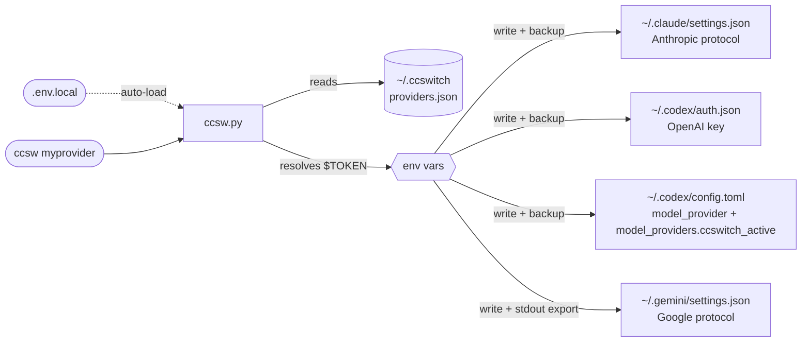

<div align="center">

# ccswitch-terminal

**Claude Code + Codex CLI + Gemini CLI 向け統一 API Provider 切り替えツール**

[](LICENSE)
[](https://www.python.org/)
[](#インストール)

[简体中文](README.md) | [English](README_EN.md) | 日本語 | [Español](README_ES.md) | [Português](README_PT.md) | [Русский](README_RU.md)

</div>

---

## 概要

Claude Code、Codex CLI、Gemini CLI を併用していますか。API Provider を切り替えるたびに複数の設定ファイルを編集し、ツールごとに異なる token フィールドを覚えるのは面倒です。**ccswitch** はその切り替え作業をまとめて扱います。

- **ワンコマンド切り替え**: `ccsw myprovider` で Claude を切り替え、`ccsw all myprovider` で 3 ツールを同時に切り替え
- **設定の分離**: 各 provider は Anthropic / OpenAI / Google の 3 系統を独立して保持
- **安全境界が明確**: `providers.json` には `$ENV_VAR` 参照のみを保存し、切り替え時に解決済みの秘密情報を対象ツールの設定または有効化ファイルに書き込み、上書き前には自動バックアップ
- **自然に連携**: Claude Code の対話中にライブ切り替えでき、Gemini の環境変数も自動で有効化

---

## インストール

**Claude Code / Codex にそのまま投げる導入プロンプト**。`<...>` を置き換えてそのまま送信できます。

```
ccswitch (AI ターミナルツール用 API スイッチャー) をインストールしてください:

リポジトリ: https://github.com/Boulea7/ccswitch-terminal
セットアップ: ~/ccsw に clone → bootstrap.sh を実行 → source ~/.zshrc

そのあと provider を 1 つ設定してください:
  名前: <provider-name>    エイリアス: <short-name>
  Claude URL:   <https://api.example.com/anthropic>
  Claude Token: <your-claude-token>
  Codex URL:    <https://api.example.com/openai/v1>
  Codex Token:  <your-codex-token>
  Gemini Key:   <your-gemini-key または空欄でスキップ>

token は平文で ~/ccsw/.env.local に保存し、providers.json では $ENV_VAR 参照を使ってください。
最後に ccsw list と ccsw show を実行して確認してください。
```

<details>
<summary>例: カスタム Provider を使う場合</summary>

```
ccswitch (AI ターミナルツール用 API スイッチャー) をインストールしてください:

リポジトリ: https://github.com/Boulea7/ccswitch-terminal
セットアップ: ~/ccsw に clone → bootstrap.sh を実行 → source ~/.zshrc

そのあと provider を 1 つ設定してください:
  名前: myprovider    エイリアス: mp
  Claude URL:   https://api.example.com/anthropic
  Claude Token: <your-claude-token>
  Codex URL:    https://api.example.com/openai/v1
  Codex Token:  <your-codex-token>
  Gemini Key:   空欄でスキップ

token は平文で ~/ccsw/.env.local に保存し、providers.json では $ENV_VAR 参照を使ってください。
最後に ccsw list と ccsw show を実行して確認してください。
```

</details>

**手動インストール（3 コマンド）:**

```bash
git clone https://github.com/Boulea7/ccswitch-terminal ~/ccsw
bash ~/ccsw/bootstrap.sh
source ~/.zshrc   # または source ~/.bashrc
```

`bootstrap.sh` 実行後、`ccsw`、`cxsw`、`gcsw`、`ccswitch` の 4 つのシェル関数が登録され、Gemini と Codex の有効化ファイルも自動で source されます。

---

## 基本的な使い方

```bash
# -- switch --
ccsw myprovider                   # Claude を切り替え（tool 名省略）
cxsw myprovider                   # Codex を切り替え（OPENAI_API_KEY を有効化し、custom model_provider を更新）
gcsw myprovider                   # Gemini を切り替え（GEMINI_API_KEY を自動有効化）
ccsw all myprovider               # 3 ツールをまとめて切り替え

# -- manage --
ccsw list                         # Provider 一覧
ccsw show                         # 現在の active 設定
ccsw add <name>                   # Provider の追加 / 更新
ccsw remove <name>                # Provider の削除
ccsw alias <alias> <provider>     # エイリアス作成
```

---

## 応用機能

<details>
<summary><b>ローカルシークレット: .env.local</b></summary>

`ccsw.py` と同じディレクトリに `.env.local` を置くと、token をローカルに保存できます。`~/.zshrc` や `~/.bashrc` に export を追加する必要はありません。

```bash
# ~/ccsw/.env.local（git には含めない）
MY_PROVIDER_CLAUDE_TOKEN=<your-claude-token>
MY_PROVIDER_CODEX_TOKEN=<your-codex-token>
MY_PROVIDER_GEMINI_KEY=<your-gemini-key>
```

`ccsw` は起動時にこのファイルを自動読み込みします。既に shell 環境に存在する変数は上書きしません。

> [!IMPORTANT]
> `.env.local` は `providers.json` や shell 起動ファイルでどう秘密情報を参照するかを解決する仕組みです。実際に切り替えを実行すると、解決済みの秘密情報は対象ツールの設定ファイルまたは有効化ファイルに書き込まれます。

> [!WARNING]
> `.env.local` には平文の秘密情報が入ります。`.gitignore` に含まれていることを確認してください。

</details>

<details>
<summary><b>対話中のライブ切り替え</b></summary>

Claude Code は API リクエストごとに `~/.claude/settings.json` の `env` を再読み込みします。

> 別ターミナルで `ccsw claude <provider>` を実行すると、今の Claude Code セッションは再起動不要で、**次のメッセージから**新しい Provider を使います。

```bash
# Terminal A: Claude Code の対話中

# Terminal B: provider を切り替え
ccsw claude myprovider

# Terminal A に戻って次のメッセージを送ると myprovider が使われる
```

> [!NOTE]
> Codex CLI でも同様で、`cxsw <provider>` 後の次回呼び出しから反映されます。
> Gemini CLI は同じ shell で `gcsw` を実行したときに即時反映されます。

</details>

<details>
<summary><b>ツールごとの設定と環境変数</b></summary>

**1 つの Provider がツールごとに別 URL / token を持ちます。**

Claude Code は Anthropic、Codex CLI は OpenAI、Gemini CLI は Google 系の設定を使うため、個別に管理します。

```json
{
  "providers": {
    "myprovider": {
      "claude": { "base_url": "https://api.example.com/anthropic", "token": "$MY_PROVIDER_CLAUDE_TOKEN" },
      "codex":  { "base_url": "https://api.example.com/openai/v1", "token": "$MY_PROVIDER_CODEX_TOKEN" },
      "gemini": { "api_key": "$MY_PROVIDER_GEMINI_KEY", "auth_type": "api-key" }
    }
  }
}
```

**1 つの Provider が 1〜2 ツールだけをサポートしていても構いません。** 未対応ツールは `null` にしておけば自動で skip されます。

```
ccsw all claude-only の出力:
[claude] Updated ~/.claude/settings.json
[codex]  Skipped: provider 'claude-only' has no codex config.
[gemini] Skipped: provider 'claude-only' has no gemini config.
```

**Gemini / Codex の env 有効化**: `GEMINI_API_KEY` と `OPENAI_API_KEY` は環境変数なので、子プロセスから親 shell を直接書き換えることはできません。`gcsw`、`cxsw`、`ccsw gemini/all` は内部で `eval` を処理します。

```bash
gcsw myprovider          # Gemini を切り替え
cxsw myprovider          # Codex を切り替え
ccsw all myprovider      # すべて切り替え
```

**CI/CD や Docker で Python スクリプトを直接呼ぶ場合** は、自分で `eval` を付けます。

```bash
eval "$(python3 ccsw.py gemini myprovider)"
eval "$(python3 ccsw.py all myprovider)"
```

Gemini の切り替えが成功すると `export` 文は `~/.ccswitch/active.env` に書かれ、新しい shell でも自動で読み込まれます。

</details>

<details>
<summary><b>Codex 0.116+ 互換性メモ</b></summary>

`codex-cli 0.116.0` 以降、一部の OpenAI 互換 relay では root の `openai_base_url` だけを書き換えても十分ではありません。CLI が内蔵 OpenAI provider とみなしたまま Responses WebSocket 経路を試すことがあります。

HTTP Responses のみ対応する relay では、次のような起動失敗が起こりえます。

- `relay: Request method 'GET' is not supported`
- `GET /openai/v1/models` が 404

そのため `ccsw` は Codex 側に次の形式で書き込みます。

```toml
model_provider = "ccswitch_active"

[model_providers.ccswitch_active]
name = "ccswitch: myprovider"
base_url = "https://api.example.com/openai/v1"
env_key = "OPENAI_API_KEY"
supports_websockets = false
wire_api = "responses"
```

これにより Codex は relay を WebSocket 非対応の custom provider として扱い、HTTP Responses を優先します。

</details>

---

## プロバイダー管理

<details>
<summary><b>組み込み Provider</b></summary>

| プロバイダー | Claude Code | Codex CLI | Gemini CLI | 別名 | シークレット参照元 |
|------------|:-----------:|:---------:|:----------:|------|--------------------|
| `88code` | ✅ | ✅ | ❌ | `88` | 環境変数または `.env.local` |
| `zhipu` | ✅ | ❌ | ❌ | `glm` | 環境変数または `.env.local` |
| `rightcode` | ❌ | ✅ | ❌ | `rc` | 環境変数または `.env.local` |
| `anyrouter` | ✅ | ❌ | ❌ | `any` | 環境変数または `.env.local` |

組み込み Provider は既定で環境変数参照を使います。独自の命名で統一したい場合は、同じ名前で `ccsw add <name>` を実行して保存し直してください。

</details>

<details>
<summary><b>設定テンプレート</b></summary>

まずは汎用テンプレートから始め、URL や環境変数名だけ provider 側の仕様に合わせて差し替えるのが簡単です。

```bash
ccsw add myprovider \
  --claude-url   https://api.example.com/anthropic \
  --claude-token '$MY_PROVIDER_CLAUDE_TOKEN' \
  --codex-url    https://api.example.com/openai/v1 \
  --codex-token  '$MY_PROVIDER_CODEX_TOKEN' \
  --gemini-key   '$MY_PROVIDER_GEMINI_KEY'
```

組み込みショートカットをそのまま使うこともできます。

```bash
ccsw 88code
ccsw glm
cxsw rc
ccsw any
```

> URL の正確なパスは provider に依存します。必ず各 provider の公式ドキュメントを確認してください。よくあるパターン:
> - Anthropic: `/api`、`/v1`、`/api/anthropic`
> - OpenAI: `/v1`、`/openai/v1`

</details>

<details>
<summary><b>カスタム Provider の追加</b></summary>

**対話式（推奨）:**

```bash
ccsw add myprovider
```

各ツールの項目に沿って入力します。空欄は skip、token は `$ENV_VAR` 形式で指定できます。

**CLI フラグ:**

```bash
ccsw add myprovider \
  --claude-url   https://api.example.com/anthropic \
  --claude-token '$MY_PROVIDER_CLAUDE_TOKEN' \
  --codex-url    https://api.example.com/openai/v1 \
  --codex-token  '$MY_PROVIDER_CODEX_TOKEN' \
  --gemini-key   '$MY_PROVIDER_GEMINI_KEY'
```

追加オプション:

- `--gemini-auth-type <TYPE>`: Provider に保存する Gemini の `auth_type`。切り替え時には `~/.gemini/settings.json` の `security.auth.selectedType` に書き込まれます。省略時は Provider に既にある値を優先し、未設定なら実行時既定値 `api-key` を使います。

**1 フィールドだけ更新:**

```bash
ccsw add myprovider --gemini-key '$NEW_KEY'   # Gemini key だけ更新
```

</details>

---

## アーキテクチャ

<details>
<summary><b>動作フローと設定書き込み先</b></summary>



> [!NOTE]
> **stdout / stderr 分離**: 状態メッセージは stderr、Codex / Gemini の activation 文は stdout に出るため、`eval` で安全に拾えます。

| ツール | 設定ファイル | 書き込み内容 |
|--------|--------------|--------------|
| Claude Code | `~/.claude/settings.json` | `env.ANTHROPIC_AUTH_TOKEN`, `env.ANTHROPIC_BASE_URL`, extra_env |
| Codex CLI | `~/.codex/auth.json` | `OPENAI_API_KEY` |
| Codex CLI | `~/.codex/config.toml` | `model_provider`, `[model_providers.ccswitch_active]` |
| Codex 環境変数 | `~/.ccswitch/codex.env` | `OPENAI_API_KEY` と `unset OPENAI_BASE_URL` |
| Gemini CLI | `~/.gemini/settings.json` | `security.auth.selectedType` |
| Gemini 環境変数 | stdout + `~/.ccswitch/active.env` | `GEMINI_API_KEY` |

> [!IMPORTANT]
> `providers.json` に保存されるのは provider 定義と `$ENV_VAR` 参照です。実際の切り替え時には、解決済みの秘密情報が上表の実行時設定または有効化ファイルに書き込まれます。

> [!NOTE]
> Codex CLI では custom `model_provider` を書き込み、`supports_websockets = false` を明示します。これにより、HTTP Responses だけをサポートする OpenAI 互換 relay でも使いやすくなります。

</details>

<details>
<summary><b>providers.json の構造</b></summary>

`~/.ccswitch/providers.json` に保存されます。

```json
{
  "version": 1,
  "active": { "claude": "myprovider", "codex": "myprovider", "gemini": null },
  "aliases": { "mp": "myprovider" },
  "providers": {
    "myprovider": {
      "claude": {
        "base_url": "https://api.example.com/anthropic",
        "token": "$MY_PROVIDER_CLAUDE_TOKEN",
        "extra_env": {
          "API_TIMEOUT_MS": null,
          "CLAUDE_CODE_DISABLE_NONESSENTIAL_TRAFFIC": null
        }
      },
      "codex": {
        "base_url": "https://api.example.com/openai/v1",
        "token": "$MY_PROVIDER_CODEX_TOKEN"
      },
      "gemini": {
        "api_key": "$MY_PROVIDER_GEMINI_KEY",
        "auth_type": "api-key"
      }
    }
  }
}
```

`extra_env` で値を `null` にすると、そのキーは対象設定から削除されます。

> [!NOTE]
> ここにあるのは `ccswitch` 自身の store です。`$ENV_VAR` 参照もここに保持されます。切り替え後は、解決済みの秘密情報が上で示した対象設定へ書き込まれます。Codex では `~/.codex/config.toml` に `model_provider = "ccswitch_active"` と `[model_providers.ccswitch_active]` が書き込まれます。

</details>

<details>
<summary><b>利用シーン: SSH / Docker / CI-CD</b></summary>

**SSH リモートサーバー**

```bash
ssh user@server
# リモート shell に入ったら:
eval "$(ccsw all myprovider)"
```

**Docker コンテナ**

```dockerfile
COPY ccsw.py /usr/local/bin/ccsw.py
RUN chmod +x /usr/local/bin/ccsw.py
ENV MY_PROVIDER_CODEX_TOKEN=<your-codex-token>
ENV MY_PROVIDER_CLAUDE_TOKEN=<your-claude-token>
```

```bash
docker exec -it mycontainer bash -c \
  'python3 /usr/local/bin/ccsw.py claude myprovider && eval "$(python3 /usr/local/bin/ccsw.py codex myprovider)"'
```

**CI/CD Pipeline (GitHub Actions)**

```yaml
- name: Configure AI tool providers
  env:
    MY_PROVIDER_CLAUDE_TOKEN: ${{ secrets.MY_PROVIDER_CLAUDE_TOKEN }}
    MY_PROVIDER_CODEX_TOKEN: ${{ secrets.MY_PROVIDER_CODEX_TOKEN }}
  run: |
    python ccsw.py claude myprovider
    python ccsw.py codex myprovider
```

</details>

---

## 開発と検証

スクリプトやドキュメントを変更したら、最低限次の確認を行ってください。

```bash
python3 ccsw.py -h
python3 ccsw.py list
python3 -m unittest discover -s tests -q
```

インストール直後の軽い smoke check は、設定を書き換えない次のコマンドを優先すると安全です。

```bash
type ccsw
type cxsw
type gcsw
ccsw list
ccsw show
```

> [!NOTE]
> 実際の `switch` コマンドは `~/.claude`、`~/.codex`、`~/.gemini`、`~/.ccswitch` の各ファイルを書き換えます。導入確認だけなら、まずは上の read-only check から始めてください。

---

## FAQ

<details>
<summary><b>Q: gcsw を実行しても $GEMINI_API_KEY が空のままです</b></summary>

確認ポイント:
1. shell function が入っているか。`type gcsw` で確認
2. 同じ shell session で実行しているか
3. Python スクリプトを直接呼んでいるなら `eval "$(python3 ccsw.py gemini ...)"` が必要

</details>

<details>
<summary><b>Q: <code>[claude] Skipped: token unresolved</code> とは何ですか</b></summary>

token が `$MY_ENV_VAR` として保存されているのに、その環境変数が今の環境に存在しない状態です。

対処方法:
- `export MY_ENV_VAR=your_token`
- `ccsw` ディレクトリの `.env.local` に `MY_ENV_VAR=your_token` を書く

</details>

<details>
<summary><b>Q: ~/.claude/settings.json が上書きされました。戻せますか</b></summary>

書き込み前に timestamp 付き backup が作られます。例: `settings.json.bak-20260313-120000`。必要なら `cp` で戻してください。

</details>

<details>
<summary><b>Q: .env.local と ~/.zshrc の export は何が違いますか</b></summary>

`.env.local` の値は `ccsw` 実行時だけ読み込まれるため、グローバルな shell 環境を汚しません。`~/.zshrc` の export は全 shell に常駐します。AI ツール用 token では `.env.local` のほうが露出面を減らせますが、切り替え成功後は解決済みの秘密情報が対象ツールの設定または有効化ファイルに書き込まれます。

</details>

---

## 要件

Python 3.8+（標準ライブラリのみ。`pip install` 不要）

## License

MIT

---

<div align="right">

[⬆ トップへ戻る](#ccswitch-terminal)

</div>
