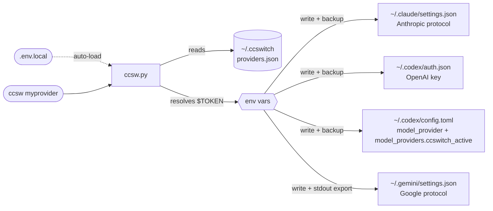

<div align="center">


# ccswitch-terminal

**Alternador unificado de providers de API para Claude Code + Codex CLI + Gemini CLI**

[](LICENSE)
[](https://www.python.org/)
[](#instalação)

[简体中文](README.md) | [English](README_EN.md) | [日本語](README_JA.md) | [Español](README_ES.md) | Português | [Русский](README_RU.md)

</div>

---

## Introdução

Se você usa Claude Code, Codex CLI e Gemini CLI ao mesmo tempo, trocar de provider de API costuma significar editar vários arquivos de configuração e lembrar campos de token diferentes para cada ferramenta. **ccswitch** simplifica esse fluxo.

- **Troca com um comando**: `ccsw myprovider` troca o Claude; `ccsw all myprovider` sincroniza as três ferramentas
- **Configuração isolada**: cada provider mantém URLs e tokens independentes para Anthropic / OpenAI / Google
- **Limite de segurança claro**: `providers.json` guarda apenas referências `$ENV_VAR`; durante a troca, os segredos resolvidos são escritos nos arquivos de configuração ou ativação de destino, com backup antes de sobrescrever
- **Integração natural**: permite troca em tempo real no Claude Code e ativa automaticamente as variáveis do Gemini

---

## Instalação

**Prompt pronto para colar no Claude Code / Codex**. Substitua os `<...>` e envie como está.

```
Por favor, instale o ccswitch (alternador de API para ferramentas de IA no terminal):

Repositório: https://github.com/Boulea7/ccswitch-terminal
Instalação: clonar em ~/ccsw → rodar bootstrap.sh → source ~/.zshrc

Depois configure um provider:
  Nome: <provider-name>    Alias: <short-name>
  Claude URL:   <https://api.example.com/anthropic>
  Claude Token: <your-claude-token>
  Codex URL:    <https://api.example.com/openai/v1>
  Codex Token:  <your-codex-token>
  Gemini Key:   <your-gemini-key ou deixe em branco para pular>

Grave os tokens em texto puro em ~/ccsw/.env.local e use referências $ENV_VAR em providers.json.
No final, execute ccsw list e ccsw show para confirmar.
```

<details>
<summary>Exemplo: versão preenchida com um provider personalizado</summary>

```
Por favor, instale o ccswitch (alternador de API para ferramentas de IA no terminal):

Repositório: https://github.com/Boulea7/ccswitch-terminal
Instalação: clonar em ~/ccsw → rodar bootstrap.sh → source ~/.zshrc

Depois configure um provider:
  Nome: myprovider    Alias: mp
  Claude URL:   https://api.example.com/anthropic
  Claude Token: <your-claude-token>
  Codex URL:    https://api.example.com/openai/v1
  Codex Token:  <your-codex-token>
  Gemini Key:   deixe em branco para pular

Grave os tokens em texto puro em ~/ccsw/.env.local e use referências $ENV_VAR em providers.json.
No final, execute ccsw list e ccsw show para confirmar.
```

</details>

**Instalação manual (3 comandos):**

```bash
git clone https://github.com/Boulea7/ccswitch-terminal ~/ccsw
bash ~/ccsw/bootstrap.sh
source ~/.zshrc   # ou source ~/.bashrc
```

Depois de `bootstrap.sh`, quatro funções de shell são registradas (`ccsw`, `cxsw`, `gcsw`, `ccswitch`) e os arquivos de ativação do Gemini e do Codex passam a ser carregados automaticamente.

---

## Uso básico

```bash
# -- switch --
ccsw myprovider                   # Troca o Claude (nome da ferramenta opcional)
cxsw myprovider                   # Troca o Codex (ativa OPENAI_API_KEY e atualiza o model_provider personalizado)
gcsw myprovider                   # Troca o Gemini (ativa GEMINI_API_KEY automaticamente)
ccsw all myprovider               # Troca as três ferramentas de uma vez

# -- manage --
ccsw list                         # Lista todos os providers
ccsw show                         # Mostra a configuração ativa
ccsw add <name>                   # Adiciona ou atualiza um provider
ccsw remove <name>                # Remove um provider
ccsw alias <alias> <provider>     # Cria um alias
```

---

## Recursos avançados

<details>
<summary><b>Segredos locais: .env.local</b></summary>

Crie um arquivo `.env.local` no mesmo diretório de `ccsw.py` para guardar tokens localmente, sem adicionar exports ao `~/.zshrc` ou `~/.bashrc`.

```bash
# ~/ccsw/.env.local  (ignorado pelo git)
MY_PROVIDER_CLAUDE_TOKEN=<your-claude-token>
MY_PROVIDER_CODEX_TOKEN=<your-codex-token>
MY_PROVIDER_GEMINI_KEY=<your-gemini-key>
```

`ccsw` carrega esse arquivo na inicialização e não sobrescreve variáveis que já existirem no ambiente.

> [!IMPORTANT]
> `.env.local` resolve como os segredos são referenciados a partir de `providers.json` e dos arquivos de inicialização do shell; quando você executa uma troca real, os segredos resolvidos ainda são escritos nos arquivos de configuração ou ativação da ferramenta de destino.

> [!WARNING]
> `.env.local` contém segredos em texto puro. Garanta que ele esteja listado no `.gitignore`.

</details>

<details>
<summary><b>Troca em tempo real durante a conversa</b></summary>

O Claude Code relê o bloco `env` de `~/.claude/settings.json` antes de cada requisição de API.

> Se você rodar `ccsw claude <provider>` em outro terminal, a sessão atual do Claude Code usará o novo provider **na próxima mensagem**, sem reiniciar.

```bash
# Terminal A: Claude Code em uso

# Terminal B: trocar o provider
ccsw claude myprovider

# De volta ao A: a próxima mensagem usa myprovider
```

> [!NOTE]
> No Codex CLI o comportamento é parecido: `cxsw <provider>` entra em vigor na próxima invocação.
> No Gemini CLI, `gcsw` precisa ser executado na mesma sessão de shell para surtir efeito imediato.

</details>

<details>
<summary><b>Configuração por ferramenta e variáveis de ambiente</b></summary>

**Cada provider mantém URL e token separados para cada ferramenta.**

Claude Code usa Anthropic, Codex CLI usa OpenAI e Gemini CLI usa Google, então cada bloco é configurado de forma independente.

```json
{
  "providers": {
    "myprovider": {
      "claude": { "base_url": "https://api.example.com/anthropic", "token": "$MY_PROVIDER_CLAUDE_TOKEN" },
      "codex":  { "base_url": "https://api.example.com/openai/v1", "token": "$MY_PROVIDER_CODEX_TOKEN" },
      "gemini": { "api_key": "$MY_PROVIDER_GEMINI_KEY", "auth_type": "api-key" }
    }
  }
}
```

**Um provider pode suportar só 1 ou 2 ferramentas.** As não suportadas ficam como `null` e são ignoradas automaticamente.

```
Saída de ccsw all claude-only:
[claude] Updated ~/.claude/settings.json
[codex]  Skipped: provider 'claude-only' has no codex config.
[gemini] Skipped: provider 'claude-only' has no gemini config.
```

**Ativação de env para Gemini / Codex**: `GEMINI_API_KEY` e `OPENAI_API_KEY` são variáveis de ambiente, então um processo filho não consegue reescrever o shell pai. As funções `gcsw`, `cxsw` e `ccsw gemini/all` já embutem `eval`.

```bash
gcsw myprovider
cxsw myprovider
ccsw all myprovider
```

**Se você chamar o script Python diretamente** em CI/CD ou Docker, adicione `eval` manualmente:

```bash
eval "$(python3 ccsw.py gemini myprovider)"
eval "$(python3 ccsw.py all myprovider)"
```

Toda troca bem-sucedida do Gemini escreve a linha `export` em `~/.ccswitch/active.env`, que é carregada automaticamente em novas sessões.

</details>

<details>
<summary><b>Nota de compatibilidade com Codex 0.116+</b></summary>

Desde `codex-cli 0.116.0`, sobrescrever apenas `openai_base_url` na raiz não é mais confiável para alguns relays compatíveis com OpenAI. O CLI ainda pode tratá-los como provider OpenAI embutido e tentar a rota Responses WebSocket.

Em relays que suportam apenas HTTP Responses, isso pode falhar com mensagens como:

- `relay: Request method 'GET' is not supported`
- `GET /openai/v1/models` retornando 404

Por isso o `ccsw` escreve a configuração do Codex neste formato:

```toml
model_provider = "ccswitch_active"

[model_providers.ccswitch_active]
name = "ccswitch: myprovider"
base_url = "https://api.example.com/openai/v1"
env_key = "OPENAI_API_KEY"
supports_websockets = false
wire_api = "responses"
```

Assim o Codex trata o relay como um provider personalizado sem suporte a WebSocket e prefere a rota HTTP Responses.

</details>

---

## Gerenciamento de providers

<details>
<summary><b>Providers embutidos</b></summary>

| Provedor | Claude Code | Codex CLI | Gemini CLI | Alias | Origem do segredo |
|----------|:-----------:|:---------:|:----------:|-------|-------------------|
| `88code` | ✅ | ✅ | ❌ | `88` | Variáveis de ambiente ou `.env.local` |
| `zhipu` | ✅ | ❌ | ❌ | `glm` | Variáveis de ambiente ou `.env.local` |
| `rightcode` | ❌ | ✅ | ❌ | `rc` | Variáveis de ambiente ou `.env.local` |
| `anyrouter` | ✅ | ❌ | ❌ | `any` | Variáveis de ambiente ou `.env.local` |

Os providers embutidos usam referências a variáveis de ambiente por padrão. Se você preferir outro esquema de nomes, pode salvar novamente o mesmo provider com `ccsw add <name>`.

</details>

<details>
<summary><b>Template de configuração</b></summary>

Comece com um template genérico e depois troque URLs e nomes de variáveis conforme a documentação do seu provider.

```bash
ccsw add myprovider \
  --claude-url   https://api.example.com/anthropic \
  --claude-token '$MY_PROVIDER_CLAUDE_TOKEN' \
  --codex-url    https://api.example.com/openai/v1 \
  --codex-token  '$MY_PROVIDER_CODEX_TOKEN' \
  --gemini-key   '$MY_PROVIDER_GEMINI_KEY'
```

Se preferir atalhos prontos, use os embutidos diretamente:

```bash
ccsw 88code
ccsw glm
cxsw rc
ccsw any
```

> O caminho exato da URL varia por provider. Sempre confira a documentação oficial. Padrões comuns:
> - Anthropic: `/api`, `/v1`, `/api/anthropic`
> - OpenAI: `/v1`, `/openai/v1`

</details>

<details>
<summary><b>Adicionando providers personalizados</b></summary>

**Modo interativo (recomendado):**

```bash
ccsw add myprovider
```

Siga os prompts de cada ferramenta. Deixe em branco para pular. Use `$ENV_VAR` para os tokens.

**Via flags de CLI:**

```bash
ccsw add myprovider \
  --claude-url   https://api.example.com/anthropic \
  --claude-token '$MY_PROVIDER_CLAUDE_TOKEN' \
  --codex-url    https://api.example.com/openai/v1 \
  --codex-token  '$MY_PROVIDER_CODEX_TOKEN' \
  --gemini-key   '$MY_PROVIDER_GEMINI_KEY'
```

Flag opcional extra:

- `--gemini-auth-type <TYPE>`: define o `auth_type` do Gemini salvo no provider. Durante a troca, ele é escrito em `security.auth.selectedType` dentro de `~/.gemini/settings.json`. Se você omitir, o valor existente no provider é preservado; se também não existir, o padrão em runtime será `api-key`.

**Atualizar um único campo:**

```bash
ccsw add myprovider --gemini-key '$NEW_KEY'   # Atualiza apenas a chave do Gemini
```

</details>

---

## Arquitetura

<details>
<summary><b>Fluxo interno e destinos de escrita</b></summary>



> [!NOTE]
> **Separação entre stdout e stderr**: mensagens de status vão para stderr; instruções de ativação de Codex / Gemini vão para stdout para que `eval` possa capturá-las.

| Ferramenta | Arquivo de configuração | Campos gravados |
|------------|-------------------------|------------------|
| Claude Code | `~/.claude/settings.json` | `env.ANTHROPIC_AUTH_TOKEN`, `env.ANTHROPIC_BASE_URL`, extra_env |
| Codex CLI | `~/.codex/auth.json` | `OPENAI_API_KEY` |
| Codex CLI | `~/.codex/config.toml` | `model_provider`, `[model_providers.ccswitch_active]` |
| Ambiente do Codex | `~/.ccswitch/codex.env` | `OPENAI_API_KEY`, além de `unset OPENAI_BASE_URL` |
| Gemini CLI | `~/.gemini/settings.json` | `security.auth.selectedType` |
| Ambiente do Gemini | stdout + `~/.ccswitch/active.env` | `GEMINI_API_KEY` |

> [!IMPORTANT]
> `providers.json` guarda definições de provider e referências `$ENV_VAR`; quando a troca acontece de fato, os segredos resolvidos são escritos nos arquivos de configuração ou ativação listados acima.

> [!NOTE]
> Para Codex CLI, `ccswitch` escreve um `model_provider` personalizado e fixa `supports_websockets = false`, o que ajuda com relays compatíveis com OpenAI que suportam HTTP Responses, mas não Responses WebSocket.

</details>

<details>
<summary><b>Estrutura do providers.json</b></summary>

Ele fica em `~/.ccswitch/providers.json`:

```json
{
  "version": 1,
  "active": { "claude": "myprovider", "codex": "myprovider", "gemini": null },
  "aliases": { "mp": "myprovider" },
  "providers": {
    "myprovider": {
      "claude": {
        "base_url": "https://api.example.com/anthropic",
        "token": "$MY_PROVIDER_CLAUDE_TOKEN",
        "extra_env": {
          "API_TIMEOUT_MS": null,
          "CLAUDE_CODE_DISABLE_NONESSENTIAL_TRAFFIC": null
        }
      },
      "codex": {
        "base_url": "https://api.example.com/openai/v1",
        "token": "$MY_PROVIDER_CODEX_TOKEN"
      },
      "gemini": {
        "api_key": "$MY_PROVIDER_GEMINI_KEY",
        "auth_type": "api-key"
      }
    }
  }
}
```

Valores `null` em `extra_env` removem aquela chave do arquivo de configuração de destino.

> [!NOTE]
> Esse JSON é o store interno do `ccswitch`. Ele mantém definições de provider e referências `$ENV_VAR`; depois da troca, os segredos resolvidos são gravados nos arquivos mostrados acima. No caso do Codex, a configuração real é escrita em `~/.codex/config.toml` usando `model_provider = "ccswitch_active"` e `[model_providers.ccswitch_active]`.

</details>

<details>
<summary><b>Cenários de uso: SSH / Docker / CI-CD</b></summary>

**Servidor remoto via SSH**

```bash
ssh user@server
# Já no shell remoto:
eval "$(ccsw all myprovider)"
```

**Container Docker**

```dockerfile
COPY ccsw.py /usr/local/bin/ccsw.py
RUN chmod +x /usr/local/bin/ccsw.py
ENV MY_PROVIDER_CODEX_TOKEN=<your-codex-token>
ENV MY_PROVIDER_CLAUDE_TOKEN=<your-claude-token>
```

```bash
docker exec -it mycontainer bash -c \
  'python3 /usr/local/bin/ccsw.py claude myprovider && eval "$(python3 /usr/local/bin/ccsw.py codex myprovider)"'
```

**Pipeline CI/CD (GitHub Actions)**

```yaml
- name: Configure AI tool providers
  env:
    MY_PROVIDER_CLAUDE_TOKEN: ${{ secrets.MY_PROVIDER_CLAUDE_TOKEN }}
    MY_PROVIDER_CODEX_TOKEN: ${{ secrets.MY_PROVIDER_CODEX_TOKEN }}
  run: |
    python ccsw.py claude myprovider
    python ccsw.py codex myprovider
```

</details>

---

## Desenvolvimento e verificação

Depois de alterar o script ou a documentação, execute pelo menos este conjunto mínimo:

```bash
python3 ccsw.py -h
python3 ccsw.py list
python3 -m unittest discover -s tests -q
```

Para um smoke check leve logo após a instalação, priorize comandos que não reescrevem configurações:

```bash
type ccsw
type cxsw
type gcsw
ccsw list
ccsw show
```

> [!NOTE]
> Os comandos `switch` reais escrevem arquivos em `~/.claude`, `~/.codex`, `~/.gemini` ou `~/.ccswitch`. Se você só quiser confirmar que a instalação funcionou, comece pelas verificações somente leitura acima.

---

## FAQ

<details>
<summary><b>Q: Depois de rodar gcsw, $GEMINI_API_KEY continua vazio</b></summary>

Verifique:
1. Se as funções de shell estão instaladas com `type gcsw`
2. Se você está executando na mesma sessão de shell
3. Se, ao chamar o script Python diretamente, você usa `eval "$(python3 ccsw.py gemini ...)"`

</details>

<details>
<summary><b>Q: O que significa <code>[claude] Skipped: token unresolved</code>?</b></summary>

Significa que o token está salvo como `$MY_ENV_VAR`, mas essa variável não existe no ambiente atual.

Soluções:
- `export MY_ENV_VAR=your_token`
- Adicionar `MY_ENV_VAR=your_token` ao `.env.local` no diretório do ccsw

</details>

<details>
<summary><b>Q: Meu ~/.claude/settings.json foi sobrescrito. Como recuperar?</b></summary>

Antes de cada escrita, o ccsw cria um backup com timestamp, por exemplo `settings.json.bak-20260313-120000`. Você pode restaurá-lo com `cp`.

</details>

<details>
<summary><b>Q: Qual a diferença entre .env.local e export em ~/.zshrc?</b></summary>

Os tokens em `.env.local` só são carregados quando `ccsw` roda, então não poluem o ambiente global do shell. Exports em `~/.zshrc` ficam presentes em toda nova sessão. `.env.local` reduz a exposição global, mas quando a troca é concluída, os segredos resolvidos ainda são gravados nos arquivos de configuração ou ativação da ferramenta de destino.

</details>

---

## Requisitos

Python 3.8+ (somente biblioteca padrão, sem `pip install`)

## License

MIT

---

<div align="right">

[⬆ Voltar ao topo](#ccswitch-terminal)

</div>
