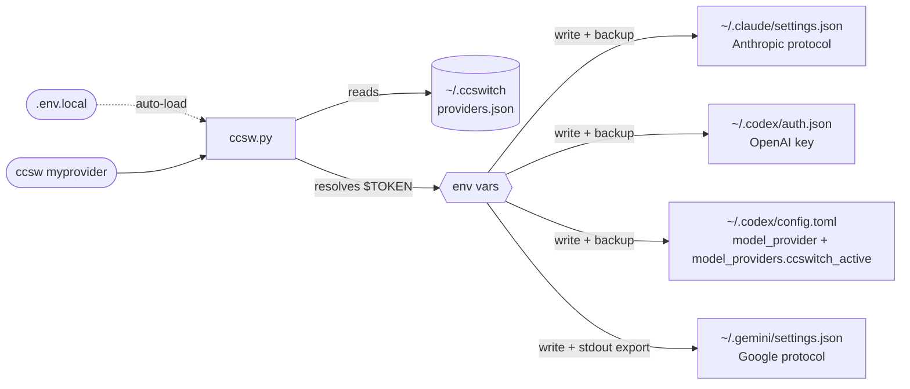

<div align="center">

# ccswitch--terminal

**Единый переключатель API providers для Claude Code + Codex CLI + Gemini CLI**

[](LICENSE)
[](https://www.python.org/)
[](#установка)

[简体中文](README.md) | [English](README_EN.md) | [日本語](README_JA.md) | [Español](README_ES.md) | [Português](README_PT.md) | Русский

</div>

---

## Введение

Если вы используете Claude Code, Codex CLI и Gemini CLI одновременно, смена API provider обычно означает правку нескольких конфигов и разные форматы token для разных инструментов. **ccswitch** упрощает этот процесс.

- **Переключение одной командой**: `ccsw myprovider` переключает Claude; `ccsw all myprovider` синхронно переключает все три инструмента
- **Изолированная конфигурация**: каждый provider хранит отдельные URL и token для Anthropic / OpenAI / Google
- **Понятная граница безопасности**: `providers.json` хранит только ссылки вида `$ENV_VAR`; при переключении разрешенные секреты записываются в целевые конфиги или файлы активации, а перед перезаписью создается backup
- **Нативная интеграция**: Claude Code можно переключать на лету, а переменные Gemini активируются автоматически

---

## Установка

**Готовый prompt для Claude Code / Codex**. Замените `<...>` и отправьте как есть.

```
Пожалуйста, установи ccswitch (переключатель API для AI-инструментов в терминале):

Репозиторий: https://github.com/Boulea7/ccswitch--terminal
Установка: клонировать в ~/ccsw → запустить bootstrap.sh → source ~/.zshrc

Затем настрой один provider:
  Имя: <provider-name>    Алиас: <short-name>
  Claude URL:   <https://api.example.com/anthropic>
  Claude Token: <your-claude-token>
  Codex URL:    <https://api.example.com/openai/v1>
  Codex Token:  <your-codex-token>
  Gemini Key:   <your-gemini-key или оставить пустым>

Сохрани token в открытом виде в ~/ccsw/.env.local, а в providers.json используй ссылки $ENV_VAR.
В конце выполни ccsw list и ccsw show для проверки.
```

<details>
<summary>Пример: заполненная версия с кастомным provider</summary>

```
Пожалуйста, установи ccswitch (переключатель API для AI-инструментов в терминале):

Репозиторий: https://github.com/Boulea7/ccswitch--terminal
Установка: клонировать в ~/ccsw → запустить bootstrap.sh → source ~/.zshrc

Затем настрой один provider:
  Имя: myprovider    Алиас: mp
  Claude URL:   https://api.example.com/anthropic
  Claude Token: <your-claude-token>
  Codex URL:    https://api.example.com/openai/v1
  Codex Token:  <your-codex-token>
  Gemini Key:   оставить пустым

Сохрани token в открытом виде в ~/ccsw/.env.local, а в providers.json используй ссылки $ENV_VAR.
В конце выполни ccsw list и ccsw show для проверки.
```

</details>

**Ручная установка (3 команды):**

```bash
git clone https://github.com/Boulea7/ccswitch--terminal ~/ccsw
bash ~/ccsw/bootstrap.sh
source ~/.zshrc   # или source ~/.bashrc
```

После `bootstrap.sh` в shell добавляются четыре функции (`ccsw`, `cxsw`, `gcsw`, `ccswitch`), а также настраивается автоподключение файлов активации для Gemini и Codex.

---

## Базовое использование

```bash
# -- switch --
ccsw myprovider                   # Переключить Claude (имя инструмента можно опустить)
cxsw myprovider                   # Переключить Codex (активирует OPENAI_API_KEY и обновляет custom model_provider)
gcsw myprovider                   # Переключить Gemini (автоматически активирует GEMINI_API_KEY)
ccsw all myprovider               # Переключить все три инструмента сразу

# -- manage --
ccsw list                         # Показать все providers
ccsw show                         # Показать активную конфигурацию
ccsw add <name>                   # Добавить или обновить provider
ccsw remove <name>                # Удалить provider
ccsw alias <alias> <provider>     # Создать алиас
```

---

## Расширенные возможности

<details>
<summary><b>Локальные секреты: .env.local</b></summary>

Создайте `.env.local` рядом с `ccsw.py`, чтобы хранить token локально и не добавлять export в `~/.zshrc` или `~/.bashrc`.

```bash
# ~/ccsw/.env.local  (игнорируется git)
MY_PROVIDER_CLAUDE_TOKEN=<your-claude-token>
MY_PROVIDER_CODEX_TOKEN=<your-codex-token>
MY_PROVIDER_GEMINI_KEY=<your-gemini-key>
```

`ccsw` автоматически загружает этот файл при старте и не перезаписывает уже существующие переменные окружения.

> [!IMPORTANT]
> `.env.local` решает задачу ссылки на секреты из `providers.json` и файлов запуска shell; когда вы выполняете реальное переключение, разрешенные секреты все равно записываются в конфиги или файлы активации целевого инструмента.

> [!WARNING]
> `.env.local` содержит секреты в открытом виде. Убедитесь, что файл включен в `.gitignore`.

</details>

<details>
<summary><b>Переключение на лету во время сессии</b></summary>

Claude Code перечитывает блок `env` из `~/.claude/settings.json` перед каждым API-запросом.

> Если выполнить `ccsw claude <provider>` в другом терминале, текущая сессия Claude Code начнет использовать новый provider **со следующего сообщения** без перезапуска.

```bash
# Терминал A: идет сессия Claude Code

# Терминал B: переключаем provider
ccsw claude myprovider

# Возвращаемся в A: следующее сообщение уже идет через myprovider
```

> [!NOTE]
> Для Codex CLI действует похожая логика: `cxsw <provider>` применяется со следующего запуска.
> Для Gemini CLI команда `gcsw` должна быть выполнена в той же shell-сессии, чтобы эффект был мгновенным.

</details>

<details>
<summary><b>Раздельная конфигурация по инструментам и env vars</b></summary>

**Каждый provider хранит отдельные URL и token для каждого инструмента.**

Claude Code использует Anthropic, Codex CLI использует OpenAI, а Gemini CLI использует Google, поэтому конфигурации разделены.

```json
{
  "providers": {
    "myprovider": {
      "claude": { "base_url": "https://api.example.com/anthropic", "token": "$MY_PROVIDER_CLAUDE_TOKEN" },
      "codex":  { "base_url": "https://api.example.com/openai/v1", "token": "$MY_PROVIDER_CODEX_TOKEN" },
      "gemini": { "api_key": "$MY_PROVIDER_GEMINI_KEY", "auth_type": "api-key" }
    }
  }
}
```

**Один provider может поддерживать только 1–2 инструмента.** Неподдерживаемые инструменты можно оставить `null`, и они будут автоматически пропущены.

```
Вывод ccsw all claude-only:
[claude] Updated ~/.claude/settings.json
[codex]  Skipped: provider 'claude-only' has no codex config.
[gemini] Skipped: provider 'claude-only' has no gemini config.
```

**Активация env для Gemini / Codex**: `GEMINI_API_KEY` и `OPENAI_API_KEY` — это переменные окружения, поэтому дочерний процесс не может напрямую изменить родительский shell. Функции `gcsw`, `cxsw` и `ccsw gemini/all` уже содержат `eval`.

```bash
gcsw myprovider
cxsw myprovider
ccsw all myprovider
```

**Если вы вызываете Python-скрипт напрямую** в CI/CD или Docker, добавьте `eval` вручную:

```bash
eval "$(python3 ccsw.py gemini myprovider)"
eval "$(python3 ccsw.py all myprovider)"
```

После успешного переключения Gemini строка `export` сохраняется в `~/.ccswitch/active.env` и автоматически подхватывается в новых shell-сессиях.

</details>

<details>
<summary><b>Заметка о совместимости с Codex 0.116+</b></summary>

Начиная с `codex-cli 0.116.0`, одной только замены root `openai_base_url` уже недостаточно для части OpenAI-совместимых relay. CLI может продолжать воспринимать endpoint как встроенный OpenAI provider и пытаться идти через Responses WebSocket.

Для relay, которые поддерживают только HTTP Responses, это может приводить к ошибкам вида:

- `relay: Request method 'GET' is not supported`
- `GET /openai/v1/models` возвращает 404

Поэтому `ccsw` пишет конфигурацию Codex в таком виде:

```toml
model_provider = "ccswitch_active"

[model_providers.ccswitch_active]
name = "ccswitch: myprovider"
base_url = "https://api.example.com/openai/v1"
env_key = "OPENAI_API_KEY"
supports_websockets = false
wire_api = "responses"
```

Так Codex рассматривает relay как custom provider без поддержки WebSocket и предпочитает путь HTTP Responses.

</details>

---

## Управление providers

<details>
<summary><b>Встроенные providers</b></summary>

| Провайдер | Claude Code | Codex CLI | Gemini CLI | Алиас | Источник секрета |
|-----------|:-----------:|:---------:|:----------:|-------|-------------------|
| `88code` | ✅ | ✅ | ❌ | `88` | Переменные окружения или `.env.local` |
| `zhipu` | ✅ | ❌ | ❌ | `glm` | Переменные окружения или `.env.local` |
| `rightcode` | ❌ | ✅ | ❌ | `rc` | Переменные окружения или `.env.local` |
| `anyrouter` | ✅ | ❌ | ❌ | `any` | Переменные окружения или `.env.local` |

Встроенные providers по умолчанию используют ссылки на переменные окружения. Если вы хотите свою схему именования, можно заново сохранить тот же provider через `ccsw add <name>`.

</details>

<details>
<summary><b>Шаблон конфигурации</b></summary>

Проще всего начать с универсального шаблона и затем подставить URL и имена env vars из документации вашего provider.

```bash
ccsw add myprovider \
  --claude-url   https://api.example.com/anthropic \
  --claude-token '$MY_PROVIDER_CLAUDE_TOKEN' \
  --codex-url    https://api.example.com/openai/v1 \
  --codex-token  '$MY_PROVIDER_CODEX_TOKEN' \
  --gemini-key   '$MY_PROVIDER_GEMINI_KEY'
```

Если удобнее использовать готовые ярлыки, можно сразу брать встроенные варианты:

```bash
ccsw 88code
ccsw glm
cxsw rc
ccsw any
```

> Точный путь URL зависит от provider. Всегда сверяйтесь с официальной документацией. Частые паттерны:
> - Anthropic: `/api`, `/v1`, `/api/anthropic`
> - OpenAI: `/v1`, `/openai/v1`

</details>

<details>
<summary><b>Добавление кастомных providers</b></summary>

**Интерактивный режим (рекомендуется):**

```bash
ccsw add myprovider
```

Следуйте подсказкам для каждого инструмента. Пустое значение означает пропуск. Для token используйте синтаксис `$ENV_VAR`.

**Через CLI flags:**

```bash
ccsw add myprovider \
  --claude-url   https://api.example.com/anthropic \
  --claude-token '$MY_PROVIDER_CLAUDE_TOKEN' \
  --codex-url    https://api.example.com/openai/v1 \
  --codex-token  '$MY_PROVIDER_CODEX_TOKEN' \
  --gemini-key   '$MY_PROVIDER_GEMINI_KEY'
```

Дополнительный необязательный флаг:

- `--gemini-auth-type <TYPE>`: задает `auth_type` Gemini, который сохраняется в provider. Во время переключения это значение записывается в `security.auth.selectedType` внутри `~/.gemini/settings.json`. Если флаг не передан, сохраняется существующее значение provider; если его нет, во время выполнения используется `api-key`.

**Обновить только одно поле:**

```bash
ccsw add myprovider --gemini-key '$NEW_KEY'   # Обновить только Gemini key
```

</details>

---

## Архитектура

<details>
<summary><b>Как это работает и куда пишется конфиг</b></summary>



> [!NOTE]
> **Разделение stdout / stderr**: статусные сообщения идут в stderr, а команды активации для Codex / Gemini — в stdout, чтобы их можно было безопасно подхватить через `eval`.

| Инструмент | Файл конфигурации | Записываемые поля |
|------------|-------------------|-------------------|
| Claude Code | `~/.claude/settings.json` | `env.ANTHROPIC_AUTH_TOKEN`, `env.ANTHROPIC_BASE_URL`, extra_env |
| Codex CLI | `~/.codex/auth.json` | `OPENAI_API_KEY` |
| Codex CLI | `~/.codex/config.toml` | `model_provider`, `[model_providers.ccswitch_active]` |
| Переменные Codex | `~/.ccswitch/codex.env` | `OPENAI_API_KEY`, а также `unset OPENAI_BASE_URL` |
| Gemini CLI | `~/.gemini/settings.json` | `security.auth.selectedType` |
| Переменные Gemini | stdout + `~/.ccswitch/active.env` | `GEMINI_API_KEY` |

> [!IMPORTANT]
> `providers.json` хранит определения provider и ссылки `$ENV_VAR`; при реальном переключении разрешенные секреты записываются в перечисленные выше runtime-конфиги или файлы активации.

> [!NOTE]
> Для Codex CLI `ccswitch` пишет custom `model_provider` и явно задает `supports_websockets = false`, что помогает при работе с OpenAI-совместимыми relay, поддерживающими HTTP Responses, но не Responses WebSocket.

</details>

<details>
<summary><b>Структура providers.json</b></summary>

Файл находится по пути `~/.ccswitch/providers.json`:

```json
{
  "version": 1,
  "active": { "claude": "myprovider", "codex": "myprovider", "gemini": null },
  "aliases": { "mp": "myprovider" },
  "providers": {
    "myprovider": {
      "claude": {
        "base_url": "https://api.example.com/anthropic",
        "token": "$MY_PROVIDER_CLAUDE_TOKEN",
        "extra_env": {
          "API_TIMEOUT_MS": null,
          "CLAUDE_CODE_DISABLE_NONESSENTIAL_TRAFFIC": null
        }
      },
      "codex": {
        "base_url": "https://api.example.com/openai/v1",
        "token": "$MY_PROVIDER_CODEX_TOKEN"
      },
      "gemini": {
        "api_key": "$MY_PROVIDER_GEMINI_KEY",
        "auth_type": "api-key"
      }
    }
  }
}
```

Если значение в `extra_env` равно `null`, соответствующий ключ будет удален из целевого конфига.

> [!NOTE]
> Это внутренний store `ccswitch`. Здесь сохраняются определения provider и ссылки `$ENV_VAR`; после переключения разрешенные секреты записываются в целевые файлы, перечисленные выше. Для Codex реальная runtime-конфигурация пишется в `~/.codex/config.toml` с `model_provider = "ccswitch_active"` и `[model_providers.ccswitch_active]`.

</details>

<details>
<summary><b>Сценарии использования: SSH / Docker / CI-CD</b></summary>

**Удаленный сервер по SSH**

```bash
ssh user@server
# После входа в shell:
eval "$(ccsw all myprovider)"
```

**Docker container**

```dockerfile
COPY ccsw.py /usr/local/bin/ccsw.py
RUN chmod +x /usr/local/bin/ccsw.py
ENV MY_PROVIDER_CODEX_TOKEN=<your-codex-token>
ENV MY_PROVIDER_CLAUDE_TOKEN=<your-claude-token>
```

```bash
docker exec -it mycontainer bash -c \
  'python3 /usr/local/bin/ccsw.py claude myprovider && eval "$(python3 /usr/local/bin/ccsw.py codex myprovider)"'
```

**CI/CD pipeline (GitHub Actions)**

```yaml
- name: Configure AI tool providers
  env:
    MY_PROVIDER_CLAUDE_TOKEN: ${{ secrets.MY_PROVIDER_CLAUDE_TOKEN }}
    MY_PROVIDER_CODEX_TOKEN: ${{ secrets.MY_PROVIDER_CODEX_TOKEN }}
  run: |
    python ccsw.py claude myprovider
    python ccsw.py codex myprovider
```

</details>

---

## Разработка и проверка

После изменения скрипта или документации выполните хотя бы такой минимальный набор:

```bash
python3 ccsw.py -h
python3 ccsw.py list
python3 -m unittest discover -s tests -q
```

Для легкого smoke check после установки лучше сначала использовать команды, которые не переписывают конфиги:

```bash
type ccsw
type cxsw
type gcsw
ccsw list
ccsw show
```

> [!NOTE]
> Реальные команды `switch` записывают файлы в `~/.claude`, `~/.codex`, `~/.gemini` или `~/.ccswitch`. Если вам нужно только проверить, что установка прошла успешно, начните с read-only команд выше.

---

## FAQ

<details>
<summary><b>Q: После запуска gcsw переменная $GEMINI_API_KEY все еще пустая</b></summary>

Проверьте:
1. Установлены ли shell-функции (`type gcsw`)
2. Выполняете ли вы команду в той же shell-сессии
3. Если вызываете Python-скрипт напрямую, используете ли `eval "$(python3 ccsw.py gemini ...)"`

</details>

<details>
<summary><b>Q: Что означает <code>[claude] Skipped: token unresolved</code>?</b></summary>

Это значит, что token сохранен как `$MY_ENV_VAR`, но такая переменная сейчас не определена в окружении.

Варианты решения:
- `export MY_ENV_VAR=your_token`
- Добавить `MY_ENV_VAR=your_token` в `.env.local` в директории ccsw

</details>

<details>
<summary><b>Q: Мой ~/.claude/settings.json был перезаписан. Как восстановить?</b></summary>

Перед каждой записью ccswitch создает backup с timestamp, например `settings.json.bak-20260313-120000`. При необходимости его можно вернуть командой `cp`.

</details>

<details>
<summary><b>Q: В чем разница между .env.local и export в ~/.zshrc?</b></summary>

Значения из `.env.local` загружаются только во время запуска `ccsw`, поэтому не засоряют глобальное окружение shell. Export в `~/.zshrc` присутствуют в каждой новой сессии. `.env.local` уменьшает глобальную площадь экспонирования, но после успешного переключения разрешенные секреты все равно записываются в конфиги или файлы активации целевого инструмента.

</details>

---

## Требования

Python 3.8+ (только стандартная библиотека, без `pip install`)

## License

MIT

---

<div align="right">

[⬆ Наверх](#ccswitch--terminal)

</div>
